# SSM复习笔记

## 首部记忆导图（Mermaid）


## 核心正文笔记

这三天的主线可以压成一句话：**Spring 用 IoC/DI 管对象和依赖，用 AOP 管横切增强，用声明式事务保证业务一致性，再通过 IoC 把 MyBatis、数据源、JUnit 等技术整合进同一个容器。**复习时不要先背注解清单，先问每个技术点解决什么问题，再记住它的配置入口。

### 1. Spring 学习主线

Spring 这里主要指 **Spring Framework**。它是 SpringBoot、SpringCloud 等生态项目的底层基础。课程中的四块重点是：

- `IoC/DI`：把对象创建和对象关系交给容器，降低业务代码耦合
- `Spring 整合 MyBatis`：IoC/DI 的典型应用，把数据源、`SqlSessionFactory`、Mapper 代理交给 Spring
- `AOP`：不修改原始代码，对方法做统一增强
- `声明式事务`：AOP 的典型应用，在业务层保证多个数据库操作同成功同失败


> **重难点：**IoC、AOP、事务不是三件孤立的事。IoC 先让对象进入容器，AOP 才能基于容器中的 Bean 创建代理，事务又依赖 AOP 在业务方法前后开启、提交或回滚事务。

### 2. IoC/DI：把 new 和依赖关系交给容器

没有 Spring 时，业务层常见写法是 `private BookDao bookDao = new BookDaoImpl();`。这种写法的问题是：业务层知道了具体实现类，一旦 Dao 实现变化，Service 也跟着改。Spring 的做法是把对象创建权转交给外部容器，这就是 **IoC 控制反转**；容器再把 Service 需要的 Dao 注入进去，这就是 **DI 依赖注入**。

| 概念 | 记忆方式 | 解决的问题 |
| --- | --- | --- |
| `IoC` | 创建权反转 | 不在业务代码里主动 `new` |
| `IoC 容器` | Spring 提供的对象仓库 | 创建、初始化、保存 Bean |
| `Bean` | 容器管理的对象 | Service、Dao、工具类、第三方对象 |
| `DI` | 依赖关系注入 | 让 Service 拿到容器中的 Dao |

最小 XML 配置如下：

```xml
<beans xmlns="http://www.springframework.org/schema/beans"
       xmlns:xsi="http://www.w3.org/2001/XMLSchema-instance"
       xsi:schemaLocation="
          http://www.springframework.org/schema/beans
          http://www.springframework.org/schema/beans/spring-beans.xsd">

    <bean id="bookDao" class="com.itheima.dao.impl.BookDaoImpl"/>

    <bean id="bookService" class="com.itheima.service.impl.BookServiceImpl">
        <property name="bookDao" ref="bookDao"/>
    </bean>
</beans>
```

```java
ApplicationContext ctx = new ClassPathXmlApplicationContext("applicationContext.xml");
BookService bookService = (BookService) ctx.getBean("bookService");
bookService.save();
```

> **易错：**`property name="bookDao"` 和 `ref="bookDao"` 不是同一个含义。`name` 对应 `setBookDao(...)` 这个属性入口，`ref` 对应容器中 id 为 `bookDao` 的 Bean。

#### Bean 基础配置

`<bean id="" class=""/>` 是核心。`id` 是容器中的唯一标识，`class` 必须写可实例化的实现类，不能写接口。`name` 可以给 Bean 起多个别名，别名可以用空格、逗号、分号分隔。

`scope` 控制 Bean 的作用范围：

| scope | 含义 | 典型场景 |
| --- | --- | --- |
| `singleton` | 默认值，容器中一个对象 | 大多数 Service、Dao、工具类 |
| `prototype` | 每次获取都创建新对象 | 有状态、每次需要独立实例的对象 |

> **易忘：**单例 Bean 适合无状态对象。若 Bean 有成员变量存放请求数据，多线程共用时可能产生线程安全问题。封装请求数据的实体对象通常不交给 Spring 容器统一管理。

#### Bean 实例化与生命周期

Spring 常见实例化方式有三种：无参构造方法、静态工厂、实例工厂。平时最常用的是 **无参构造方法**，整合框架时常见 **FactoryBean**。

```java
public class UserDaoFactoryBean implements FactoryBean<UserDao> {
    public UserDao getObject() {
        return new UserDaoImpl();
    }

    public Class<?> getObjectType() {
        return UserDao.class;
    }

    public boolean isSingleton() {
        return true;
    }
}
```

生命周期的顺序要按“容器创建对象”的过程记：

1. 分配内存并创建对象
2. 执行构造方法
3. 执行属性注入，也就是 setter 或构造器注入
4. 执行初始化方法
5. 业务使用 Bean
6. 关闭容器时执行销毁方法

XML 生命周期配置：

```xml
<bean id="bookDao"
      class="com.itheima.dao.impl.BookDaoImpl"
      init-method="init"
      destroy-method="destroy"/>
```

```java
ClassPathXmlApplicationContext ctx =
    new ClassPathXmlApplicationContext("applicationContext.xml");
ctx.registerShutdownHook(); // JVM 退出前关闭容器
// ctx.close();             // 立即关闭容器
```

> **易错：**`ApplicationContext` 接口本身没有 `close()` 和 `registerShutdownHook()`。需要使用 `ClassPathXmlApplicationContext` 或其父接口 `ConfigurableApplicationContext`。

#### DI 注入方式

setter 注入适合可选依赖，构造器注入适合对象创建时必须具备的强依赖。自己写的模块课程中推荐 setter 注入，第三方框架根据它提供的 API 决定。

```xml
<!-- setter 注入引用类型 -->
<property name="bookDao" ref="bookDao"/>

<!-- setter 注入简单类型 -->
<property name="databaseName" value="mysql"/>

<!-- 构造器注入引用类型 -->
<constructor-arg name="bookDao" ref="bookDao"/>

<!-- 构造器注入简单类型 -->
<constructor-arg name="connectionNum" value="10"/>
```

构造器注入还可以用 `type` 或 `index`，但它们分别会和参数类型、参数顺序耦合。复习时记住：**`name` 看形参名，`type` 看类型，`index` 看位置。**

集合注入常用标签：

```xml
<property name="list">
    <list>
        <value>itheima</value>
        <value>boxuegu</value>
    </list>
</property>

<property name="map">
    <map>
        <entry key="country" value="china"/>
        <entry key="city" value="kaifeng"/>
    </map>
</property>

<property name="properties">
    <props>
        <prop key="driver">com.mysql.jdbc.Driver</prop>
    </props>
</property>
```

XML 自动装配用 `autowire`：

```xml
<bean id="bookService"
      class="com.itheima.service.impl.BookServiceImpl"
      autowire="byType"/>
```

> **易错：**`byType` 要求容器中同类型 Bean 唯一，否则抛 `NoUniqueBeanDefinitionException`。`byName` 根据 setter 推出的属性名找 Bean，找不到可能注入 `null`，变量名与配置耦合更强。

#### 外部 properties 文件

数据库四要素不应写死在 XML 中。XML 方式先开启 `context` 命名空间，再加载配置文件：

```xml
<context:property-placeholder
    location="classpath:jdbc.properties"
    system-properties-mode="NEVER"/>

<bean id="dataSource" class="com.alibaba.druid.pool.DruidDataSource">
    <property name="driverClassName" value="${jdbc.driver}"/>
    <property name="url" value="${jdbc.url}"/>
    <property name="username" value="${jdbc.username}"/>
    <property name="password" value="${jdbc.password}"/>
</bean>
```

```properties
jdbc.driver=com.mysql.jdbc.Driver
jdbc.url=jdbc:mysql://127.0.0.1:3306/spring_db
jdbc.username=root
jdbc.password=root
```

> **易忘：**不要随手把 key 写成 `username`。`property-placeholder` 默认可能读取系统环境变量，导致 `${username}` 取到电脑用户名。解决方式是使用 `jdbc.username` 这类带前缀的 key，或配置 `system-properties-mode="NEVER"`。

#### 核心容器

`ApplicationContext` 是最常用的 Spring 容器接口，常用实现类如下：

| 创建方式 | 说明 | 复习结论 |
| --- | --- | --- |
| `ClassPathXmlApplicationContext` | 从类路径加载 XML | 常用 |
| `FileSystemXmlApplicationContext` | 从文件系统路径加载 XML | 路径耦合强，了解 |
| `AnnotationConfigApplicationContext` | 从配置类加载 | 纯注解开发常用 |

Bean 获取方式：

```java
ctx.getBean("bookDao");                    // 按名称，需强转
ctx.getBean("bookDao", BookDao.class);     // 按名称 + 类型
ctx.getBean(BookDao.class);                // 按类型，要求同类型唯一
```

`BeanFactory` 是 IoC 容器的顶层接口，默认延迟加载 Bean；`ApplicationContext` 功能更完整，默认容器初始化时立即创建单例 Bean。若想让某个 Bean 延迟加载，可配置 `lazy-init="true"`。

### 3. 注解开发：从 XML 转向配置类

注解开发的核心变化是：用类上的注解代替 XML 中的 `<bean>`，用配置类代替 `applicationContext.xml`。

```java
@Configuration
@ComponentScan("com.itheima")
public class SpringConfig {
}
```

```java
ApplicationContext ctx =
    new AnnotationConfigApplicationContext(SpringConfig.class);
```

定义 Bean 的四个常用注解：

| 注解 | 层次语义 | 本质 |
| --- | --- | --- |
| `@Component` | 普通组件 | 交给 Spring 管理 |
| `@Controller` | 表现层 | `@Component` 衍生 |
| `@Service` | 业务层 | `@Component` 衍生 |
| `@Repository` | 数据层 | `@Component` 衍生 |

```java
@Repository("bookDao")
public class BookDaoImpl implements BookDao {
    public void save() {
        System.out.println("book dao save ...");
    }
}
```

> **易错：**`@Component`、`@Service`、`@Repository` 不能写在接口上，因为接口无法实例化。通常写在实现类上。

注解版作用域和生命周期：

```java
@Repository
@Scope("prototype")
public class BookDaoImpl implements BookDao {
    @PostConstruct
    public void init() {
        System.out.println("init ...");
    }

    @PreDestroy
    public void destroy() {
        System.out.println("destroy ...");
    }
}
```

> **易忘：**JDK 9 以后如果找不到 `@PostConstruct` 和 `@PreDestroy`，需要补 `javax.annotation-api` 依赖。

#### 注解版依赖注入

`@Autowired` 用于引用类型注入，默认先按类型找。若同类型 Bean 有多个，再尝试按变量名匹配 Bean 名称；仍不能确定时，用 `@Qualifier` 明确指定。

```java
@Service
public class BookServiceImpl implements BookService {
    @Autowired
    @Qualifier("bookDao")
    private BookDao bookDao;

    public void save() {
        bookDao.save();
    }
}
```

`@Value` 用于简单类型或字符串：

```java
@Repository
public class BookDaoImpl implements BookDao {
    @Value("${name}")
    private String name;
}
```

配置类加载 properties：

```java
@Configuration
@ComponentScan("com.itheima")
@PropertySource("classpath:jdbc.properties")
public class SpringConfig {
}
```

> **易错：**`@Qualifier` 不能单独使用，必须配合 `@Autowired`。`@PropertySource` 可以写数组加载多个文件，但不支持 `*.properties` 通配符。

#### 管理第三方 Bean：@Bean 与 @Import

第三方类在 jar 包中，不能去它源码上加 `@Component`。这时在配置类中写方法，并用 `@Bean` 把返回值交给容器。

```java
public class JdbcConfig {
    @Value("${jdbc.driver}")
    private String driver;
    @Value("${jdbc.url}")
    private String url;
    @Value("${jdbc.username}")
    private String userName;
    @Value("${jdbc.password}")
    private String password;

    @Bean
    public DataSource dataSource() {
        DruidDataSource ds = new DruidDataSource();
        ds.setDriverClassName(driver);
        ds.setUrl(url);
        ds.setUsername(userName);
        ds.setPassword(password);
        return ds;
    }
}
```

主配置类引入外部配置类：

```java
@Configuration
@ComponentScan("com.itheima")
@PropertySource("classpath:jdbc.properties")
@Import({JdbcConfig.class})
public class SpringConfig {
}
```

如果 `@Bean` 方法需要引用类型参数，Spring 会按类型从容器自动装配：

```java
@Bean
public DataSource dataSource(BookDao bookDao) {
    System.out.println(bookDao);
    DruidDataSource ds = new DruidDataSource();
    return ds;
}
```

> **易错：**创建 Druid 时变量类型最好写 `DruidDataSource ds = new DruidDataSource();`。如果写成 `DataSource ds`，接口上没有 Druid 相关 setter，无法设置连接属性。

### 4. Spring 整合 MyBatis 与 JUnit

整合 MyBatis 的本质是：**把 MyBatis 原本自己创建和管理的关键对象交给 Spring 容器。**真正需要 Spring 管的是 `SqlSessionFactory` 以及 Mapper 接口代理。

准备数据表和实体：

```sql
create database spring_db character set utf8;
use spring_db;

create table tbl_account(
    id int primary key auto_increment,
    name varchar(35),
    money double
);
```

Mapper 接口可以使用 MyBatis 注解：

```java
public interface AccountDao {
    @Insert("insert into tbl_account(name,money) values(#{name},#{money})")
    void save(Account account);

    @Delete("delete from tbl_account where id = #{id}")
    void delete(Integer id);

    @Update("update tbl_account set name = #{name}, money = #{money} where id = #{id}")
    void update(Account account);

    @Select("select * from tbl_account")
    List<Account> findAll();

    @Select("select * from tbl_account where id = #{id}")
    Account findById(Integer id);
}
```

Service 交给 Spring 管理，Dao 通过自动装配拿到 Mapper 代理对象：

```java
@Service
public class AccountServiceImpl implements AccountService {
    @Autowired
    private AccountDao accountDao;

    public Account findById(Integer id) {
        return accountDao.findById(id);
    }
}
```

MyBatis 整合配置类记住两个核心 Bean：

```java
public class MybatisConfig {
    @Bean
    public SqlSessionFactoryBean sqlSessionFactory(DataSource dataSource) {
        SqlSessionFactoryBean ssfb = new SqlSessionFactoryBean();
        ssfb.setTypeAliasesPackage("com.itheima.domain");
        ssfb.setDataSource(dataSource);
        return ssfb;
    }

    @Bean
    public MapperScannerConfigurer mapperScannerConfigurer() {
        MapperScannerConfigurer msc = new MapperScannerConfigurer();
        msc.setBasePackage("com.itheima.dao");
        return msc;
    }
}
```

主配置类组合 Spring、Jdbc、MyBatis：

```java
@Configuration
@ComponentScan("com.itheima")
@PropertySource("classpath:jdbc.properties")
@Import({JdbcConfig.class, MybatisConfig.class})
public class SpringConfig {
}
```

> **重难点：**`SqlSessionFactoryBean` 负责创建 `SqlSessionFactory`，`MapperScannerConfigurer` 负责扫描 Dao 接口并创建 Mapper 代理对象。前者服务于会话工厂，后者服务于 Mapper 注入，不要混成一个概念。

整合 JUnit 后，测试类不用手动创建 Spring 容器：

```java
@RunWith(SpringJUnit4ClassRunner.class)
@ContextConfiguration(classes = SpringConfig.class)
public class AccountServiceTest {
    @Autowired
    private AccountService accountService;

    @Test
    public void testFindById() {
        System.out.println(accountService.findById(1));
    }
}
```

如果加载 XML，则写成：

```java
@ContextConfiguration(locations = {"classpath:applicationContext.xml"})
```

### 5. AOP：不改原代码做统一增强

AOP 的一句话定义：**在不改变原始设计的基础上，对指定方法添加共性功能。**例如统计业务方法执行耗时、统一日志、参数清洗、权限校验、事务管理。


核心概念按“谁、在哪、做什么、怎么绑定”来记：

| 概念 | 含义 | 记忆 |
| --- | --- | --- |
| `JoinPoint` 连接点 | 程序执行过程中的位置，Spring AOP 中主要指方法执行 | 所有可被拦的方法 |
| `Pointcut` 切入点 | 匹配连接点的表达式 | 真正要增强的方法 |
| `Advice` 通知 | 在切入点执行的共性功能 | 增强代码 |
| `Aspect` 切面 | 通知与切入点的对应关系 | 哪些方法加哪些增强 |
| `Target` 目标对象 | 被代理的原始对象 | 原始 Bean |
| `Proxy` 代理对象 | Spring 为目标对象创建的增强对象 | 容器中拿到的可能是它 |

AOP 入门配置：

```xml
<dependency>
    <groupId>org.aspectj</groupId>
    <artifactId>aspectjweaver</artifactId>
    <version>1.9.4</version>
</dependency>
```

```java
@Configuration
@ComponentScan("com.itheima")
@EnableAspectJAutoProxy
public class SpringConfig {
}
```

```java
@Component
@Aspect
public class MyAdvice {
    @Pointcut("execution(void com.itheima.dao.BookDao.update())")
    private void pt() {}

    @Before("pt()")
    public void method() {
        System.out.println(System.currentTimeMillis());
    }
}
```

> **易忘：**`@Aspect` 只声明这是切面类，`@Component` 才让它进入 Spring 容器，`@EnableAspectJAutoProxy` 才开启注解式 AOP。三者缺一个，AOP 都可能不生效。

#### AOP 工作流程

Spring 容器启动时先加载 Bean 定义和切面配置；初始化 Bean 时判断其方法是否匹配切入点；如果匹配，容器中保存代理对象；如果不匹配，保存原始对象。调用 Bean 方法时，若拿到的是代理对象，就按通知类型执行增强和原始方法。


验证是否是代理对象，不要直接 `System.out.println(bookDao)`，因为可能走重写后的 `toString()`。应打印：

```java
System.out.println(bookDao.getClass());
```

#### 切入点表达式

标准格式：

```text
execution(访问修饰符 返回值 包名.类名/接口名.方法名(参数) 异常名)
```

示例：

```java
execution(public User com.itheima.service.UserService.findById(int))
execution(* com.itheima.service.*Service.*(..))
```

常用通配符：

| 通配符 | 含义 | 示例 |
| --- | --- | --- |
| `*` | 单个任意符号 | 任意返回值、任意类名、任意方法名片段 |
| `..` | 多个连续任意符号 | 任意层级包、任意参数 |
| `+` | 匹配子类类型 | 使用率低 |

书写技巧：

- 通常描述接口，不描述实现类，减少耦合
- 访问修饰符一般省略
- 查询方法返回值常用 `*`，增删改可写精准返回值
- 包名尽量少用大范围 `..`，避免匹配范围过大
- 业务层常用 `execution(* com.itheima.service.*Service.*(..))`
- 方法名保留动词，如 `getBy*`、`save*`、`update*`

> **易错：**`execution(* *..*(..))` 可以匹配项目中任意包任意类的任意方法，范围过大，不建议在真实项目中随手使用。

#### 五种通知类型

| 通知 | 注解 | 执行时机 | 复习重点 |
| --- | --- | --- | --- |
| 前置通知 | `@Before` | 原始方法前 | 不能控制原始方法是否执行 |
| 后置通知 | `@After` | 原始方法后 | 无论是否异常都可能执行 |
| 环绕通知 | `@Around` | 原始方法前后 | 最重要，可控制调用、参数、返回值、异常 |
| 返回后通知 | `@AfterReturning` | 正常返回后 | 可拿返回值 |
| 异常后通知 | `@AfterThrowing` | 抛异常后 | 可拿异常 |

环绕通知最容易出错，标准写法如下：

```java
@Around("servicePt()")
public Object runSpeed(ProceedingJoinPoint pjp) throws Throwable {
    long start = System.currentTimeMillis();

    Object ret = pjp.proceed();

    long end = System.currentTimeMillis();
    System.out.println("执行时间: " + (end - start) + "ms");
    return ret;
}
```

> **重难点：**环绕通知如果不调用 `pjp.proceed()`，原始方法就不会执行。如果原始方法有返回值，环绕通知也要返回对应值，通常写 `Object` 最稳。

统计业务层方法万次执行耗时：

```java
@Component
@Aspect
public class ProjectAdvice {
    @Pointcut("execution(* com.itheima.service.*Service.*(..))")
    private void servicePt() {}

    @Around("servicePt()")
    public Object runSpeed(ProceedingJoinPoint pjp) throws Throwable {
        Signature signature = pjp.getSignature();
        String className = signature.getDeclaringTypeName();
        String methodName = signature.getName();

        long start = System.currentTimeMillis();
        Object ret = null;
        for (int i = 0; i < 10000; i++) {
            ret = pjp.proceed();
        }
        long end = System.currentTimeMillis();

        System.out.println("万次执行: " + className + "." + methodName + " -> " + (end - start) + "ms");
        return ret;
    }
}
```

#### 通知获取参数、返回值、异常

非环绕通知用 `JoinPoint` 获取参数：

```java
@Before("pt()")
public void before(JoinPoint jp) {
    Object[] args = jp.getArgs();
    System.out.println(Arrays.toString(args));
}
```

环绕通知用 `ProceedingJoinPoint` 获取并可修改参数：

```java
@Around("pt()")
public Object around(ProceedingJoinPoint pjp) throws Throwable {
    Object[] args = pjp.getArgs();
    args[0] = 666;
    return pjp.proceed(args);
}
```

返回后通知获取返回值：

```java
@AfterReturning(value = "pt()", returning = "ret")
public void afterReturning(Object ret) {
    System.out.println("返回值: " + ret);
}
```

异常后通知获取异常：

```java
@AfterThrowing(value = "pt()", throwing = "t")
public void afterThrowing(Throwable t) {
    System.out.println("异常: " + t);
}
```

提示性案例：百度网盘提取码多空格兼容。需求是在业务方法执行前，对所有字符串参数做 `trim()`，再调用原始方法，因此必须用环绕通知。

```java
@Component
@Aspect
public class DataAdvice {
    @Pointcut("execution(boolean com.itheima.service.*Service.*(*,*))")
    private void servicePt() {}

    @Around("servicePt()")
    public Object trimStr(ProceedingJoinPoint pjp) throws Throwable {
        Object[] args = pjp.getArgs();
        for (int i = 0; i < args.length; i++) {
            if (args[i] != null && args[i].getClass().equals(String.class)) {
                args[i] = args[i].toString().trim();
            }
        }
        return pjp.proceed(args);
    }
}
```

> **易错：**如果处理参数后仍调用 `pjp.proceed()`，原方法拿到的还是原参数。必须调用 `pjp.proceed(args)` 才能把修改后的参数传进去。

### 6. 声明式事务：业务整体同成功同失败

事务的作用是在一组数据库操作中保证一致性。数据层单个方法自带事务还不够，因为转账业务包含“转出账户扣钱”和“转入账户加钱”两个 Dao 操作。若事务只在 Dao 层，各操作各自提交，中间异常会导致一个成功、一个失败。因此事务应加在 **业务层方法** 上。

转账 Dao：

```java
public interface AccountDao {
    @Update("update tbl_account set money = money + #{money} where name = #{name}")
    void inMoney(@Param("name") String name, @Param("money") Double money);

    @Update("update tbl_account set money = money - #{money} where name = #{name}")
    void outMoney(@Param("name") String name, @Param("money") Double money);
}
```

业务方法：

```java
@Service
public class AccountServiceImpl implements AccountService {
    @Autowired
    private AccountDao accountDao;

    @Transactional
    public void transfer(String out, String in, Double money) {
        accountDao.outMoney(out, money);
        int i = 1 / 0;
        accountDao.inMoney(in, money);
    }
}
```

事务管理器配置：

```java
public class JdbcConfig {
    @Bean
    public PlatformTransactionManager transactionManager(DataSource dataSource) {
        DataSourceTransactionManager transactionManager = new DataSourceTransactionManager();
        transactionManager.setDataSource(dataSource);
        return transactionManager;
    }
}
```

开启注解式事务：

```java
@Configuration
@ComponentScan("com.itheima")
@PropertySource("classpath:jdbc.properties")
@Import({JdbcConfig.class, MybatisConfig.class})
@EnableTransactionManagement
public class SpringConfig {
}
```

> **重难点：**MyBatis 底层使用 JDBC 事务，所以这里选 `DataSourceTransactionManager`。事务管理器和 `SqlSessionFactoryBean` 必须使用同一个 `DataSource`，否则事务无法正确协调同一批数据库操作。

`@Transactional` 可以写在接口、接口方法、实现类、实现类方法上。课程建议写在实现类或实现类方法上。方法上的配置粒度更细，类上的配置适合该类所有方法都需要事务。

#### 事务角色

| 角色 | 含义 | 例子 |
| --- | --- | --- |
| 事务管理员 | 发起事务的一方 | `AccountService.transfer()` |
| 事务协调员 | 加入事务的一方 | `outMoney()`、`inMoney()`、其他被调用业务方法 |

未开启 Spring 事务时，两个 Dao 修改方法可能分别提交。开启后，业务层的 `transfer()` 携带一个大事务，Dao 操作加入该事务，中间异常则整体回滚。


#### 事务属性

常见属性都配置在 `@Transactional(...)` 中：

| 属性 | 含义 | 记忆点 |
| --- | --- | --- |
| `readOnly` | 只读事务 | 查询可设 `true`，增删改必须 `false` |
| `timeout` | 超时时间，单位秒 | `-1` 表示不设置 |
| `rollbackFor` | 指定哪些异常回滚 | 检查异常常用 |
| `noRollbackFor` | 指定哪些异常不回滚 | 特殊业务才用 |
| `isolation` | 隔离级别 | 默认跟随数据库 |
| `propagation` | 传播行为 | 多事务协作重点 |

默认情况下，Spring 只对 `RuntimeException`、`Error` 及其子类回滚。`IOException` 这类检查异常默认不回滚，需要显式指定：

```java
@Transactional(rollbackFor = IOException.class)
public void transfer(String out, String in, Double money) throws IOException {
    accountDao.outMoney(out, money);
    throw new IOException();
}
```

> **易错：**“抛异常就一定回滚”是错的。默认只回滚运行时异常和 Error。检查异常要用 `rollbackFor`。

#### 事务传播行为

传播行为描述的是：事务协调员如何处理事务管理员携带来的事务。默认是 `REQUIRED`，表示当前有事务就加入，没有事务就新建。

转账追加日志案例要求：**转账成功或失败都要记录日志**。如果日志方法使用默认 `REQUIRED`，它会加入转账事务，转账失败时日志也回滚。解决方式是让日志方法开启独立新事务：

```java
@Service
public class LogServiceImpl implements LogService {
    @Autowired
    private LogDao logDao;

    @Transactional(propagation = Propagation.REQUIRES_NEW)
    public void log(String out, String in, Double money) {
        logDao.log("转账操作由" + out + "到" + in + ", 金额: " + money);
    }
}
```

转账业务中用 `finally` 保证日志调用：

```java
@Transactional
public void transfer(String out, String in, Double money) {
    try {
        accountDao.outMoney(out, money);
        int i = 1 / 0;
        accountDao.inMoney(in, money);
    } finally {
        logService.log(out, in, money);
    }
}
```

> **重难点：**`REQUIRES_NEW` 会开启一个新事务，并与当前事务隔离。转账事务回滚，不影响日志事务提交。这是“主业务失败但审计日志保留”的典型场景。

## 尾部复盘导图（Mermaid）

```mermaid
flowchart LR
    accTitle: SSM Quick Recall Map
    accDescr: This compact recall map keeps only the hardest review cues: container, injection, integration, aspect, around advice, transaction rollback, and propagation.

    q1["为什么学 Spring?"] --> q2["解耦<br/>IoC 管创建<br/>DI 管关系"]
    q2 --> q3["怎么配置?"]
    q3 --> x1["XML<br/>bean + property"]
    q3 --> x2["注解<br/>@ComponentScan<br/>@Autowired<br/>@Bean"]
    x2 --> q4["整合 MyBatis<br/>DataSource<br/>SqlSessionFactoryBean<br/>MapperScannerConfigurer"]
    q4 --> q5["AOP 增强<br/>Pointcut 找方法<br/>Advice 放功能<br/>Aspect 绑定"]
    q5 --> q6["@Around 必背<br/>ProceedingJoinPoint<br/>proceed(args)<br/>return ret"]
    q6 --> q7["事务<br/>@Transactional<br/>事务管理器<br/>EnableTransactionManagement"]
    q7 --> q8["默认回滚<br/>RuntimeException/Error<br/>检查异常 rollbackFor"]
    q8 --> q9["传播行为<br/>REQUIRED 默认加入<br/>REQUIRES_NEW 独立事务"]

    classDef key fill:#dbeafe,stroke:#2563eb,stroke-width:2px,color:#1e3a5f
    classDef danger fill:#fee2e2,stroke:#dc2626,stroke-width:2px,color:#7f1d1d
    classDef app fill:#dcfce7,stroke:#16a34a,stroke-width:2px,color:#14532d

    class q2,q3,q5,q6,q7 key
    class q8,q9 danger
    class q4 app
```


