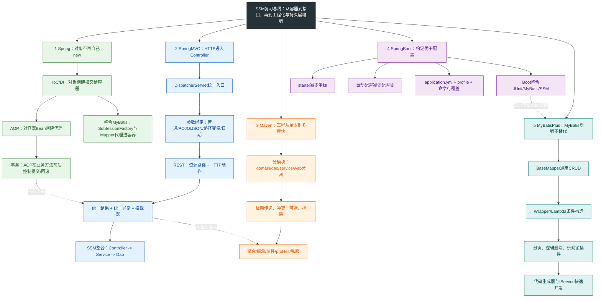
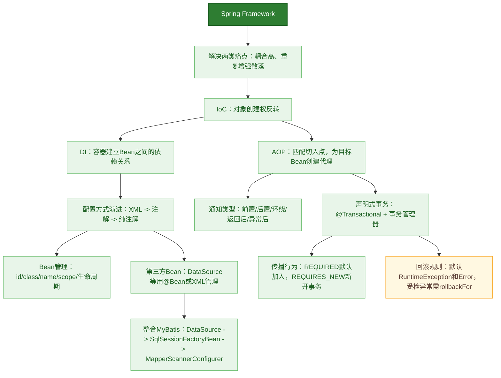
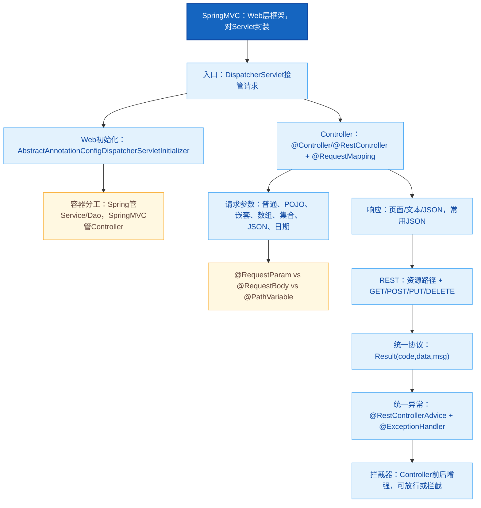
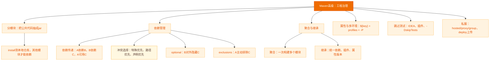
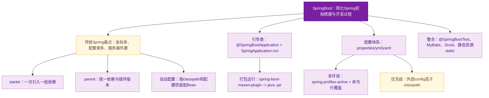
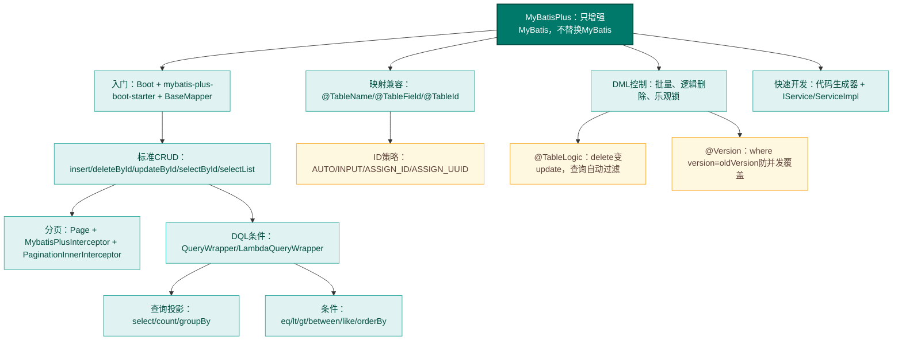

# SSM 复习笔记

这份笔记按 `Spring -> SpringMVC -> Maven -> SpringBoot -> MyBatisPlus` 的顺序整理。复习时不要先背注解清单，而要先记住每一层在项目中的职责：**Spring 管对象和事务，SpringMVC 管请求和响应，Maven 管工程与依赖，SpringBoot 管快速装配，MyBatisPlus 管持久层增强。**

## 首部记忆导图（Mermaid）



## 核心正文笔记

### 一、Spring：先把对象交给容器，再让容器增强对象

#### Spring 记忆导图（Mermaid）



Spring Framework 是 Spring 家族的基础。复习 Spring 时，最重要的不是记“有哪些注解”，而是记住它的主线：**IoC/DI 先把对象及依赖关系放进容器；AOP 才能围绕容器中的 Bean 创建代理；声明式事务又是 AOP 的典型应用。**

#### 1. IoC/DI：从“我来 new”到“容器给我”

传统代码里，业务层常常写成这样：

```java
public class BookServiceImpl implements BookService {
    private BookDao bookDao = new BookDaoImpl();

    public void save() {
        System.out.println("book service save ...");
        bookDao.save();
    }
}
```

这段代码的问题不是能不能运行，而是 `BookServiceImpl` 直接知道了 `BookDaoImpl`，实现类一变，业务层也要跟着改。Spring 的解法是把对象创建权交给外部容器，这就是 **IoC 控制反转**；再把需要的对象注入进来，这就是 **DI 依赖注入**。

| 概念 | 记忆方式 | 解决的问题 |
| --- | --- | --- |
| `IoC` | 创建权反转 | 不在业务代码里主动 `new` 依赖对象 |
| `IoC容器` | Spring 管对象的仓库 | 负责创建、初始化、保存 Bean |
| `Bean` | 被容器管理的对象 | Service、Dao、第三方对象都可以是 Bean |
| `DI` | 依赖关系注入 | 把 Dao 注入给 Service |

最小 XML 配置如下：

```xml
<beans xmlns="http://www.springframework.org/schema/beans"
       xmlns:xsi="http://www.w3.org/2001/XMLSchema-instance"
       xsi:schemaLocation="
          http://www.springframework.org/schema/beans
          http://www.springframework.org/schema/beans/spring-beans.xsd">

    <bean id="bookDao" class="com.itheima.dao.impl.BookDaoImpl"/>

    <bean id="bookService" class="com.itheima.service.impl.BookServiceImpl">
        <property name="bookDao" ref="bookDao"/>
    </bean>
</beans>
```

```java
ApplicationContext ctx = new ClassPathXmlApplicationContext("applicationContext.xml");
BookService bookService = (BookService) ctx.getBean("bookService");
bookService.save();
```

> **易错点：**`property name="bookDao"` 指的是 `setBookDao(...)` 这个注入入口；`ref="bookDao"` 指的是容器里 id 为 `bookDao` 的 Bean。两者同名只是刚好同名，含义完全不同。

#### 2. Bean 配置：id、class、scope 与生命周期

`<bean id="" class=""/>` 是 XML 管理对象的基本单元。`id` 是容器内唯一标识，`class` 必须写可实例化的实现类，不能写接口。`name` 可以给 Bean 起别名，多个别名可用空格、逗号、分号分隔。

`scope` 控制 Bean 的作用范围：

| scope | 含义 | 典型场景 |
| --- | --- | --- |
| `singleton` | 默认值，容器中一个对象 | 大多数 Service、Dao、工具类 |
| `prototype` | 每次获取都创建新对象 | 有状态、每次都需要独立实例的对象 |

> **易忘点：**单例 Bean 适合无状态对象。若 Bean 的成员变量保存了请求级数据，多线程共用时可能出现线程安全问题。

Bean 的生命周期可以按“容器造对象”的过程记：

1. 分配内存并创建对象。
2. 执行构造方法。
3. 注入属性。
4. 执行初始化方法。
5. 业务使用 Bean。
6. 容器关闭时执行销毁方法。

```xml
<bean id="bookDao"
      class="com.itheima.dao.impl.BookDaoImpl"
      init-method="init"
      destroy-method="destroy"/>
```

在注解开发中对应的是：

```java
@Repository
public class BookDaoImpl implements BookDao {
    @PostConstruct
    public void init() {
        System.out.println("init ...");
    }

    @PreDestroy
    public void destroy() {
        System.out.println("destroy ...");
    }
}
```

#### 3. DI 注入方式：setter、构造器、自动装配、集合

XML 中常见注入方式有两类。引用类型用 `ref`，简单类型用 `value`：

```xml
<bean id="bookService" class="com.itheima.service.impl.BookServiceImpl">
    <property name="bookDao" ref="bookDao"/>
    <property name="databaseName" value="spring_db"/>
</bean>
```

构造器注入用 `constructor-arg`：

```xml
<bean id="bookService" class="com.itheima.service.impl.BookServiceImpl">
    <constructor-arg name="bookDao" ref="bookDao"/>
    <constructor-arg name="msg" value="hello"/>
</bean>
```

注解开发中，常用组合是：

```java
@Configuration
@ComponentScan("com.itheima")
@PropertySource("classpath:jdbc.properties")
public class SpringConfig {
}
```

```java
@Service
public class BookServiceImpl implements BookService {
    @Autowired
    @Qualifier("bookDao")
    private BookDao bookDao;

    @Value("${jdbc.url}")
    private String url;
}
```

| 注解 | 用途 | 记忆点 |
| --- | --- | --- |
| `@Component` | 通用 Bean | 不好归类时使用 |
| `@Controller` | 表现层 Bean | SpringMVC 控制器 |
| `@Service` | 业务层 Bean | 事务通常加在这里 |
| `@Repository` | 数据层 Bean | Dao/Mapper 相关 |
| `@Autowired` | 按类型自动装配 | 类型有多个时会产生歧义 |
| `@Qualifier` | 配合 `@Autowired` 指定名称 | 解决同类型多个 Bean |
| `@Value` | 注入简单值或配置项 | `${key}` 读取配置 |
| `@PropertySource` | 加载 properties | 纯注解配置常用 |

> **重难点：**`@Autowired` 默认按类型装配。若同类型有多个 Bean，不要以为它会“聪明地猜对”，应配合 `@Qualifier` 或使用更清晰的构造器注入。

#### 4. 第三方 Bean：DataSource 是典型案例

第三方类不能直接改源码加 `@Component`，因此常用 `@Bean` 方法交给容器管理：

```java
public class JdbcConfig {
    @Value("${jdbc.driver}")
    private String driver;
    @Value("${jdbc.url}")
    private String url;
    @Value("${jdbc.username}")
    private String userName;
    @Value("${jdbc.password}")
    private String password;

    @Bean
    public DataSource dataSource() {
        DruidDataSource ds = new DruidDataSource();
        ds.setDriverClassName(driver);
        ds.setUrl(url);
        ds.setUsername(userName);
        ds.setPassword(password);
        return ds;
    }
}
```

主配置类引入外部配置：

```java
@Configuration
@ComponentScan("com.itheima")
@PropertySource("classpath:jdbc.properties")
@Import(JdbcConfig.class)
public class SpringConfig {
}
```

> **易错点：**XML 加载 properties 时，如果 key 写成 `username`，可能被系统环境变量覆盖。更稳妥的命名是 `jdbc.username`，或在 XML 中设置 `system-properties-mode="NEVER"`。

#### 5. Spring 整合 MyBatis：让工厂和 Mapper 进容器

整合 MyBatis 的核心不是“把 MyBatis 配置挪个地方”，而是让 Spring 管两件事：

1. `SqlSessionFactory` 的创建。
2. Mapper 接口代理对象的创建与扫描。

关键配置如下：

```java
public class MybatisConfig {
    @Bean
    public SqlSessionFactoryBean sqlSessionFactory(DataSource dataSource) {
        SqlSessionFactoryBean ssfb = new SqlSessionFactoryBean();
        ssfb.setTypeAliasesPackage("com.itheima.domain");
        ssfb.setDataSource(dataSource);
        return ssfb;
    }

    @Bean
    public MapperScannerConfigurer mapperScannerConfigurer() {
        MapperScannerConfigurer msc = new MapperScannerConfigurer();
        msc.setBasePackage("com.itheima.dao");
        return msc;
    }
}
```

完整主配置类：

```java
@Configuration
@ComponentScan("com.itheima")
@PropertySource("classpath:jdbc.properties")
@Import({JdbcConfig.class, MybatisConfig.class})
public class SpringConfig {
}
```

> **重难点：**`SqlSessionFactoryBean` 是 MyBatis-Spring 提供的工厂 Bean，用来生成 `SqlSessionFactory`；`MapperScannerConfigurer` 用来扫描 Mapper 接口并创建代理对象。不要把二者和普通业务 Bean 混为一谈。

Spring 整合 JUnit 后，测试类可以直接从 Spring 容器中注入 Bean：

```java
@RunWith(SpringJUnit4ClassRunner.class)
@ContextConfiguration(classes = SpringConfig.class)
public class AccountServiceTest {
    @Autowired
    private AccountService accountService;

    @Test
    public void testFindById() {
        System.out.println(accountService.findById(1));
    }
}
```

#### 6. AOP：在不改原方法的前提下增强

AOP 的一句话记忆：**把共性功能抽成通知，用切入点找到要增强的方法，再由切面描述“谁在何处增强谁”。**

| 概念 | 含义 | 例子 |
| --- | --- | --- |
| 连接点 `JoinPoint` | 程序执行中的可增强位置 | SpringAOP 中通常是方法执行 |
| 切入点 `Pointcut` | 匹配连接点的表达式 | `execution(* com.itheima.dao.*Dao.*(..))` |
| 通知 `Advice` | 要增强的共性功能 | 记录日志、统计耗时、事务控制 |
| 通知类 | 定义通知方法的类 | `MyAdvice` |
| 切面 `Aspect` | 通知与切入点的绑定关系 | `@Before("pt()")` |
| 目标对象 | 被增强的原对象 | `BookDaoImpl` |
| 代理对象 | 容器中实际执行增强逻辑的对象 | JDK 或 CGLIB 动态代理 |

入门案例：

```java
@Component
@Aspect
public class MyAdvice {
    @Pointcut("execution(void com.itheima.dao.BookDao.update())")
    private void pt() {
    }

    @Before("pt()")
    public void method() {
        System.out.println(System.currentTimeMillis());
    }
}
```

```java
@Configuration
@ComponentScan("com.itheima")
@EnableAspectJAutoProxy
public class SpringConfig {
}
```

切入点表达式按下面的结构记：

```text
execution(访问修饰符 返回值 包名.类/接口名.方法名(参数) 异常名)
```

常用写法：

```java
@Pointcut("execution(* com.itheima.service.*Service.*(..))")
private void servicePt() {}
```

通知类型：

| 注解 | 执行位置 | 常见用途 |
| --- | --- | --- |
| `@Before` | 原方法前 | 参数校验、日志 |
| `@After` | 原方法后，无论是否异常 | 资源清理 |
| `@Around` | 原方法前后包围 | 统计耗时、权限、事务 |
| `@AfterReturning` | 原方法成功返回后 | 获取返回值 |
| `@AfterThrowing` | 原方法抛异常后 | 记录异常 |

环绕通知最容易写错：

```java
@Around("servicePt()")
public Object around(ProceedingJoinPoint pjp) throws Throwable {
    long start = System.currentTimeMillis();
    Object ret = pjp.proceed();
    long end = System.currentTimeMillis();
    System.out.println(pjp.getSignature() + " cost " + (end - start) + "ms");
    return ret;
}
```

> **易错点：**环绕通知必须调用 `pjp.proceed()`，否则原方法不会执行；原方法有返回值时，环绕通知也必须把返回值 `return` 出去。

#### 7. 声明式事务：AOP 在业务层保证一致性

转账案例是事务的最佳记忆锚点：出账成功后如果入账前异常，钱会“少一半”。事务要保证两个数据库操作同成功、同失败。

```java
@Service
public class AccountServiceImpl implements AccountService {
    @Autowired
    private AccountDao accountDao;

    @Transactional
    public void transfer(String out, String in, Double money) {
        accountDao.outMoney(out, money);
        int i = 1 / 0;
        accountDao.inMoney(in, money);
    }
}
```

事务管理器配置：

```java
public class JdbcConfig {
    @Bean
    public PlatformTransactionManager transactionManager(DataSource dataSource) {
        DataSourceTransactionManager tm = new DataSourceTransactionManager();
        tm.setDataSource(dataSource);
        return tm;
    }
}
```

开启注解事务：

```java
@Configuration
@ComponentScan("com.itheima")
@PropertySource("classpath:jdbc.properties")
@Import({JdbcConfig.class, MybatisConfig.class})
@EnableTransactionManagement
public class SpringConfig {
}
```

事务常用属性：

| 属性 | 作用 | 复习提示 |
| --- | --- | --- |
| `readOnly` | 只读事务 | 查询设为 `true`，增删改设为 `false` |
| `timeout` | 超时时间 | 单位秒，超时回滚 |
| `rollbackFor` | 指定哪些异常回滚 | 受检异常常用 |
| `noRollbackFor` | 指定哪些异常不回滚 | 特殊业务场景 |
| `isolation` | 隔离级别 | 默认跟随数据库 |
| `propagation` | 传播行为 | 方法互相调用时如何处理事务 |

> **重难点：**Spring 事务默认只对 `RuntimeException`、`Error` 及其子类回滚。`IOException` 这类受检异常默认不回滚，需要写 `@Transactional(rollbackFor = IOException.class)`。

日志场景常考传播行为：转账失败也要记录日志，此时日志不能加入转账的大事务，应新开事务。

```java
@Service
public class LogServiceImpl implements LogService {
    @Autowired
    private LogDao logDao;

    @Transactional(propagation = Propagation.REQUIRES_NEW)
    public void log(String out, String in, Double money) {
        logDao.log("transfer from " + out + " to " + in + ", money=" + money);
    }
}
```

> **易忘点：**`REQUIRED` 是默认值，有事务就加入，没有就新建；`REQUIRES_NEW` 总是新建事务，适合“主业务失败但日志仍要保存”的场景。

### 二、SpringMVC：让 HTTP 请求变成可维护的接口

#### SpringMVC 记忆导图（Mermaid）



SpringMVC 属于 Web 层，核心职责是：**接收请求、绑定参数、调用业务层、转换响应数据。**它把原来分散在 Servlet 中的路径映射、参数获取、JSON 输出统一到 Controller 方法上。

#### 1. 入门结构：让 DispatcherServlet 接管请求

SpringMVC 的最小配置由三部分组成：依赖、SpringMVC 配置类、Web 容器初始化类。

```xml
<dependency>
    <groupId>javax.servlet</groupId>
    <artifactId>javax.servlet-api</artifactId>
    <version>3.1.0</version>
    <scope>provided</scope>
</dependency>
<dependency>
    <groupId>org.springframework</groupId>
    <artifactId>spring-webmvc</artifactId>
    <version>5.2.10.RELEASE</version>
</dependency>
```

```java
@Configuration
@ComponentScan("com.itheima.controller")
public class SpringMvcConfig {
}
```

```java
public class ServletContainersInitConfig extends AbstractDispatcherServletInitializer {
    protected WebApplicationContext createServletApplicationContext() {
        AnnotationConfigWebApplicationContext ctx = new AnnotationConfigWebApplicationContext();
        ctx.register(SpringMvcConfig.class);
        return ctx;
    }

    protected String[] getServletMappings() {
        return new String[]{"/"};
    }

    protected WebApplicationContext createRootApplicationContext() {
        return null;
    }
}
```

Controller：

```java
@Controller
public class UserController {
    @RequestMapping("/save")
    @ResponseBody
    public String save() {
        System.out.println("user save ...");
        return "{'info':'springmvc'}";
    }
}
```

> **易错点：**如果方法直接返回字符串但没有 `@ResponseBody`，SpringMVC 会把字符串当作页面名去找视图，找不到就 404。要返回文本或 JSON，必须加 `@ResponseBody`，或直接使用 `@RestController`。

请求执行流程：

1. 浏览器发送请求。
2. Web 容器发现请求匹配 SpringMVC 映射规则 `/`。
3. 请求交给 DispatcherServlet。
4. DispatcherServlet 根据路径找到 Controller 方法。
5. 执行方法。
6. 若有 `@ResponseBody`，直接把返回值写入响应体。

#### 2. Spring 与 SpringMVC 的容器分工

SSM 项目中通常有两个容器：

| 容器 | 管理内容 | 配置类 |
| --- | --- | --- |
| Spring 根容器 | Service、Dao、DataSource、事务、MyBatis | `SpringConfig` |
| SpringMVC 子容器 | Controller、WebMVC 配置、拦截器 | `SpringMvcConfig` |

> **重难点：**不要让 Spring 的包扫描把 Controller 也扫进去。Controller 应由 SpringMVC 容器管理，Service/Dao 应由 Spring 根容器管理。否则职责混乱，后期整合和拦截器配置都容易出问题。

可以用精准包扫描：

```java
@Configuration
@ComponentScan("com.itheima.service")
public class SpringConfig {
}
```

```java
@Configuration
@ComponentScan("com.itheima.controller")
@EnableWebMvc
public class SpringMvcConfig {
}
```

#### 3. 请求参数绑定：先分清参数来自哪里

普通参数可以按形参名自动绑定：

```java
@RequestMapping("/commonParam")
@ResponseBody
public String commonParam(String name, int age) {
    System.out.println(name + "," + age);
    return "{'module':'common param'}";
}
```

参数名不一致时用 `@RequestParam`：

```java
@RequestMapping("/commonParamDifferentName")
@ResponseBody
public String commonParamDifferentName(@RequestParam("name") String userName) {
    System.out.println(userName);
    return "{'module':'common param different name'}";
}
```

POJO 参数按属性名绑定：

```java
@RequestMapping("/pojoParam")
@ResponseBody
public String pojoParam(User user) {
    System.out.println(user);
    return "{'module':'pojo param'}";
}
```

JSON 参数必须引入 Jackson，开启 MVC 注解支持，并使用 `@RequestBody`：

```xml
<dependency>
    <groupId>com.fasterxml.jackson.core</groupId>
    <artifactId>jackson-databind</artifactId>
    <version>2.9.0</version>
</dependency>
```

```java
@Configuration
@ComponentScan("com.itheima.controller")
@EnableWebMvc
public class SpringMvcConfig {
}
```

```java
@RequestMapping("/listParamForJson")
@ResponseBody
public String listParamForJson(@RequestBody List<String> likes) {
    System.out.println(likes);
    return "{'module':'list common for json param'}";
}
```

日期参数用 `@DateTimeFormat`：

```java
@RequestMapping("/dataParam")
@ResponseBody
public String dataParam(@DateTimeFormat(pattern = "yyyy-MM-dd HH:mm:ss") Date date) {
    System.out.println(date);
    return "{'module':'data param'}";
}
```

三类常用参数注解对比：

| 注解 | 接收位置 | 常见场景 |
| --- | --- | --- |
| `@RequestParam` | URL 参数、表单参数 | 非 JSON，参数名不一致或需要明确指定 |
| `@RequestBody` | 请求体 JSON | 新增、修改时提交复杂对象 |
| `@PathVariable` | REST 路径变量 | `/books/{id}` 中的 id |

> **易忘点：**`@RequestBody` 一个方法中通常只用一次，因为请求体只能被完整读取一次；多个简单参数优先用 URL 参数或包装成一个对象。

#### 4. 响应数据与静态资源

返回对象或集合时，SpringMVC 会借助 Jackson 转成 JSON：

```java
@RequestMapping("/toJsonPOJO")
@ResponseBody
public User toJsonPOJO() {
    User user = new User();
    user.setName("itcast");
    user.setAge(15);
    return user;
}
```

SpringMVC 拦截路径设置为 `/` 后，静态资源也可能被拦截。可以配置资源放行：

```java
@Configuration
public class SpringMvcSupport extends WebMvcConfigurationSupport {
    @Override
    protected void addResourceHandlers(ResourceHandlerRegistry registry) {
        registry.addResourceHandler("/pages/**").addResourceLocations("/pages/");
        registry.addResourceHandler("/js/**").addResourceLocations("/js/");
        registry.addResourceHandler("/css/**").addResourceLocations("/css/");
        registry.addResourceHandler("/plugins/**").addResourceLocations("/plugins/");
    }
}
```

> **易错点：**配置类本身也要被 SpringMVC 扫描到，否则资源放行规则不会生效。

#### 5. REST：资源路径统一，动作交给 HTTP 方法

REST 风格把路径从“动词路径”改为“资源路径”：

| 操作 | 传统路径 | REST 路径与方法 |
| --- | --- | --- |
| 新增 | `/save` | `POST /books` |
| 删除 | `/delete?id=1` | `DELETE /books/1` |
| 修改 | `/update` | `PUT /books` |
| 查询单个 | `/getById?id=1` | `GET /books/1` |
| 查询全部 | `/findAll` | `GET /books` |

快速开发写法：

```java
@RestController
@RequestMapping("/books")
public class BookController {
    @PostMapping
    public String save(@RequestBody Book book) {
        System.out.println("book save..." + book);
        return "{'module':'book save'}";
    }

    @DeleteMapping("/{id}")
    public String delete(@PathVariable Integer id) {
        System.out.println("book delete..." + id);
        return "{'module':'book delete'}";
    }

    @PutMapping
    public String update(@RequestBody Book book) {
        System.out.println("book update..." + book);
        return "{'module':'book update'}";
    }

    @GetMapping("/{id}")
    public String getById(@PathVariable Integer id) {
        System.out.println("book getById..." + id);
        return "{'module':'book getById'}";
    }

    @GetMapping
    public String getAll() {
        System.out.println("book getAll...");
        return "{'module':'book getAll'}";
    }
}
```

> **重难点：**`@RestController = @Controller + @ResponseBody`。类上的 `@RequestMapping("/books")` 提取公共资源路径，方法上的 `@GetMapping`、`@PostMapping` 等表达动作。

#### 6. SSM 整合：配置分层要稳

SSM 整合的配置顺序可以按下面记：

1. Web 入口加载 Spring 与 SpringMVC 两类配置。
2. Spring 管 Service、事务、数据源、MyBatis。
3. SpringMVC 管 Controller、JSON 转换、拦截器。
4. Dao 由 MyBatis-Spring 扫描成代理对象。

Spring 配置：

```java
@Configuration
@ComponentScan({"com.itheima.service"})
@PropertySource("classpath:jdbc.properties")
@Import({JdbcConfig.class, MyBatisConfig.class})
@EnableTransactionManagement
public class SpringConfig {
}
```

JDBC 配置：

```java
public class JdbcConfig {
    @Value("${jdbc.driver}")
    private String driver;
    @Value("${jdbc.url}")
    private String url;
    @Value("${jdbc.username}")
    private String username;
    @Value("${jdbc.password}")
    private String password;

    @Bean
    public DataSource dataSource() {
        DruidDataSource dataSource = new DruidDataSource();
        dataSource.setDriverClassName(driver);
        dataSource.setUrl(url);
        dataSource.setUsername(username);
        dataSource.setPassword(password);
        return dataSource;
    }

    @Bean
    public PlatformTransactionManager transactionManager(DataSource dataSource) {
        DataSourceTransactionManager ds = new DataSourceTransactionManager();
        ds.setDataSource(dataSource);
        return ds;
    }
}
```

MyBatis 配置：

```java
public class MyBatisConfig {
    @Bean
    public SqlSessionFactoryBean sqlSessionFactory(DataSource dataSource) {
        SqlSessionFactoryBean factoryBean = new SqlSessionFactoryBean();
        factoryBean.setDataSource(dataSource);
        factoryBean.setTypeAliasesPackage("com.itheima.domain");
        return factoryBean;
    }

    @Bean
    public MapperScannerConfigurer mapperScannerConfigurer() {
        MapperScannerConfigurer msc = new MapperScannerConfigurer();
        msc.setBasePackage("com.itheima.dao");
        return msc;
    }
}
```

SpringMVC 配置：

```java
@Configuration
@ComponentScan("com.itheima.controller")
@EnableWebMvc
public class SpringMvcConfig {
}
```

Web 入口：

```java
public class ServletConfig extends AbstractAnnotationConfigDispatcherServletInitializer {
    protected Class<?>[] getRootConfigClasses() {
        return new Class[]{SpringConfig.class};
    }

    protected Class<?>[] getServletConfigClasses() {
        return new Class[]{SpringMvcConfig.class};
    }

    protected String[] getServletMappings() {
        return new String[]{"/"};
    }

    @Override
    protected Filter[] getServletFilters() {
        CharacterEncodingFilter filter = new CharacterEncodingFilter();
        filter.setEncoding("utf-8");
        return new Filter[]{filter};
    }
}
```

> **易错点：**`javax.servlet-api` 必须设置 `provided`，运行时使用 Tomcat 自带 Servlet API，否则容易与容器里的包冲突。

#### 7. 统一结果封装：前后端协议要稳定

Controller 如果有的返回 `boolean`，有的返回对象，有的返回集合，前端解析会很乱。统一协议通常包含三部分：

```java
public class Result {
    private Object data;
    private Integer code;
    private String msg;

    public Result(Integer code, Object data) {
        this.code = code;
        this.data = data;
    }

    public Result(Integer code, Object data, String msg) {
        this.code = code;
        this.data = data;
        this.msg = msg;
    }
}
```

操作码集中定义：

```java
public class Code {
    public static final Integer SAVE_OK = 20011;
    public static final Integer DELETE_OK = 20021;
    public static final Integer UPDATE_OK = 20031;
    public static final Integer GET_OK = 20041;

    public static final Integer SAVE_ERR = 20010;
    public static final Integer DELETE_ERR = 20020;
    public static final Integer UPDATE_ERR = 20030;
    public static final Integer GET_ERR = 20040;

    public static final Integer SYSTEM_ERR = 50001;
    public static final Integer BUSINESS_ERR = 60002;
}
```

Controller 返回统一结果：

```java
@RestController
@RequestMapping("/books")
public class BookController {
    @Autowired
    private BookService bookService;

    @PostMapping
    public Result save(@RequestBody Book book) {
        boolean flag = bookService.save(book);
        return new Result(flag ? Code.SAVE_OK : Code.SAVE_ERR, flag);
    }

    @GetMapping("/{id}")
    public Result getById(@PathVariable Integer id) {
        Book book = bookService.getById(id);
        Integer code = book != null ? Code.GET_OK : Code.GET_ERR;
        String msg = book != null ? "" : "数据查询失败，请重试";
        return new Result(code, book, msg);
    }
}
```

#### 8. 统一异常处理：异常不要散落在 Controller

全局异常处理器：

```java
@RestControllerAdvice
public class ProjectExceptionAdvice {
    @ExceptionHandler(SystemException.class)
    public Result doSystemException(SystemException ex) {
        return new Result(ex.getCode(), null, ex.getMessage());
    }

    @ExceptionHandler(BusinessException.class)
    public Result doBusinessException(BusinessException ex) {
        return new Result(ex.getCode(), null, ex.getMessage());
    }

    @ExceptionHandler(Exception.class)
    public Result doException(Exception ex) {
        return new Result(Code.SYSTEM_ERR, null, "系统繁忙，请稍后再试");
    }
}
```

自定义异常：

```java
public class BusinessException extends RuntimeException {
    private Integer code;

    public BusinessException(Integer code, String message) {
        super(message);
        this.code = code;
    }

    public Integer getCode() {
        return code;
    }
}
```

> **重难点：**异常处理器不是为了“吞掉异常”，而是把异常转换成前端能理解的统一协议。系统异常、业务异常和未知异常要分层处理。

#### 9. 拦截器：Controller 方法前后的增强

拦截器属于 SpringMVC，只拦截进入 SpringMVC 的请求；过滤器属于 Servlet，可以拦截更广泛的资源访问。

| 对比项 | Filter | Interceptor |
| --- | --- | --- |
| 所属技术 | Servlet | SpringMVC |
| 拦截范围 | 几乎所有请求 | SpringMVC 控制器请求 |
| 典型用途 | 编码、跨域、安全过滤 | 登录校验、权限、Controller 前后增强 |

拦截器实现：

```java
@Component
public class ProjectInterceptor implements HandlerInterceptor {
    @Override
    public boolean preHandle(HttpServletRequest request,
                             HttpServletResponse response,
                             Object handler) throws Exception {
        System.out.println("preHandle...");
        return true;
    }

    @Override
    public void postHandle(HttpServletRequest request,
                           HttpServletResponse response,
                           Object handler,
                           ModelAndView modelAndView) throws Exception {
        System.out.println("postHandle...");
    }

    @Override
    public void afterCompletion(HttpServletRequest request,
                                HttpServletResponse response,
                                Object handler,
                                Exception ex) throws Exception {
        System.out.println("afterCompletion...");
    }
}
```

注册拦截器：

```java
@Configuration
@ComponentScan({"com.itheima.controller"})
@EnableWebMvc
public class SpringMvcConfig implements WebMvcConfigurer {
    @Autowired
    private ProjectInterceptor projectInterceptor;

    @Override
    public void addInterceptors(InterceptorRegistry registry) {
        registry.addInterceptor(projectInterceptor)
                .addPathPatterns("/books", "/books/*");
    }
}
```

> **易错点：**`preHandle` 返回 `true` 才放行，返回 `false` 会拦截后续 Controller 方法。多个拦截器时，`preHandle` 按注册顺序执行，`postHandle` 和 `afterCompletion` 通常按反向顺序执行。

### 三、Maven 高级：从“能跑”到“可维护、可构建、可共享”

#### Maven 记忆导图（Mermaid）



Maven 高级的核心不是“会写坐标”，而是把项目从单体练习推进到团队协作：**模块可拆、依赖可控、构建可批量、配置可切换、产物可共享。**

#### 1. 分模块开发：把公共能力抽出来

分模块有两种常见动机：

1. 按功能拆：订单、商品、用户等业务模块分离，避免一个功能异常影响整个系统。
2. 按层拆：`domain`、`dao`、`service`、`web` 等公共层单独成模块，避免重复代码。

抽取 `domain` 模块的关键步骤：

1. 创建 `maven_03_pojo` 这类 `jar` 模块。
2. 把 `Book` 等实体类移到新模块。
3. 原项目删除重复实体类。
4. 原项目引入新模块依赖。

```xml
<dependency>
    <groupId>com.itheima</groupId>
    <artifactId>maven_03_pojo</artifactId>
    <version>1.0-SNAPSHOT</version>
</dependency>
```

如果编译报找不到 `maven_03_pojo`，原因是 Maven 会先去本地仓库找 jar，但这个模块还没有安装。需要对被依赖模块执行：

```shell
mvn install
```

> **易错点：**IDEA 中能看到相邻模块，不代表 Maven 构建时一定能找到。Maven 的依赖解析以仓库和 Reactor 构建为准，被依赖模块没有参与聚合构建或没有安装到本地仓库，就可能找不到。

#### 2. 依赖传递与冲突：理解 Maven 如何选版本

依赖具有传递性：A 依赖 B，B 依赖 C，那么 A 通常也能使用 C。依赖传递带来便利，也会带来版本冲突。

Maven 冲突选择可以这样记：

| 规则 | 含义 | 记忆 |
| --- | --- | --- |
| 特殊优先 | 同一个 pom 中同级配置相同资源不同版本，后配置覆盖先配置 | “近在本文件，后者赢” |
| 路径优先 | 依赖路径越短，优先级越高 | “离我近的赢” |
| 声明优先 | 路径长度相同，先声明的优先 | “同距离先到先得” |

> **重难点：**规则不必死背到焦虑。真实排查时看 Maven Dependencies 视图或执行 `mvn dependency:tree`，以最终解析结果为准。

可选依赖是“提供方隐藏”：

```xml
<dependency>
    <groupId>com.itheima</groupId>
    <artifactId>maven_03_pojo</artifactId>
    <version>1.0-SNAPSHOT</version>
    <optional>true</optional>
</dependency>
```

排除依赖是“使用方主动断开”：

```xml
<dependency>
    <groupId>com.itheima</groupId>
    <artifactId>maven_04_dao</artifactId>
    <version>1.0-SNAPSHOT</version>
    <exclusions>
        <exclusion>
            <groupId>com.itheima</groupId>
            <artifactId>maven_03_pojo</artifactId>
        </exclusion>
    </exclusions>
</dependency>
```

> **易忘点：**`optional` 写在 B 上，表示 B 不想把 C 传给别人；`exclusions` 写在 A 上，表示 A 知道 B 会传来 C，但我主动不要。

#### 3. 聚合与继承：一个管构建，一个管配置

聚合用于一次构建多个模块。聚合工程通常只有 `pom.xml`，打包方式为 `pom`：

```xml
<packaging>pom</packaging>

<modules>
    <module>../maven_03_pojo</module>
    <module>../maven_04_dao</module>
    <module>../maven_02_ssm</module>
</modules>
```

继承用于统一配置。父工程也通常是 `pom` 打包，子工程声明父工程：

```xml
<parent>
    <groupId>com.itheima</groupId>
    <artifactId>maven_01_parent</artifactId>
    <version>1.0-RELEASE</version>
    <relativePath>../maven_01_parent/pom.xml</relativePath>
</parent>
```

父工程可用 `dependencyManagement` 统一版本，但不会直接导入依赖：

```xml
<dependencyManagement>
    <dependencies>
        <dependency>
            <groupId>org.springframework</groupId>
            <artifactId>spring-webmvc</artifactId>
            <version>5.2.10.RELEASE</version>
        </dependency>
    </dependencies>
</dependencyManagement>
```

子工程只写 G 和 A：

```xml
<dependency>
    <groupId>org.springframework</groupId>
    <artifactId>spring-webmvc</artifactId>
</dependency>
```

| 对比 | 聚合 | 继承 |
| --- | --- | --- |
| 目的 | 批量构建 | 统一配置 |
| 标签 | `<modules>` | `<parent>` |
| 方向 | 父知道子 | 子知道父 |
| 常见打包 | `pom` | `pom` |

> **重难点：**聚合和继承可以放在同一个父工程中，但它们解决的问题不同。聚合解决“一次构建多个模块”，继承解决“多个模块共用配置”。

#### 4. 属性、资源过滤与版本管理

父工程中定义属性：

```xml
<properties>
    <spring.version>5.2.10.RELEASE</spring.version>
    <jdbc.url>jdbc:mysql://127.0.0.1:3306/ssm_db</jdbc.url>
</properties>
```

依赖版本引用属性：

```xml
<dependency>
    <groupId>org.springframework</groupId>
    <artifactId>spring-webmvc</artifactId>
    <version>${spring.version}</version>
</dependency>
```

资源文件也可以用 Maven 属性，但需要开启资源过滤：

```xml
<build>
    <resources>
        <resource>
            <directory>${project.basedir}/src/main/resources</directory>
            <filtering>true</filtering>
        </resource>
    </resources>
</build>
```

`jdbc.properties`：

```properties
jdbc.driver=com.mysql.jdbc.Driver
jdbc.url=${jdbc.url}
jdbc.username=root
jdbc.password=root
```

> **易错点：**Maven 的 `${}` 在构建阶段替换，Spring 的 `${}` 在运行时由 Spring 读取配置替换。两者长得一样，但发生时机不同。

版本命名：

| 后缀 | 含义 |
| --- | --- |
| `SNAPSHOT` | 快照版本，开发中可不断更新 |
| `RELEASE` | 发布版本，阶段稳定产物 |
| `alpha/beta` | 内测/公测，不稳定程度不同 |

#### 5. 多环境、跳过测试与私服

Maven profiles 可以定义多环境：

```xml
<profiles>
    <profile>
        <id>env_dep</id>
        <properties>
            <jdbc.url>jdbc:mysql://127.1.1.1:3306/ssm_db</jdbc.url>
        </properties>
        <activation>
            <activeByDefault>true</activeByDefault>
        </activation>
    </profile>
    <profile>
        <id>env_pro</id>
        <properties>
            <jdbc.url>jdbc:mysql://127.2.2.2:3306/ssm_db</jdbc.url>
        </properties>
    </profile>
</profiles>
```

命令行切换：

```shell
mvn install -P env_pro
```

跳过测试三种方式：

1. IDEA Maven 面板点击 Skip Tests。
2. 配置 `maven-surefire-plugin`。
3. 命令行：

```shell
mvn install -DskipTests
```

> **易忘点：**`-DskipTests` 只有构建生命周期经过 test 阶段时才有意义。单独执行 `compile` 本来就不跑测试。

Nexus 私服仓库分类：

| 仓库类型 | 作用 |
| --- | --- |
| hosted | 存放团队自研构件或中央仓库没有的构件 |
| proxy | 代理中央仓库等远程仓库 |
| group | 仓库组，统一下载入口，不直接存资源 |

本地 Maven `settings.xml` 配置认证：

```xml
<servers>
    <server>
        <id>itheima-release</id>
        <username>admin</username>
        <password>admin</password>
    </server>
    <server>
        <id>itheima-snapshot</id>
        <username>admin</username>
        <password>admin</password>
    </server>
</servers>
```

配置镜像：

```xml
<mirrors>
    <mirror>
        <id>maven-public</id>
        <mirrorOf>*</mirrorOf>
        <url>http://localhost:8081/repository/maven-public/</url>
    </mirror>
</mirrors>
```

工程配置上传地址：

```xml
<distributionManagement>
    <repository>
        <id>itheima-release</id>
        <url>http://localhost:8081/repository/itheima-release/</url>
    </repository>
    <snapshotRepository>
        <id>itheima-snapshot</id>
        <url>http://localhost:8081/repository/itheima-snapshot/</url>
    </snapshotRepository>
</distributionManagement>
```

发布到私服：

```shell
mvn deploy
```

### 四、SpringBoot：把传统 SSM 的配置成本降下来

#### SpringBoot 记忆导图（Mermaid）



SpringBoot 的目标是简化 Spring 应用的初始搭建和开发过程。传统 SSM 要写大量坐标、Web 初始化类、Spring 配置类、SpringMVC 配置类；SpringBoot 用 **起步依赖、自动配置、内置服务器** 把这些固定工作压缩掉。

#### 1. 快速入门：一个 starter，一个引导类，一个 Controller

典型 `pom.xml`：

```xml
<parent>
    <groupId>org.springframework.boot</groupId>
    <artifactId>spring-boot-starter-parent</artifactId>
    <version>2.5.0</version>
</parent>

<dependencies>
    <dependency>
        <groupId>org.springframework.boot</groupId>
        <artifactId>spring-boot-starter-web</artifactId>
    </dependency>
</dependencies>

<build>
    <plugins>
        <plugin>
            <groupId>org.springframework.boot</groupId>
            <artifactId>spring-boot-maven-plugin</artifactId>
        </plugin>
    </plugins>
</build>
```

引导类：

```java
@SpringBootApplication
public class Application {
    public static void main(String[] args) {
        SpringApplication.run(Application.class, args);
    }
}
```

Controller：

```java
@RestController
@RequestMapping("/books")
public class BookController {
    @GetMapping("/{id}")
    public String getById(@PathVariable Integer id) {
        System.out.println("id ==> " + id);
        return "hello , spring boot!";
    }
}
```

> **易忘点：**SpringBoot 默认打 `jar` 包，内置服务器随应用启动；传统 Web 项目常打 `war` 包交给外部 Tomcat。

打包运行：

```shell
mvn package
java -jar springboot_01_quickstart-0.0.1-SNAPSHOT.jar
```

> **易错点：**如果缺少 `spring-boot-maven-plugin`，打出来的 jar 可能不是可直接运行的 Boot jar。

#### 2. starter、parent 与内置服务器

`starter` 用来减少依赖配置。例如 `spring-boot-starter-web` 内部包含 SpringMVC、JSON、Tomcat 等 Web 开发常用依赖。

`parent` 用来减少版本冲突。`spring-boot-starter-parent` 通过依赖管理锁定大量常见坐标版本，所以开发者通常只写 `groupId` 和 `artifactId`。

> **重难点：**`dependencyManagement` 只是管理版本，不等于导入依赖。需要使用某项技术时，仍要在 `dependencies` 中声明对应 starter 或依赖。

切换 Web 服务器时，先排除 Tomcat，再引入 Jetty：

```xml
<dependency>
    <groupId>org.springframework.boot</groupId>
    <artifactId>spring-boot-starter-web</artifactId>
    <exclusions>
        <exclusion>
            <groupId>org.springframework.boot</groupId>
            <artifactId>spring-boot-starter-tomcat</artifactId>
        </exclusion>
    </exclusions>
</dependency>

<dependency>
    <groupId>org.springframework.boot</groupId>
    <artifactId>spring-boot-starter-jetty</artifactId>
</dependency>
```

#### 3. 配置文件：application 名字固定，后缀可变

SpringBoot 常用三种配置格式：

```properties
server.port=80
```

```yaml
server:
  port: 81
```

```yml
server:
  port: 82
```

> **易错点：**配置文件名必须是 `application`，后缀可以是 `properties`、`yml`、`yaml`。

YAML 基本规则：

1. 大小写敏感。
2. 属性层级用缩进表示。
3. 缩进不能用 Tab。
4. `key: value` 冒号后要有空格。

读取配置三种方式：

```java
@Value("${enterprise.name}")
private String name;
```

```java
@Autowired
private Environment environment;

public void print() {
    System.out.println(environment.getProperty("enterprise.name"));
}
```

```java
@Component
@ConfigurationProperties(prefix = "enterprise")
public class Enterprise {
    private String name;
    private int age;
    private String tel;
    private String[] subject;
}
```

给 `@ConfigurationProperties` 加元数据提示：

```xml
<dependency>
    <groupId>org.springframework.boot</groupId>
    <artifactId>spring-boot-configuration-processor</artifactId>
    <optional>true</optional>
</dependency>
```

#### 4. 多环境与配置优先级

YAML 多环境：

```yaml
spring:
  profiles:
    active: dev

---
spring:
  config:
    activate:
      on-profile: dev
server:
  port: 80

---
spring:
  config:
    activate:
      on-profile: pro
server:
  port: 81
```

properties 多环境：

```properties
# application.properties
spring.profiles.active=pro
```

```properties
# application-pro.properties
server.port=82
```

命令行覆盖：

```shell
java -jar springboot.jar --server.port=88 --spring.profiles.active=test
```

配置文件位置优先级从低到高记：

| 级别 | 位置 |
| --- | --- |
| 1 | `classpath:application.yml` |
| 2 | `classpath:config/application.yml` |
| 3 | `file:application.yml` |
| 4 | `file:config/application.yml` |

> **重难点：**越靠近部署环境的外部配置优先级越高。这样测试或运维可以不改 jar，只在外部放配置覆盖默认值。

#### 5. SpringBoot 整合 JUnit 与 MyBatis

JUnit 测试：

```java
@SpringBootTest
class SpringbootTestApplicationTests {
    @Autowired
    private BookService bookService;

    @Test
    public void save() {
        bookService.save();
    }
}
```

> **易错点：**测试类所在包应在引导类所在包及其子包内；不满足时需要 `@SpringBootTest(classes = Application.class)` 明确指定引导类。

整合 MyBatis：

```yaml
spring:
  datasource:
    driver-class-name: com.mysql.cj.jdbc.Driver
    url: jdbc:mysql://localhost:3306/ssm_db?serverTimezone=UTC
    username: root
    password: root
```

```java
@Mapper
public interface BookDao {
    @Select("select * from tbl_book where id = #{id}")
    Book getById(Integer id);
}
```

使用 Druid：

```xml
<dependency>
    <groupId>com.alibaba</groupId>
    <artifactId>druid</artifactId>
    <version>1.1.16</version>
</dependency>
```

```yaml
spring:
  datasource:
    type: com.alibaba.druid.pool.DruidDataSource
    driver-class-name: com.mysql.cj.jdbc.Driver
    url: jdbc:mysql://localhost:3306/ssm_db?serverTimezone=UTC
    username: root
    password: root
```

SpringBoot 改写传统 SSM 案例时，记住这几处替换：

| 传统 SSM | SpringBoot |
| --- | --- |
| `SpringConfig`、`SpringMvcConfig`、Web 初始化类 | 通常删除，交给自动配置 |
| `webapp` 静态资源 | 放到 `resources/static` |
| MyBatis Mapper 扫描配置 | `@Mapper` 或 `@MapperScan` |
| Spring JUnit 配置 | `@SpringBootTest` |
| 数据源配置类 | `application.yml` |

### 五、MyBatisPlus：在 MyBatis 之上做增强

#### MyBatisPlus 记忆导图（Mermaid）



MyBatisPlus 简称 MP，是基于 MyBatis 的增强工具。它的定位是：**只做增强，不做改变；帮你少写单表 CRUD、分页、条件构造、常见 DML 控制代码。**

#### 1. 入门案例：继承 BaseMapper 就有通用 CRUD

核心依赖：

```xml
<dependency>
    <groupId>com.baomidou</groupId>
    <artifactId>mybatis-plus-boot-starter</artifactId>
    <version>3.4.1</version>
</dependency>
<dependency>
    <groupId>com.alibaba</groupId>
    <artifactId>druid</artifactId>
    <version>1.1.16</version>
</dependency>
```

配置数据源：

```yaml
spring:
  datasource:
    type: com.alibaba.druid.pool.DruidDataSource
    driver-class-name: com.mysql.cj.jdbc.Driver
    url: jdbc:mysql://localhost:3306/mybatisplus_db?serverTimezone=Asia/Shanghai
    username: root
    password: root
```

实体类：

```java
public class User {
    private Long id;
    private String name;
    private String password;
    private Integer age;
    private String tel;
}
```

Dao 接口：

```java
@Mapper
public interface UserDao extends BaseMapper<User> {
}
```

测试：

```java
@SpringBootTest
class MpDemoApplicationTests {
    @Autowired
    private UserDao userDao;

    @Test
    public void testGetAll() {
        List<User> userList = userDao.selectList(null);
        System.out.println(userList);
    }
}
```

> **易错点：**MP 不是 IDEA 内置勾选项，通常要手动加 `mybatis-plus-boot-starter`。同时不要再重复引入一堆 MyBatis 与 MyBatis-Spring 依赖，starter 已经通过依赖传递带入。

#### 2. 标准 CRUD 与 Lombok

常用 CRUD：

| 方法 | 含义 |
| --- | --- |
| `insert(T entity)` | 新增 |
| `deleteById(Serializable id)` | 按 id 删除 |
| `updateById(T entity)` | 按 id 修改非空字段 |
| `selectById(Serializable id)` | 按 id 查询 |
| `selectList(Wrapper<T> wrapper)` | 按条件查询集合，`null` 表示无条件 |

新增：

```java
@Test
void testSave() {
    User user = new User();
    user.setName("黑马程序员");
    user.setPassword("itheima");
    user.setAge(12);
    user.setTel("4006184000");
    userDao.insert(user);
}
```

修改：

```java
@Test
void testUpdate() {
    User user = new User();
    user.setId(1L);
    user.setName("Tom888");
    user.setPassword("tom888");
    userDao.updateById(user);
}
```

> **易忘点：**`updateById` 只修改实体对象中非空的字段。未设置的字段不会被更新为 `null`。

Lombok 简化实体：

```xml
<dependency>
    <groupId>org.projectlombok</groupId>
    <artifactId>lombok</artifactId>
</dependency>
```

```java
@Data
@AllArgsConstructor
@NoArgsConstructor
public class User {
    private Long id;
    private String name;
    private String password;
    private Integer age;
    private String tel;
}
```

#### 3. 分页：必须配置 MP 分页拦截器

分页调用：

```java
@Test
void testSelectPage() {
    IPage<User> page = new Page<>(1, 3);
    userDao.selectPage(page, null);

    System.out.println("当前页码值：" + page.getCurrent());
    System.out.println("每页显示数：" + page.getSize());
    System.out.println("一共多少页：" + page.getPages());
    System.out.println("一共多少条数据：" + page.getTotal());
    System.out.println("数据：" + page.getRecords());
}
```

分页插件：

```java
@Configuration
public class MybatisPlusConfig {
    @Bean
    public MybatisPlusInterceptor mybatisPlusInterceptor() {
        MybatisPlusInterceptor mpInterceptor = new MybatisPlusInterceptor();
        mpInterceptor.addInnerInterceptor(new PaginationInnerInterceptor());
        return mpInterceptor;
    }
}
```

打开 SQL 日志：

```yaml
mybatis-plus:
  configuration:
    log-impl: org.apache.ibatis.logging.stdout.StdOutImpl
```

> **易错点：**只写 `selectPage` 不配置分页拦截器，分页能力不完整。SQL 日志适合调试，调试完要关闭，避免影响性能和日志体积。

#### 4. DQL 条件构造：Wrapper 是核心

MP 用 `Wrapper` 以编程方式组织查询条件。普通写法：

```java
@Test
void testGetByCondition() {
    QueryWrapper<User> qw = new QueryWrapper<>();
    qw.lt("age", 18);
    List<User> userList = userDao.selectList(qw);
    System.out.println(userList);
}
```

Lambda 写法避免字段名写错：

```java
@Test
void testLambdaQueryWrapper() {
    LambdaQueryWrapper<User> lqw = new LambdaQueryWrapper<>();
    lqw.lt(User::getAge, 18);
    List<User> userList = userDao.selectList(lqw);
    System.out.println(userList);
}
```

多条件：

```java
LambdaQueryWrapper<User> lqw = new LambdaQueryWrapper<>();
lqw.lt(User::getAge, 30).gt(User::getAge, 10);
```

条件可能为空时，不要拼出无效条件：

```java
Integer minAge = null;
Integer maxAge = 30;

LambdaQueryWrapper<User> lqw = new LambdaQueryWrapper<>();
lqw.gt(minAge != null, User::getAge, minAge);
lqw.lt(maxAge != null, User::getAge, maxAge);
```

常用条件：

| 方法 | SQL 含义 |
| --- | --- |
| `eq` | `=` |
| `ne` | `<>` |
| `lt` / `le` | `<` / `<=` |
| `gt` / `ge` | `>` / `>=` |
| `between` | 区间 |
| `like` | 模糊匹配 |
| `orderByAsc` / `orderByDesc` | 排序 |

查询投影：

```java
QueryWrapper<User> qw = new QueryWrapper<>();
qw.select("id", "name", "age");
List<User> users = userDao.selectList(qw);
```

聚合分组：

```java
QueryWrapper<User> qw = new QueryWrapper<>();
qw.select("count(*) as count, tel");
qw.groupBy("tel");
List<Map<String, Object>> maps = userDao.selectMaps(qw);
```

> **重难点：**优先使用 `LambdaQueryWrapper`，它能把字段引用绑定到 getter，减少字符串字段名写错导致的运行时问题。

#### 5. 映射兼容：表名、字段名、非表字段、隐藏字段

当实体类和表结构不一致时，用注解显式映射。

```java
@Data
@TableName("tbl_user")
public class User {
    @TableId(type = IdType.ASSIGN_ID)
    private Long id;

    private String name;

    @TableField(value = "pwd", select = false)
    private String password;

    private Integer age;
    private String tel;

    @TableField(exist = false)
    private Integer online;
}
```

| 注解 | 作用 |
| --- | --- |
| `@TableName` | 指定数据库表名 |
| `@TableField(value = "...")` | 指定字段映射 |
| `@TableField(exist = false)` | 该属性不是数据库字段 |
| `@TableField(select = false)` | 默认查询不返回该字段 |
| `@TableId` | 主键字段与策略 |

> **易忘点：**`select = false` 常用于密码等敏感字段。它只影响 MP 默认查询，不代表数据库层面真的禁止访问。

#### 6. ID 生成策略：别让主键策略和数据库冲突

常见 ID 策略：

| 策略 | 含义 | 场景 |
| --- | --- | --- |
| `AUTO` | 数据库自增 | MySQL 自增主键 |
| `INPUT` | 手动输入 | 业务系统生成编号 |
| `ASSIGN_ID` | 雪花算法生成 Long/Integer/String | 分布式常用 |
| `ASSIGN_UUID` | UUID 字符串 | 字符串主键 |

```java
@TableId(type = IdType.AUTO)
private Long id;
```

全局配置：

```yaml
mybatis-plus:
  global-config:
    db-config:
      id-type: auto
      table-prefix: tbl_
```

> **易错点：**数据库列是自增时用 `AUTO`；如果实体配置了 `ASSIGN_ID`，插入时 MP 会生成很长的 ID，不会使用数据库自增值。

#### 7. 逻辑删除：删除变更新，查询自动过滤

物理删除是真的执行 `delete`；逻辑删除是保留数据，把状态字段改成删除态。

实体配置：

```java
@Data
public class User {
    @TableId(type = IdType.ASSIGN_ID)
    private Long id;
    private String name;
    private String password;
    private Integer age;
    private String tel;

    @TableLogic(value = "0", delval = "1")
    private Integer deleted;
}
```

全局配置：

```yaml
mybatis-plus:
  global-config:
    db-config:
      logic-delete-field: deleted
      logic-not-delete-value: 0
      logic-delete-value: 1
```

> **重难点：**MP 逻辑删除的本质是 `UPDATE tbl_user SET deleted=1 WHERE id=? AND deleted=0`。之后普通查询会自动追加 `deleted=0` 条件，已删除数据默认查不出来。

如果确实要查包含已删除的数据，可以自己写 SQL：

```java
@Mapper
public interface UserDao extends BaseMapper<User> {
    @Select("select * from tbl_user")
    List<User> selectAll();
}
```

#### 8. 乐观锁：用 version 防止并发覆盖

乐观锁解决的是“我更新时，这条记录没有被别人改过”。实现思路：

1. 表中增加 `version` 字段，默认值 1。
2. 查询时带出当前 version。
3. 更新时 SQL 带 `where version = oldVersion`。
4. 更新成功后 version 自动加 1。
5. 如果别人先更新，version 变了，当前更新影响行数为 0。

实体：

```java
@Data
public class User {
    @TableId(type = IdType.ASSIGN_ID)
    private Long id;
    private String name;
    private Integer age;

    @Version
    private Integer version;
}
```

拦截器：

```java
@Configuration
public class MpConfig {
    @Bean
    public MybatisPlusInterceptor mpInterceptor() {
        MybatisPlusInterceptor mpInterceptor = new MybatisPlusInterceptor();
        mpInterceptor.addInnerInterceptor(new OptimisticLockerInnerInterceptor());
        return mpInterceptor;
    }
}
```

正确更新流程：

```java
@Test
void testUpdate() {
    User user = userDao.selectById(3L);
    user.setName("Jock888");
    userDao.updateById(user);
}
```

模拟并发：

```java
@Test
void testUpdateConflict() {
    User user1 = userDao.selectById(3L);
    User user2 = userDao.selectById(3L);

    user2.setName("Jock aaa");
    userDao.updateById(user2);

    user1.setName("Jock bbb");
    userDao.updateById(user1);
}
```

> **易错点：**乐观锁更新前必须先查询出带 version 的对象。只 new 一个对象并设置 id 和 name，如果没有 version，MP 无法构造版本条件。

#### 9. 代码生成器与 Service 快速开发

代码生成器的本质是“模板 + 数据库元数据 + 自定义配置”。它根据表名、字段、策略生成 entity、mapper、service、controller 等代码。

核心生成配置示意：

```java
public class CodeGenerator {
    public static void main(String[] args) {
        AutoGenerator autoGenerator = new AutoGenerator();

        DataSourceConfig dataSource = new DataSourceConfig();
        dataSource.setDriverName("com.mysql.cj.jdbc.Driver");
        dataSource.setUrl("jdbc:mysql://localhost:3306/mybatisplus_db?serverTimezone=UTC");
        dataSource.setUsername("root");
        dataSource.setPassword("root");
        autoGenerator.setDataSource(dataSource);

        GlobalConfig globalConfig = new GlobalConfig();
        globalConfig.setOutputDir(System.getProperty("user.dir") + "/src/main/java");
        globalConfig.setOpen(false);
        globalConfig.setAuthor("itheima");
        globalConfig.setFileOverride(true);
        globalConfig.setMapperName("%sDao");
        globalConfig.setIdType(IdType.ASSIGN_ID);
        autoGenerator.setGlobalConfig(globalConfig);

        PackageConfig packageInfo = new PackageConfig();
        packageInfo.setParent("com.itheima");
        packageInfo.setEntity("domain");
        packageInfo.setMapper("dao");
        autoGenerator.setPackageInfo(packageInfo);

        StrategyConfig strategyConfig = new StrategyConfig();
        strategyConfig.setInclude("tbl_user");
        strategyConfig.setTablePrefix("tbl_");
        strategyConfig.setRestControllerStyle(true);
        strategyConfig.setVersionFieldName("version");
        strategyConfig.setLogicDeleteFieldName("deleted");
        strategyConfig.setEntityLombokModel(true);
        autoGenerator.setStrategy(strategyConfig);

        autoGenerator.execute();
    }
}
```

MP 还提供 Service 层通用能力：

```java
public interface UserService extends IService<User> {
}

@Service
public class UserServiceImpl extends ServiceImpl<UserDao, User>
        implements UserService {
}
```

这样 Service 层也天然拥有常见 CRUD 方法，如 `save`、`removeById`、`updateById`、`list`、`getById` 等。

> **复习闭环：**传统 MyBatis 负责 SQL 映射；Spring 管 Mapper 代理和事务；SpringBoot 简化整合配置；MyBatisPlus 在这个基础上继续减少单表 CRUD 和条件构造代码。把这条链记住，SSM 到 Boot 再到 MP 就不容易断层。
