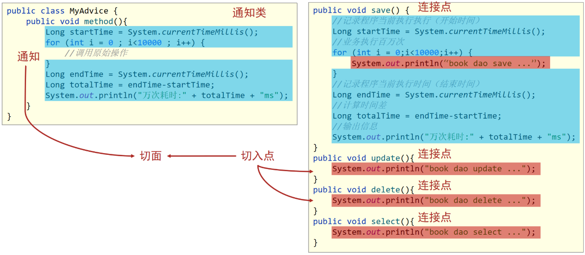
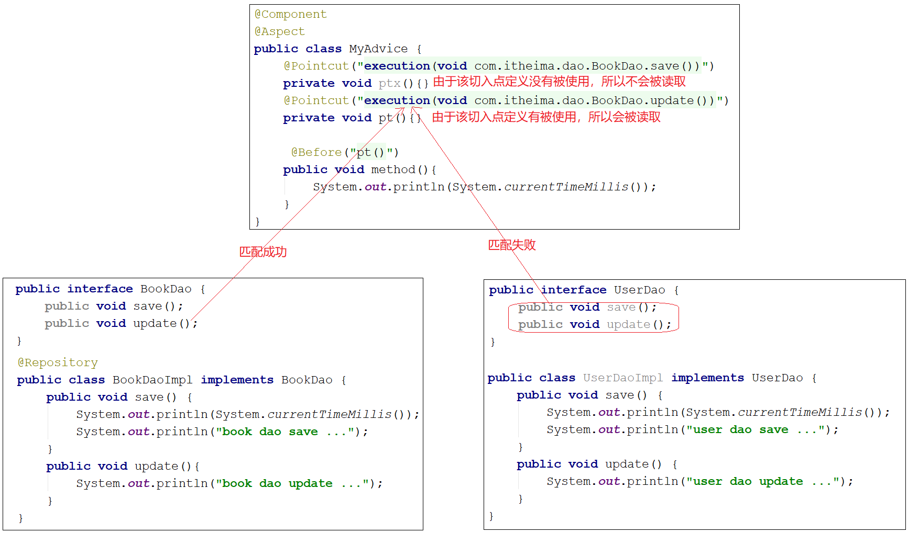
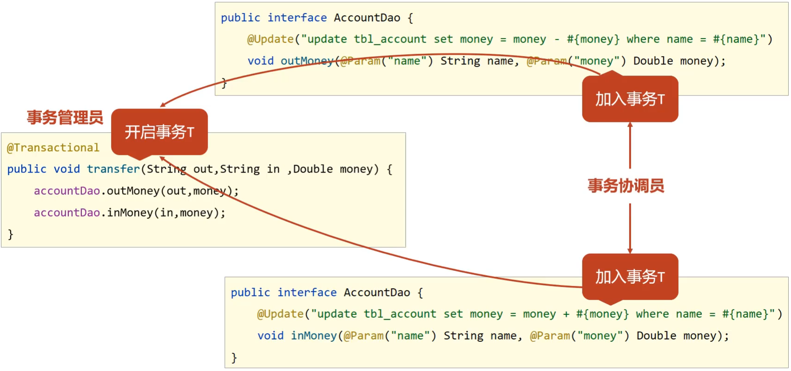

# SSM复习笔记

## 首部记忆导图（Mermaid）


## 核心正文笔记

这三天的主线可以压成一句话：**Spring 用 IoC/DI 管对象和依赖，用 AOP 管横切增强，用声明式事务保证业务一致性，再通过 IoC 把 MyBatis、数据源、JUnit 等技术整合进同一个容器。**复习时不要先背注解清单，先问每个技术点解决什么问题，再记住它的配置入口。

### 文档结构

这份 SSM 笔记按“先容器、再 Web、再持久层增强、最后项目化”的顺序组织：

- **第一部分：Spring Framework**，对应下面第 1 到第 6 节，重点是 IoC/DI、AOP、事务和 Spring 整合 MyBatis。
- **第二部分：SpringMVC**，对应下面第 7 节开始，重点是请求入口、参数绑定、JSON 响应、REST、SSM 整合、统一结果、统一异常和拦截器。
- **后续预留：MyBatisPlus 与项目整合**，后面继续追加时直接接在 SpringMVC 之后即可。

### 1. Spring 学习主线

Spring 这里主要指 **Spring Framework**。它是 SpringBoot、SpringCloud 等生态项目的底层基础。课程中的四块重点是：

- `IoC/DI`：把对象创建和对象关系交给容器，降低业务代码耦合
- `Spring 整合 MyBatis`：IoC/DI 的典型应用，把数据源、`SqlSessionFactory`、Mapper 代理交给 Spring
- `AOP`：不修改原始代码，对方法做统一增强
- `声明式事务`：AOP 的典型应用，在业务层保证多个数据库操作同成功同失败


> **重难点：**IoC、AOP、事务不是三件孤立的事。IoC 先让对象进入容器，AOP 才能基于容器中的 Bean 创建代理，事务又依赖 AOP 在业务方法前后开启、提交或回滚事务。

### 2. IoC/DI：把 new 和依赖关系交给容器

没有 Spring 时，业务层常见写法是 `private BookDao bookDao = new BookDaoImpl();`。这种写法的问题是：业务层知道了具体实现类，一旦 Dao 实现变化，Service 也跟着改。Spring 的做法是把对象创建权转交给外部容器，这就是 **IoC 控制反转**；容器再把 Service 需要的 Dao 注入进去，这就是 **DI 依赖注入**。

| 概念 | 记忆方式 | 解决的问题 |
| --- | --- | --- |
| `IoC` | 创建权反转 | 不在业务代码里主动 `new` |
| `IoC 容器` | Spring 提供的对象仓库 | 创建、初始化、保存 Bean |
| `Bean` | 容器管理的对象 | Service、Dao、工具类、第三方对象 |
| `DI` | 依赖关系注入 | 让 Service 拿到容器中的 Dao |

最小 XML 配置如下：

```xml
<beans xmlns="http://www.springframework.org/schema/beans"
       xmlns:xsi="http://www.w3.org/2001/XMLSchema-instance"
       xsi:schemaLocation="
          http://www.springframework.org/schema/beans
          http://www.springframework.org/schema/beans/spring-beans.xsd">

    <bean id="bookDao" class="com.itheima.dao.impl.BookDaoImpl"/>

    <bean id="bookService" class="com.itheima.service.impl.BookServiceImpl">
        <property name="bookDao" ref="bookDao"/>
    </bean>
</beans>
```

```java
ApplicationContext ctx = new ClassPathXmlApplicationContext("applicationContext.xml");
BookService bookService = (BookService) ctx.getBean("bookService");
bookService.save();
```

> **易错：**`property name="bookDao"` 和 `ref="bookDao"` 不是同一个含义。`name` 对应 `setBookDao(...)` 这个属性入口，`ref` 对应容器中 id 为 `bookDao` 的 Bean。

#### Bean 基础配置

`<bean id="" class=""/>` 是核心。`id` 是容器中的唯一标识，`class` 必须写可实例化的实现类，不能写接口。`name` 可以给 Bean 起多个别名，别名可以用空格、逗号、分号分隔。

`scope` 控制 Bean 的作用范围：

| scope | 含义 | 典型场景 |
| --- | --- | --- |
| `singleton` | 默认值，容器中一个对象 | 大多数 Service、Dao、工具类 |
| `prototype` | 每次获取都创建新对象 | 有状态、每次需要独立实例的对象 |

> **易忘：**单例 Bean 适合无状态对象。若 Bean 有成员变量存放请求数据，多线程共用时可能产生线程安全问题。封装请求数据的实体对象通常不交给 Spring 容器统一管理。

#### Bean 实例化与生命周期

Spring 常见实例化方式有三种：无参构造方法、静态工厂、实例工厂。平时最常用的是 **无参构造方法**，整合框架时常见 **FactoryBean**。

```java
public class UserDaoFactoryBean implements FactoryBean<UserDao> {
    public UserDao getObject() {
        return new UserDaoImpl();
    }

    public Class<?> getObjectType() {
        return UserDao.class;
    }

    public boolean isSingleton() {
        return true;
    }
}
```

生命周期的顺序要按“容器创建对象”的过程记：

1. 分配内存并创建对象
2. 执行构造方法
3. 执行属性注入，也就是 setter 或构造器注入
4. 执行初始化方法
5. 业务使用 Bean
6. 关闭容器时执行销毁方法

XML 生命周期配置：

```xml
<bean id="bookDao"
      class="com.itheima.dao.impl.BookDaoImpl"
      init-method="init"
      destroy-method="destroy"/>
```

```java
ClassPathXmlApplicationContext ctx =
    new ClassPathXmlApplicationContext("applicationContext.xml");
ctx.registerShutdownHook(); // JVM 退出前关闭容器
// ctx.close();             // 立即关闭容器
```

> **易错：**`ApplicationContext` 接口本身没有 `close()` 和 `registerShutdownHook()`。需要使用 `ClassPathXmlApplicationContext` 或其父接口 `ConfigurableApplicationContext`。

#### DI 注入方式

setter 注入适合可选依赖，构造器注入适合对象创建时必须具备的强依赖。自己写的模块课程中推荐 setter 注入，第三方框架根据它提供的 API 决定。

```xml
<!-- setter 注入引用类型 -->
<property name="bookDao" ref="bookDao"/>

<!-- setter 注入简单类型 -->
<property name="databaseName" value="mysql"/>

<!-- 构造器注入引用类型 -->
<constructor-arg name="bookDao" ref="bookDao"/>

<!-- 构造器注入简单类型 -->
<constructor-arg name="connectionNum" value="10"/>
```

构造器注入还可以用 `type` 或 `index`，但它们分别会和参数类型、参数顺序耦合。复习时记住：**`name` 看形参名，`type` 看类型，`index` 看位置。**

集合注入常用标签：

```xml
<property name="list">
    <list>
        <value>itheima</value>
        <value>boxuegu</value>
    </list>
</property>

<property name="map">
    <map>
        <entry key="country" value="china"/>
        <entry key="city" value="kaifeng"/>
    </map>
</property>

<property name="properties">
    <props>
        <prop key="driver">com.mysql.jdbc.Driver</prop>
    </props>
</property>
```

XML 自动装配用 `autowire`：

```xml
<bean id="bookService"
      class="com.itheima.service.impl.BookServiceImpl"
      autowire="byType"/>
```

> **易错：**`byType` 要求容器中同类型 Bean 唯一，否则抛 `NoUniqueBeanDefinitionException`。`byName` 根据 setter 推出的属性名找 Bean，找不到可能注入 `null`，变量名与配置耦合更强。

#### 外部 properties 文件

数据库四要素不应写死在 XML 中。XML 方式先开启 `context` 命名空间，再加载配置文件：

```xml
<context:property-placeholder
    location="classpath:jdbc.properties"
    system-properties-mode="NEVER"/>

<bean id="dataSource" class="com.alibaba.druid.pool.DruidDataSource">
    <property name="driverClassName" value="${jdbc.driver}"/>
    <property name="url" value="${jdbc.url}"/>
    <property name="username" value="${jdbc.username}"/>
    <property name="password" value="${jdbc.password}"/>
</bean>
```

```properties
jdbc.driver=com.mysql.jdbc.Driver
jdbc.url=jdbc:mysql://127.0.0.1:3306/spring_db
jdbc.username=root
jdbc.password=root
```

> **易忘：**不要随手把 key 写成 `username`。`property-placeholder` 默认可能读取系统环境变量，导致 `${username}` 取到电脑用户名。解决方式是使用 `jdbc.username` 这类带前缀的 key，或配置 `system-properties-mode="NEVER"`。

#### 核心容器

`ApplicationContext` 是最常用的 Spring 容器接口，常用实现类如下：

| 创建方式 | 说明 | 复习结论 |
| --- | --- | --- |
| `ClassPathXmlApplicationContext` | 从类路径加载 XML | 常用 |
| `FileSystemXmlApplicationContext` | 从文件系统路径加载 XML | 路径耦合强，了解 |
| `AnnotationConfigApplicationContext` | 从配置类加载 | 纯注解开发常用 |

Bean 获取方式：

```java
ctx.getBean("bookDao");                    // 按名称，需强转
ctx.getBean("bookDao", BookDao.class);     // 按名称 + 类型
ctx.getBean(BookDao.class);                // 按类型，要求同类型唯一
```

`BeanFactory` 是 IoC 容器的顶层接口，默认延迟加载 Bean；`ApplicationContext` 功能更完整，默认容器初始化时立即创建单例 Bean。若想让某个 Bean 延迟加载，可配置 `lazy-init="true"`。

### 3. 注解开发：从 XML 转向配置类

注解开发的核心变化是：用类上的注解代替 XML 中的 `<bean>`，用配置类代替 `applicationContext.xml`。

```java
@Configuration
@ComponentScan("com.itheima")
public class SpringConfig {
}
```

```java
ApplicationContext ctx =
    new AnnotationConfigApplicationContext(SpringConfig.class);
```

定义 Bean 的四个常用注解：

| 注解 | 层次语义 | 本质 |
| --- | --- | --- |
| `@Component` | 普通组件 | 交给 Spring 管理 |
| `@Controller` | 表现层 | `@Component` 衍生 |
| `@Service` | 业务层 | `@Component` 衍生 |
| `@Repository` | 数据层 | `@Component` 衍生 |

```java
@Repository("bookDao")
public class BookDaoImpl implements BookDao {
    public void save() {
        System.out.println("book dao save ...");
    }
}
```

> **易错：**`@Component`、`@Service`、`@Repository` 不能写在接口上，因为接口无法实例化。通常写在实现类上。

注解版作用域和生命周期：

```java
@Repository
@Scope("prototype")
public class BookDaoImpl implements BookDao {
    @PostConstruct
    public void init() {
        System.out.println("init ...");
    }

    @PreDestroy
    public void destroy() {
        System.out.println("destroy ...");
    }
}
```

> **易忘：**JDK 9 以后如果找不到 `@PostConstruct` 和 `@PreDestroy`，需要补 `javax.annotation-api` 依赖。

#### 注解版依赖注入

`@Autowired` 用于引用类型注入，默认先按类型找。若同类型 Bean 有多个，再尝试按变量名匹配 Bean 名称；仍不能确定时，用 `@Qualifier` 明确指定。

```java
@Service
public class BookServiceImpl implements BookService {
    @Autowired
    @Qualifier("bookDao")
    private BookDao bookDao;

    public void save() {
        bookDao.save();
    }
}
```

`@Value` 用于简单类型或字符串：

```java
@Repository
public class BookDaoImpl implements BookDao {
    @Value("${name}")
    private String name;
}
```

配置类加载 properties：

```java
@Configuration
@ComponentScan("com.itheima")
@PropertySource("classpath:jdbc.properties")
public class SpringConfig {
}
```

> **易错：**`@Qualifier` 不能单独使用，必须配合 `@Autowired`。`@PropertySource` 可以写数组加载多个文件，但不支持 `*.properties` 通配符。

#### 管理第三方 Bean：@Bean 与 @Import

第三方类在 jar 包中，不能去它源码上加 `@Component`。这时在配置类中写方法，并用 `@Bean` 把返回值交给容器。

```java
public class JdbcConfig {
    @Value("${jdbc.driver}")
    private String driver;
    @Value("${jdbc.url}")
    private String url;
    @Value("${jdbc.username}")
    private String userName;
    @Value("${jdbc.password}")
    private String password;

    @Bean
    public DataSource dataSource() {
        DruidDataSource ds = new DruidDataSource();
        ds.setDriverClassName(driver);
        ds.setUrl(url);
        ds.setUsername(userName);
        ds.setPassword(password);
        return ds;
    }
}
```

主配置类引入外部配置类：

```java
@Configuration
@ComponentScan("com.itheima")
@PropertySource("classpath:jdbc.properties")
@Import({JdbcConfig.class})
public class SpringConfig {
}
```

如果 `@Bean` 方法需要引用类型参数，Spring 会按类型从容器自动装配：

```java
@Bean
public DataSource dataSource(BookDao bookDao) {
    System.out.println(bookDao);
    DruidDataSource ds = new DruidDataSource();
    return ds;
}
```

> **易错：**创建 Druid 时变量类型最好写 `DruidDataSource ds = new DruidDataSource();`。如果写成 `DataSource ds`，接口上没有 Druid 相关 setter，无法设置连接属性。

### 4. Spring 整合 MyBatis 与 JUnit

整合 MyBatis 的本质是：**把 MyBatis 原本自己创建和管理的关键对象交给 Spring 容器。**真正需要 Spring 管的是 `SqlSessionFactory` 以及 Mapper 接口代理。

准备数据表和实体：

```sql
create database spring_db character set utf8;
use spring_db;

create table tbl_account(
    id int primary key auto_increment,
    name varchar(35),
    money double
);
```

Mapper 接口可以使用 MyBatis 注解：

```java
public interface AccountDao {
    @Insert("insert into tbl_account(name,money) values(#{name},#{money})")
    void save(Account account);

    @Delete("delete from tbl_account where id = #{id}")
    void delete(Integer id);

    @Update("update tbl_account set name = #{name}, money = #{money} where id = #{id}")
    void update(Account account);

    @Select("select * from tbl_account")
    List<Account> findAll();

    @Select("select * from tbl_account where id = #{id}")
    Account findById(Integer id);
}
```

Service 交给 Spring 管理，Dao 通过自动装配拿到 Mapper 代理对象：

```java
@Service
public class AccountServiceImpl implements AccountService {
    @Autowired
    private AccountDao accountDao;

    public Account findById(Integer id) {
        return accountDao.findById(id);
    }
}
```

MyBatis 整合配置类记住两个核心 Bean：

```java
public class MybatisConfig {
    @Bean
    public SqlSessionFactoryBean sqlSessionFactory(DataSource dataSource) {
        SqlSessionFactoryBean ssfb = new SqlSessionFactoryBean();
        ssfb.setTypeAliasesPackage("com.itheima.domain");
        ssfb.setDataSource(dataSource);
        return ssfb;
    }

    @Bean
    public MapperScannerConfigurer mapperScannerConfigurer() {
        MapperScannerConfigurer msc = new MapperScannerConfigurer();
        msc.setBasePackage("com.itheima.dao");
        return msc;
    }
}
```

主配置类组合 Spring、Jdbc、MyBatis：

```java
@Configuration
@ComponentScan("com.itheima")
@PropertySource("classpath:jdbc.properties")
@Import({JdbcConfig.class, MybatisConfig.class})
public class SpringConfig {
}
```

> **重难点：**`SqlSessionFactoryBean` 负责创建 `SqlSessionFactory`，`MapperScannerConfigurer` 负责扫描 Dao 接口并创建 Mapper 代理对象。前者服务于会话工厂，后者服务于 Mapper 注入，不要混成一个概念。

整合 JUnit 后，测试类不用手动创建 Spring 容器：

```java
@RunWith(SpringJUnit4ClassRunner.class)
@ContextConfiguration(classes = SpringConfig.class)
public class AccountServiceTest {
    @Autowired
    private AccountService accountService;

    @Test
    public void testFindById() {
        System.out.println(accountService.findById(1));
    }
}
```

如果加载 XML，则写成：

```java
@ContextConfiguration(locations = {"classpath:applicationContext.xml"})
```

### 5. AOP：不改原代码做统一增强

AOP 的一句话定义：**在不改变原始设计的基础上，对指定方法添加共性功能。**例如统计业务方法执行耗时、统一日志、参数清洗、权限校验、事务管理。



核心概念按“谁、在哪、做什么、怎么绑定”来记：

| 概念 | 含义 | 记忆 |
| --- | --- | --- |
| `JoinPoint` 连接点 | 程序执行过程中的位置，Spring AOP 中主要指方法执行 | 所有可被拦的方法 |
| `Pointcut` 切入点 | 匹配连接点的表达式 | 真正要增强的方法 |
| `Advice` 通知 | 在切入点执行的共性功能 | 增强代码 |
| `Aspect` 切面 | 通知与切入点的对应关系 | 哪些方法加哪些增强 |
| `Target` 目标对象 | 被代理的原始对象 | 原始 Bean |
| `Proxy` 代理对象 | Spring 为目标对象创建的增强对象 | 容器中拿到的可能是它 |

AOP 入门配置：

```xml
<dependency>
    <groupId>org.aspectj</groupId>
    <artifactId>aspectjweaver</artifactId>
    <version>1.9.4</version>
</dependency>
```

```java
@Configuration
@ComponentScan("com.itheima")
@EnableAspectJAutoProxy
public class SpringConfig {
}
```

```java
@Component
@Aspect
public class MyAdvice {
    @Pointcut("execution(void com.itheima.dao.BookDao.update())")
    private void pt() {}

    @Before("pt()")
    public void method() {
        System.out.println(System.currentTimeMillis());
    }
}
```

> **易忘：**`@Aspect` 只声明这是切面类，`@Component` 才让它进入 Spring 容器，`@EnableAspectJAutoProxy` 才开启注解式 AOP。三者缺一个，AOP 都可能不生效。

#### AOP 工作流程

Spring 容器启动时先加载 Bean 定义和切面配置；初始化 Bean 时判断其方法是否匹配切入点；如果匹配，容器中保存代理对象；如果不匹配，保存原始对象。调用 Bean 方法时，若拿到的是代理对象，就按通知类型执行增强和原始方法。



验证是否是代理对象，不要直接 `System.out.println(bookDao)`，因为可能走重写后的 `toString()`。应打印：

```java
System.out.println(bookDao.getClass());
```

#### 切入点表达式

标准格式：

```text
execution(访问修饰符 返回值 包名.类名/接口名.方法名(参数) 异常名)
```

示例：

```java
execution(public User com.itheima.service.UserService.findById(int))
execution(* com.itheima.service.*Service.*(..))
```

常用通配符：

| 通配符 | 含义 | 示例 |
| --- | --- | --- |
| `*` | 单个任意符号 | 任意返回值、任意类名、任意方法名片段 |
| `..` | 多个连续任意符号 | 任意层级包、任意参数 |
| `+` | 匹配子类类型 | 使用率低 |

书写技巧：

- 通常描述接口，不描述实现类，减少耦合
- 访问修饰符一般省略
- 查询方法返回值常用 `*`，增删改可写精准返回值
- 包名尽量少用大范围 `..`，避免匹配范围过大
- 业务层常用 `execution(* com.itheima.service.*Service.*(..))`
- 方法名保留动词，如 `getBy*`、`save*`、`update*`

> **易错：**`execution(* *..*(..))` 可以匹配项目中任意包任意类的任意方法，范围过大，不建议在真实项目中随手使用。

#### 五种通知类型

| 通知 | 注解 | 执行时机 | 复习重点 |
| --- | --- | --- | --- |
| 前置通知 | `@Before` | 原始方法前 | 不能控制原始方法是否执行 |
| 后置通知 | `@After` | 原始方法后 | 无论是否异常都可能执行 |
| 环绕通知 | `@Around` | 原始方法前后 | 最重要，可控制调用、参数、返回值、异常 |
| 返回后通知 | `@AfterReturning` | 正常返回后 | 可拿返回值 |
| 异常后通知 | `@AfterThrowing` | 抛异常后 | 可拿异常 |

环绕通知最容易出错，标准写法如下：

```java
@Around("servicePt()")
public Object runSpeed(ProceedingJoinPoint pjp) throws Throwable {
    long start = System.currentTimeMillis();

    Object ret = pjp.proceed();

    long end = System.currentTimeMillis();
    System.out.println("执行时间: " + (end - start) + "ms");
    return ret;
}
```

> **重难点：**环绕通知如果不调用 `pjp.proceed()`，原始方法就不会执行。如果原始方法有返回值，环绕通知也要返回对应值，通常写 `Object` 最稳。

统计业务层方法万次执行耗时：

```java
@Component
@Aspect
public class ProjectAdvice {
    @Pointcut("execution(* com.itheima.service.*Service.*(..))")
    private void servicePt() {}

    @Around("servicePt()")
    public Object runSpeed(ProceedingJoinPoint pjp) throws Throwable {
        Signature signature = pjp.getSignature();
        String className = signature.getDeclaringTypeName();
        String methodName = signature.getName();

        long start = System.currentTimeMillis();
        Object ret = null;
        for (int i = 0; i < 10000; i++) {
            ret = pjp.proceed();
        }
        long end = System.currentTimeMillis();

        System.out.println("万次执行: " + className + "." + methodName + " -> " + (end - start) + "ms");
        return ret;
    }
}
```

#### 通知获取参数、返回值、异常

非环绕通知用 `JoinPoint` 获取参数：

```java
@Before("pt()")
public void before(JoinPoint jp) {
    Object[] args = jp.getArgs();
    System.out.println(Arrays.toString(args));
}
```

环绕通知用 `ProceedingJoinPoint` 获取并可修改参数：

```java
@Around("pt()")
public Object around(ProceedingJoinPoint pjp) throws Throwable {
    Object[] args = pjp.getArgs();
    args[0] = 666;
    return pjp.proceed(args);
}
```

返回后通知获取返回值：

```java
@AfterReturning(value = "pt()", returning = "ret")
public void afterReturning(Object ret) {
    System.out.println("返回值: " + ret);
}
```

异常后通知获取异常：

```java
@AfterThrowing(value = "pt()", throwing = "t")
public void afterThrowing(Throwable t) {
    System.out.println("异常: " + t);
}
```

提示性案例：百度网盘提取码多空格兼容。需求是在业务方法执行前，对所有字符串参数做 `trim()`，再调用原始方法，因此必须用环绕通知。

```java
@Component
@Aspect
public class DataAdvice {
    @Pointcut("execution(boolean com.itheima.service.*Service.*(*,*))")
    private void servicePt() {}

    @Around("servicePt()")
    public Object trimStr(ProceedingJoinPoint pjp) throws Throwable {
        Object[] args = pjp.getArgs();
        for (int i = 0; i < args.length; i++) {
            if (args[i] != null && args[i].getClass().equals(String.class)) {
                args[i] = args[i].toString().trim();
            }
        }
        return pjp.proceed(args);
    }
}
```

> **易错：**如果处理参数后仍调用 `pjp.proceed()`，原方法拿到的还是原参数。必须调用 `pjp.proceed(args)` 才能把修改后的参数传进去。

### 6. 声明式事务：业务整体同成功同失败

事务的作用是在一组数据库操作中保证一致性。数据层单个方法自带事务还不够，因为转账业务包含“转出账户扣钱”和“转入账户加钱”两个 Dao 操作。若事务只在 Dao 层，各操作各自提交，中间异常会导致一个成功、一个失败。因此事务应加在 **业务层方法** 上。

转账 Dao：

```java
public interface AccountDao {
    @Update("update tbl_account set money = money + #{money} where name = #{name}")
    void inMoney(@Param("name") String name, @Param("money") Double money);

    @Update("update tbl_account set money = money - #{money} where name = #{name}")
    void outMoney(@Param("name") String name, @Param("money") Double money);
}
```

业务方法：

```java
@Service
public class AccountServiceImpl implements AccountService {
    @Autowired
    private AccountDao accountDao;

    @Transactional
    public void transfer(String out, String in, Double money) {
        accountDao.outMoney(out, money);
        int i = 1 / 0;
        accountDao.inMoney(in, money);
    }
}
```

事务管理器配置：

```java
public class JdbcConfig {
    @Bean
    public PlatformTransactionManager transactionManager(DataSource dataSource) {
        DataSourceTransactionManager transactionManager = new DataSourceTransactionManager();
        transactionManager.setDataSource(dataSource);
        return transactionManager;
    }
}
```

开启注解式事务：

```java
@Configuration
@ComponentScan("com.itheima")
@PropertySource("classpath:jdbc.properties")
@Import({JdbcConfig.class, MybatisConfig.class})
@EnableTransactionManagement
public class SpringConfig {
}
```

> **重难点：**MyBatis 底层使用 JDBC 事务，所以这里选 `DataSourceTransactionManager`。事务管理器和 `SqlSessionFactoryBean` 必须使用同一个 `DataSource`，否则事务无法正确协调同一批数据库操作。

`@Transactional` 可以写在接口、接口方法、实现类、实现类方法上。课程建议写在实现类或实现类方法上。方法上的配置粒度更细，类上的配置适合该类所有方法都需要事务。

#### 事务角色

| 角色 | 含义 | 例子 |
| --- | --- | --- |
| 事务管理员 | 发起事务的一方 | `AccountService.transfer()` |
| 事务协调员 | 加入事务的一方 | `outMoney()`、`inMoney()`、其他被调用业务方法 |

未开启 Spring 事务时，两个 Dao 修改方法可能分别提交。开启后，业务层的 `transfer()` 携带一个大事务，Dao 操作加入该事务，中间异常则整体回滚。



#### 事务属性

常见属性都配置在 `@Transactional(...)` 中：

| 属性 | 含义 | 记忆点 |
| --- | --- | --- |
| `readOnly` | 只读事务 | 查询可设 `true`，增删改必须 `false` |
| `timeout` | 超时时间，单位秒 | `-1` 表示不设置 |
| `rollbackFor` | 指定哪些异常回滚 | 检查异常常用 |
| `noRollbackFor` | 指定哪些异常不回滚 | 特殊业务才用 |
| `isolation` | 隔离级别 | 默认跟随数据库 |
| `propagation` | 传播行为 | 多事务协作重点 |

默认情况下，Spring 只对 `RuntimeException`、`Error` 及其子类回滚。`IOException` 这类检查异常默认不回滚，需要显式指定：

```java
@Transactional(rollbackFor = IOException.class)
public void transfer(String out, String in, Double money) throws IOException {
    accountDao.outMoney(out, money);
    throw new IOException();
}
```

> **易错：**“抛异常就一定回滚”是错的。默认只回滚运行时异常和 Error。检查异常要用 `rollbackFor`。

#### 事务传播行为

传播行为描述的是：事务协调员如何处理事务管理员携带来的事务。默认是 `REQUIRED`，表示当前有事务就加入，没有事务就新建。

转账追加日志案例要求：**转账成功或失败都要记录日志**。如果日志方法使用默认 `REQUIRED`，它会加入转账事务，转账失败时日志也回滚。解决方式是让日志方法开启独立新事务：

```java
@Service
public class LogServiceImpl implements LogService {
    @Autowired
    private LogDao logDao;

    @Transactional(propagation = Propagation.REQUIRES_NEW)
    public void log(String out, String in, Double money) {
        logDao.log("转账操作由" + out + "到" + in + ", 金额: " + money);
    }
}
```

转账业务中用 `finally` 保证日志调用：

```java
@Transactional
public void transfer(String out, String in, Double money) {
    try {
        accountDao.outMoney(out, money);
        int i = 1 / 0;
        accountDao.inMoney(in, money);
    } finally {
        logService.log(out, in, money);
    }
}
```

> **重难点：**`REQUIRES_NEW` 会开启一个新事务，并与当前事务隔离。转账事务回滚，不影响日志事务提交。这是“主业务失败但审计日志保留”的典型场景。

### 7. SpringMVC 学习主线

SpringMVC 是 Spring Framework 体系里的 **Web 表现层框架**，本质上是对 Servlet 开发的封装。复习它不要从注解开始背，而要先记住一条请求链：

> **浏览器发送请求 -> Tomcat 接收 -> DispatcherServlet 统一分发 -> Controller 方法处理 -> 参数绑定/业务调用 -> 消息转换器把结果写回响应体。**

传统 Servlet 开发的问题是：每个 Servlet 往往对应一类请求，路径映射、参数获取、响应输出都要自己写，Web 层代码容易又散又重复。SpringMVC 把这些重复工作抽出来，让开发者主要关注 `Controller` 方法。

| 学习块 | 解决的问题 | 关键记忆点 |
| --- | --- | --- |
| 入门配置 | SpringMVC 如何接管 Web 请求 | `DispatcherServlet` 是统一入口 |
| Bean 加载控制 | Spring 和 SpringMVC 谁管哪些 Bean | MVC 容器管 Controller，Spring 容器管 Service/Dao/事务 |
| 请求参数 | 前端数据如何进入 Java 方法 | 普通参数、POJO、数组、集合、JSON、路径变量 |
| 响应结果 | Java 返回值如何变成响应内容 | `@ResponseBody` + Jackson + `@EnableWebMvc` |
| REST 风格 | 用统一 URL 表示资源操作 | 资源名用名词，动作交给 HTTP 方法 |
| SSM 整合 | SpringMVC + Spring + MyBatis 协同 | Web 入口加载两个容器配置 |
| 统一结果/异常 | 前后端通信协议稳定 | `Result`、`Code`、`@RestControllerAdvice` |
| 拦截器 | Controller 前后做统一增强 | `preHandle` 控制是否放行 |

> **重难点：**SpringMVC 和 Spring 不是两套互不相干的框架。SpringMVC 负责“请求进来怎么找 Controller、数据怎么收发”；Spring 负责“业务对象、数据源、Mapper、事务怎么管理”。SSM 整合时，二者通过父子容器协作。

### 8. SpringMVC 入门：让 DispatcherServlet 接管请求

SpringMVC 入门案例可以按 Servlet 的替代路线记：以前写 `Servlet + web.xml`，现在写 `Controller + SpringMVC 配置类 + Web 容器初始化类`。

Maven Web 工程的关键依赖：

```xml
<dependencies>
    <dependency>
        <groupId>javax.servlet</groupId>
        <artifactId>javax.servlet-api</artifactId>
        <version>3.1.0</version>
        <scope>provided</scope>
    </dependency>

    <dependency>
        <groupId>org.springframework</groupId>
        <artifactId>spring-webmvc</artifactId>
        <version>5.2.10.RELEASE</version>
    </dependency>
</dependencies>
```

> **易错：**`servlet-api` 必须用 `provided`。Tomcat 运行时已经提供 Servlet API，如果项目再把它打进运行环境，容易和 Tomcat 自带 jar 冲突。

SpringMVC 配置类只扫描表现层：

```java
@Configuration
@ComponentScan("com.itheima.controller")
public class SpringMvcConfig {
}
```

控制器方法：

```java
@Controller
public class UserController {
    @RequestMapping("/save")
    @ResponseBody
    public String save() {
        System.out.println("user save ...");
        return "{'info':'springmvc'}";
    }
}
```

Web 容器初始化类用于替代 `web.xml`：

```java
public class ServletContainersInitConfig extends AbstractDispatcherServletInitializer {
    @Override
    protected WebApplicationContext createServletApplicationContext() {
        AnnotationConfigWebApplicationContext ctx =
                new AnnotationConfigWebApplicationContext();
        ctx.register(SpringMvcConfig.class);
        return ctx;
    }

    @Override
    protected String[] getServletMappings() {
        return new String[]{"/"};
    }

    @Override
    protected WebApplicationContext createRootApplicationContext() {
        return null;
    }
}
```

这段配置的含义要拆开记：

- `createServletApplicationContext()`：创建 SpringMVC 容器，加载 Controller 等表现层 Bean。
- `getServletMappings()`：设置 SpringMVC 拦截哪些请求，`/` 表示除 JSP 外几乎都交给 SpringMVC。
- `createRootApplicationContext()`：创建 Spring 根容器，SSM 整合时用来加载 Spring、Service、Dao、事务等配置。

> **易错：**Controller 方法如果直接返回 `String`，默认会被当作“视图名称”解析。想把字符串本身写回浏览器，必须加 `@ResponseBody`，或者在类上用 `@RestController`。

SpringMVC 单次请求流程：

1. 浏览器请求 `/save`。
2. Tomcat 根据 Servlet 映射规则，把请求交给 SpringMVC 的 `DispatcherServlet`。
3. SpringMVC 查找 `/save` 对应的 Controller 方法。
4. 执行 `save()`。
5. 发现 `@ResponseBody`，不走页面解析，直接把返回值写入响应体。

### 9. Spring 与 SpringMVC 的 Bean 加载边界

SSM 项目里通常同时存在 `SpringConfig` 和 `SpringMvcConfig`。这不是重复配置，而是职责分离：

| 容器 | 应加载的 Bean | 不建议加载的 Bean |
| --- | --- | --- |
| SpringMVC 容器 | `Controller`、MVC 配置、拦截器、静态资源映射 | Service、Dao、DataSource、事务 |
| Spring 根容器 | `Service`、Dao/Mapper、DataSource、MyBatis、事务管理器 | Controller |

推荐写法是精准扫描：

```java
@Configuration
@ComponentScan("com.itheima.controller")
@EnableWebMvc
public class SpringMvcConfig {
}
```

```java
@Configuration
@ComponentScan("com.itheima.service")
@PropertySource("classpath:jdbc.properties")
@Import({JdbcConfig.class, MyBatisConfig.class})
@EnableTransactionManagement
public class SpringConfig {
}
```

如果 Spring 根容器扫描范围写成 `com.itheima`，就可能把 `Controller` 也扫进去。可用排除过滤：

```java
@Configuration
@ComponentScan(
    value = "com.itheima",
    excludeFilters = @ComponentScan.Filter(
        type = FilterType.ANNOTATION,
        classes = Controller.class
    )
)
public class SpringConfig {
}
```

> **重难点：**Controller 最好只在 SpringMVC 容器中。表现层 Bean 被 Spring 根容器提前扫描进去，轻则结构混乱，重则 MVC 特性、拦截器、异常处理等协作关系不清晰。

### 10. 请求映射与参数绑定

`@RequestMapping` 可以写在类上和方法上。类上路径负责抽公共前缀，方法上路径负责具体动作：

```java
@Controller
@RequestMapping("/user")
public class UserController {
    @RequestMapping("/save")
    @ResponseBody
    public String save() {
        return "{'module':'user save'}";
    }
}
```

最终访问路径是 `/user/save`。

#### 普通参数

请求地址：

```text
GET /commonParam?name=itheima&age=15
```

后端接收：

```java
@RequestMapping("/commonParam")
@ResponseBody
public String commonParam(String name, int age) {
    System.out.println("name = " + name + ", age = " + age);
    return "{'module':'common param'}";
}
```

如果请求参数名和方法形参名不一致，用 `@RequestParam` 指定：

```java
@RequestMapping("/commonParamDifferentName")
@ResponseBody
public String commonParamDifferentName(@RequestParam("name") String userName, int age) {
    System.out.println("userName = " + userName + ", age = " + age);
    return "{'module':'common param different name'}";
}
```

> **易错：**`@RequestParam` 用于 URL 参数或表单参数，不用于接收 JSON 请求体。JSON 请求体要用 `@RequestBody`。

#### POJO 与嵌套 POJO

只要请求参数名和对象属性名一致，SpringMVC 会自动封装：

```java
public class User {
    private String name;
    private Integer age;
    private Address address;
    // getter/setter
}
```

请求地址：

```text
GET /pojoParam?name=itheima&age=15&address.province=beijing&address.city=beijing
```

Controller：

```java
@RequestMapping("/pojoParam")
@ResponseBody
public String pojoParam(User user) {
    System.out.println(user);
    return "{'module':'pojo param'}";
}
```

#### 数组与集合

数组适合接收同名多值参数：

```text
GET /arrayParam?likes=game&likes=music&likes=travel
```

```java
@RequestMapping("/arrayParam")
@ResponseBody
public String arrayParam(String[] likes) {
    System.out.println(Arrays.toString(likes));
    return "{'module':'array param'}";
}
```

集合接收同名参数时需要 `@RequestParam`：

```java
@RequestMapping("/listParam")
@ResponseBody
public String listParam(@RequestParam List<String> likes) {
    System.out.println(likes);
    return "{'module':'list param'}";
}
```

> **易错：**普通集合参数如果不加 `@RequestParam`，SpringMVC 容易按复杂对象处理，导致绑定失败。简单集合接收 URL/form 参数时记得加。

#### JSON 参数

接收 JSON 需要三件事：

1. 导入 Jackson 依赖。
2. SpringMVC 配置类加 `@EnableWebMvc`，开启 MVC 注解支持与消息转换。
3. Controller 形参加 `@RequestBody`。

```xml
<dependency>
    <groupId>com.fasterxml.jackson.core</groupId>
    <artifactId>jackson-databind</artifactId>
    <version>2.9.0</version>
</dependency>
```

```java
@Configuration
@ComponentScan("com.itheima.controller")
@EnableWebMvc
public class SpringMvcConfig {
}
```

JSON 对象：

```json
{
  "name": "itheima",
  "age": 15
}
```

```java
@RequestMapping("/jsonPojoParam")
@ResponseBody
public String jsonPojoParam(@RequestBody User user) {
    System.out.println(user);
    return "{'module':'json pojo param'}";
}
```

JSON 对象数组：

```json
[
  {"name": "itheima", "age": 15},
  {"name": "itcast", "age": 16}
]
```

```java
@RequestMapping("/jsonListParam")
@ResponseBody
public String jsonListParam(@RequestBody List<User> users) {
    System.out.println(users);
    return "{'module':'json list param'}";
}
```

#### 日期参数

默认日期格式通常能接收 `yyyy/MM/dd`，如果前端传 `yyyy-MM-dd` 或带时分秒，需要显式声明格式：

```java
@RequestMapping("/dateParam")
@ResponseBody
public String dateParam(
        Date date,
        @DateTimeFormat(pattern = "yyyy-MM-dd") Date date1,
        @DateTimeFormat(pattern = "yyyy/MM/dd HH:mm:ss") Date date2) {
    System.out.println(date);
    System.out.println(date1);
    System.out.println(date2);
    return "{'module':'date param'}";
}
```

> **易忘：**`@DateTimeFormat` 处理的是请求参数到 Java 日期对象的转换；JSON 日期格式转换属于消息转换器/Jackson 的范畴，不能混为一谈。

### 11. 响应数据：从返回页面到返回 JSON

早期 MVC 会返回页面视图，现在前后端分离更常见，SpringMVC 主要返回 JSON。

返回页面：

```java
@RequestMapping("/toJumpPage")
public String toJumpPage() {
    return "page.jsp";
}
```

返回文本：

```java
@RequestMapping("/toText")
@ResponseBody
public String toText() {
    return "response text";
}
```

返回对象或集合时，SpringMVC 会借助 Jackson 把对象转换成 JSON：

```java
@RequestMapping("/toJsonPojo")
@ResponseBody
public User toJsonPojo() {
    User user = new User();
    user.setName("itheima");
    user.setAge(15);
    return user;
}
```

```java
@RequestMapping("/toJsonList")
@ResponseBody
public List<User> toJsonList() {
    User user1 = new User();
    user1.setName("itheima");
    user1.setAge(15);

    User user2 = new User();
    user2.setName("itcast");
    user2.setAge(16);

    return Arrays.asList(user1, user2);
}
```

> **重难点：**`@ResponseBody` 不是“返回 JSON”的专用注解，它的核心语义是“把返回值写入响应体，不走视图解析”。返回对象能变成 JSON，是因为消息转换器和 Jackson 参与了转换。

### 12. REST 风格：用资源路径统一增删改查

REST 是一种软件架构风格。它强调用 URL 表示资源，用 HTTP 请求方式表示动作：

| 操作 | 传统路径 | REST 路径 | HTTP 方法 |
| --- | --- | --- | --- |
| 新增 | `/saveUser` | `/users` | `POST` |
| 删除 | `/deleteUser?id=1` | `/users/1` | `DELETE` |
| 修改 | `/updateUser` | `/users` | `PUT` |
| 根据 ID 查询 | `/getUserById?id=1` | `/users/1` | `GET` |
| 查询全部 | `/getAllUsers` | `/users` | `GET` |

完整 Controller 写法：

```java
@RestController
@RequestMapping("/books")
public class BookController {
    @PostMapping
    public String save(@RequestBody Book book) {
        System.out.println("book save..." + book);
        return "{'module':'book save'}";
    }

    @DeleteMapping("/{id}")
    public String delete(@PathVariable Integer id) {
        System.out.println("book delete..." + id);
        return "{'module':'book delete'}";
    }

    @PutMapping
    public String update(@RequestBody Book book) {
        System.out.println("book update..." + book);
        return "{'module':'book update'}";
    }

    @GetMapping("/{id}")
    public String getById(@PathVariable Integer id) {
        System.out.println("book getById..." + id);
        return "{'module':'book getById'}";
    }

    @GetMapping
    public String getAll() {
        System.out.println("book getAll...");
        return "{'module':'book getAll'}";
    }
}
```

`@RestController` 等价于 `@Controller + @ResponseBody`，适合整个类都返回响应体的 REST 接口。

`@GetMapping`、`@PostMapping`、`@PutMapping`、`@DeleteMapping` 是 `@RequestMapping(method = ...)` 的快捷写法。

`@PathVariable` 用于接收路径变量：

```java
@DeleteMapping("/{id}")
public String delete(@PathVariable Integer id) {
    return "{'module':'book delete'}";
}
```

如果路径变量名和形参名不一致，需要显式指定：

```java
@DeleteMapping("/{bookId}")
public String delete(@PathVariable("bookId") Integer id) {
    return "{'module':'book delete'}";
}
```

三种常见参数注解对比：

| 注解 | 数据来源 | 典型场景 |
| --- | --- | --- |
| `@RequestParam` | URL 参数、表单参数 | `?name=tom`、普通集合 |
| `@RequestBody` | JSON 请求体 | 新增、修改时提交对象 |
| `@PathVariable` | REST 路径变量 | `/books/1` 中的 `1` |

> **易错：**REST 中路径写资源名，不写动词。`POST /books` 已经表达“新增图书”，不要写成 `POST /books/save`。

### 13. 静态资源放行

当 `DispatcherServlet` 映射为 `/` 时，SpringMVC 会尝试处理很多请求，包括 `/pages/books.html`、`/js/vue.js` 等静态资源。如果没有对应 Controller，就会 404。

解决方式是配置静态资源处理器：

```java
@Configuration
public class SpringMvcSupport extends WebMvcConfigurationSupport {
    @Override
    protected void addResourceHandlers(ResourceHandlerRegistry registry) {
        registry.addResourceHandler("/pages/**").addResourceLocations("/pages/");
        registry.addResourceHandler("/js/**").addResourceLocations("/js/");
        registry.addResourceHandler("/css/**").addResourceLocations("/css/");
        registry.addResourceHandler("/plugins/**").addResourceLocations("/plugins/");
    }
}
```

并保证该配置类能被 SpringMVC 扫描：

```java
@Configuration
@ComponentScan({"com.itheima.controller", "com.itheima.config"})
@EnableWebMvc
public class SpringMvcConfig {
}
```

> **易忘：**静态资源放行配置属于 SpringMVC 容器，不是 Spring 根容器。写了配置类但没被 `SpringMvcConfig` 扫描到，等于没写。

### 14. SSM 整合：两套配置，一个 Web 入口

SSM 整合的核心是让三层各归其位：

- `Controller`：由 SpringMVC 扫描，负责请求、参数、响应。
- `Service`：由 Spring 扫描，负责业务与事务。
- `Dao/Mapper`：由 MyBatis-Spring 扫描代理，交给 Spring 注入。
- `DataSource`、`SqlSessionFactoryBean`、`PlatformTransactionManager`：由 Spring 配置类创建。

#### Web 入口配置

```java
public class ServletConfig extends AbstractAnnotationConfigDispatcherServletInitializer {
    @Override
    protected Class<?>[] getRootConfigClasses() {
        return new Class[]{SpringConfig.class};
    }

    @Override
    protected Class<?>[] getServletConfigClasses() {
        return new Class[]{SpringMvcConfig.class};
    }

    @Override
    protected String[] getServletMappings() {
        return new String[]{"/"};
    }

    @Override
    protected Filter[] getServletFilters() {
        CharacterEncodingFilter filter = new CharacterEncodingFilter();
        filter.setEncoding("utf-8");
        return new Filter[]{filter};
    }
}
```

> **重难点：**`getRootConfigClasses()` 加载 Spring 根容器，`getServletConfigClasses()` 加载 SpringMVC 容器。SSM 整合时不要再返回空数组，否则 Service、Dao、事务等都不会进入 Spring 根容器。

#### Spring 配置

```java
@Configuration
@ComponentScan("com.itheima.service")
@PropertySource("classpath:jdbc.properties")
@Import({JdbcConfig.class, MyBatisConfig.class})
@EnableTransactionManagement
public class SpringConfig {
}
```

#### JDBC 配置

```java
public class JdbcConfig {
    @Value("${jdbc.driver}")
    private String driver;
    @Value("${jdbc.url}")
    private String url;
    @Value("${jdbc.username}")
    private String username;
    @Value("${jdbc.password}")
    private String password;

    @Bean
    public DataSource dataSource() {
        DruidDataSource dataSource = new DruidDataSource();
        dataSource.setDriverClassName(driver);
        dataSource.setUrl(url);
        dataSource.setUsername(username);
        dataSource.setPassword(password);
        return dataSource;
    }

    @Bean
    public PlatformTransactionManager transactionManager(DataSource dataSource) {
        DataSourceTransactionManager ds = new DataSourceTransactionManager();
        ds.setDataSource(dataSource);
        return ds;
    }
}
```

```properties
jdbc.driver=com.mysql.jdbc.Driver
jdbc.url=jdbc:mysql://localhost:3306/ssm_db
jdbc.username=root
jdbc.password=root
```

#### MyBatis 配置

```java
public class MyBatisConfig {
    @Bean
    public SqlSessionFactoryBean sqlSessionFactory(DataSource dataSource) {
        SqlSessionFactoryBean factoryBean = new SqlSessionFactoryBean();
        factoryBean.setDataSource(dataSource);
        factoryBean.setTypeAliasesPackage("com.itheima.domain");
        return factoryBean;
    }

    @Bean
    public MapperScannerConfigurer mapperScannerConfigurer() {
        MapperScannerConfigurer msc = new MapperScannerConfigurer();
        msc.setBasePackage("com.itheima.dao");
        return msc;
    }
}
```

#### SpringMVC 配置

```java
@Configuration
@ComponentScan("com.itheima.controller")
@EnableWebMvc
public class SpringMvcConfig {
}
```

#### 图书模块 CRUD

数据库表：

```sql
create database ssm_db character set utf8;
use ssm_db;

create table tbl_book(
    id int primary key auto_increment,
    type varchar(20),
    name varchar(50),
    description varchar(255)
);
```

实体类：

```java
public class Book {
    private Integer id;
    private String type;
    private String name;
    private String description;
    // getter/setter/toString
}
```

Dao 接口：

```java
public interface BookDao {
    @Insert("insert into tbl_book(type, name, description) values(#{type}, #{name}, #{description})")
    void save(Book book);

    @Update("update tbl_book set type = #{type}, name = #{name}, description = #{description} where id = #{id}")
    void update(Book book);

    @Delete("delete from tbl_book where id = #{id}")
    void delete(Integer id);

    @Select("select * from tbl_book where id = #{id}")
    Book getById(Integer id);

    @Select("select * from tbl_book")
    List<Book> getAll();
}
```

Service：

```java
@Transactional
public interface BookService {
    boolean save(Book book);
    boolean update(Book book);
    boolean delete(Integer id);
    Book getById(Integer id);
    List<Book> getAll();
}
```

```java
@Service
public class BookServiceImpl implements BookService {
    @Autowired
    private BookDao bookDao;

    public boolean save(Book book) {
        bookDao.save(book);
        return true;
    }

    public boolean update(Book book) {
        bookDao.update(book);
        return true;
    }

    public boolean delete(Integer id) {
        bookDao.delete(id);
        return true;
    }

    public Book getById(Integer id) {
        return bookDao.getById(id);
    }

    public List<Book> getAll() {
        return bookDao.getAll();
    }
}
```

Controller：

```java
@RestController
@RequestMapping("/books")
public class BookController {
    @Autowired
    private BookService bookService;

    @PostMapping
    public boolean save(@RequestBody Book book) {
        return bookService.save(book);
    }

    @PutMapping
    public boolean update(@RequestBody Book book) {
        return bookService.update(book);
    }

    @DeleteMapping("/{id}")
    public boolean delete(@PathVariable Integer id) {
        return bookService.delete(id);
    }

    @GetMapping("/{id}")
    public Book getById(@PathVariable Integer id) {
        return bookService.getById(id);
    }

    @GetMapping
    public List<Book> getAll() {
        return bookService.getAll();
    }
}
```

业务层单元测试：

```java
@RunWith(SpringJUnit4ClassRunner.class)
@ContextConfiguration(classes = SpringConfig.class)
public class BookServiceTest {
    @Autowired
    private BookService bookService;

    @Test
    public void testGetById() {
        System.out.println(bookService.getById(1));
    }

    @Test
    public void testGetAll() {
        System.out.println(bookService.getAll());
    }
}
```

> **易错：**IDEA 可能提示 `BookDao` 无法注入，因为它看不到接口实现类。但 MyBatis-Spring 会在运行时创建 Mapper 代理对象并交给 Spring 管理。只要 `MapperScannerConfigurer` 包路径正确，运行时可以正常注入。

### 15. 统一结果封装：前后端约定一种响应格式

如果 Controller 有时返回 `boolean`，有时返回对象，有时返回集合，前端处理会越来越乱。统一结果封装的目的就是让所有接口都返回同一种外壳：

```json
{
  "code": 20041,
  "data": {},
  "msg": "查询成功"
}
```

结果模型：

```java
public class Result {
    private Object data;
    private Integer code;
    private String msg;

    public Result() {
    }

    public Result(Integer code, Object data) {
        this.code = code;
        this.data = data;
    }

    public Result(Integer code, Object data, String msg) {
        this.code = code;
        this.data = data;
        this.msg = msg;
    }

    // getter/setter
}
```

状态码：

```java
public class Code {
    public static final Integer SAVE_OK = 20011;
    public static final Integer DELETE_OK = 20021;
    public static final Integer UPDATE_OK = 20031;
    public static final Integer GET_OK = 20041;

    public static final Integer SAVE_ERR = 20010;
    public static final Integer DELETE_ERR = 20020;
    public static final Integer UPDATE_ERR = 20030;
    public static final Integer GET_ERR = 20040;

    public static final Integer SYSTEM_ERR = 50001;
    public static final Integer SYSTEM_TIMEOUT_ERR = 50002;
    public static final Integer BUSINESS_ERR = 60002;
}
```

Controller 改造：

```java
@RestController
@RequestMapping("/books")
public class BookController {
    @Autowired
    private BookService bookService;

    @PostMapping
    public Result save(@RequestBody Book book) {
        boolean flag = bookService.save(book);
        return new Result(flag ? Code.SAVE_OK : Code.SAVE_ERR, flag);
    }

    @PutMapping
    public Result update(@RequestBody Book book) {
        boolean flag = bookService.update(book);
        return new Result(flag ? Code.UPDATE_OK : Code.UPDATE_ERR, flag);
    }

    @DeleteMapping("/{id}")
    public Result delete(@PathVariable Integer id) {
        boolean flag = bookService.delete(id);
        return new Result(flag ? Code.DELETE_OK : Code.DELETE_ERR, flag);
    }

    @GetMapping("/{id}")
    public Result getById(@PathVariable Integer id) {
        Book book = bookService.getById(id);
        Integer code = book != null ? Code.GET_OK : Code.GET_ERR;
        String msg = book != null ? "" : "数据查询失败，请重试";
        return new Result(code, book, msg);
    }

    @GetMapping
    public Result getAll() {
        List<Book> books = bookService.getAll();
        Integer code = books != null ? Code.GET_OK : Code.GET_ERR;
        String msg = books != null ? "" : "数据查询失败，请重试";
        return new Result(code, books, msg);
    }
}
```

> **重难点：**统一结果封装不是为了“多包一层”好看，而是为了固定前后端协议。前端永远先看 `code` 判断结果，再从 `data` 取业务数据，异常信息从 `msg` 展示。

### 16. 统一异常处理：让异常也走统一协议

如果 Controller 或 Service 抛异常，默认可能返回 Tomcat/SpringMVC 的错误页面或杂乱错误信息。前后端分离项目需要把异常也转成统一 JSON。

统一异常处理器：

```java
@RestControllerAdvice
public class ProjectExceptionAdvice {
    @ExceptionHandler(Exception.class)
    public Result doException(Exception ex) {
        System.out.println("异常被统一处理：" + ex.getMessage());
        return new Result(Code.SYSTEM_ERR, null, "系统繁忙，请稍后再试");
    }
}
```

`@RestControllerAdvice` 可以理解为“给所有 REST Controller 做增强”，`@ExceptionHandler` 指定当前方法处理哪类异常。

更工程化的做法是先区分异常类型：

| 异常类型 | 含义 | 处理思路 |
| --- | --- | --- |
| 系统异常 | 数据库、服务器、网络、第三方服务等不可控问题 | 记录日志，给用户统一友好提示 |
| 业务异常 | 用户操作或业务规则不满足 | 给用户明确可理解提示 |
| 其他异常 | 未预期问题 | 记录日志，给通用提示 |

自定义系统异常：

```java
public class SystemException extends RuntimeException {
    private Integer code;

    public SystemException(Integer code, String message) {
        super(message);
        this.code = code;
    }

    public SystemException(Integer code, String message, Throwable cause) {
        super(message, cause);
        this.code = code;
    }

    public Integer getCode() {
        return code;
    }
}
```

自定义业务异常：

```java
public class BusinessException extends RuntimeException {
    private Integer code;

    public BusinessException(Integer code, String message) {
        super(message);
        this.code = code;
    }

    public Integer getCode() {
        return code;
    }
}
```

异常处理器分类处理：

```java
@RestControllerAdvice
public class ProjectExceptionAdvice {
    @ExceptionHandler(SystemException.class)
    public Result doSystemException(SystemException ex) {
        return new Result(ex.getCode(), null, ex.getMessage());
    }

    @ExceptionHandler(BusinessException.class)
    public Result doBusinessException(BusinessException ex) {
        return new Result(ex.getCode(), null, ex.getMessage());
    }

    @ExceptionHandler(Exception.class)
    public Result doException(Exception ex) {
        return new Result(Code.SYSTEM_ERR, null, "系统繁忙，请稍后再试");
    }
}
```

业务代码中抛出：

```java
public Book getById(Integer id) {
    if (id == 1) {
        throw new BusinessException(Code.BUSINESS_ERR, "请不要使用你的技术挑战我的耐性");
    }

    try {
        int i = 1 / 0;
    } catch (Exception e) {
        throw new SystemException(Code.SYSTEM_TIMEOUT_ERR, "服务器访问超时，请重试", e);
    }

    return bookDao.getById(id);
}
```

> **易错：**`@RestControllerAdvice` 也要被 SpringMVC 扫描到。它处理的是表现层异常响应，所以配置类应在 SpringMVC 的扫描范围内。

### 17. 前后台协议联调：页面只认接口协议

前端页面通过 Axios 调接口时，不应该依赖后端返回的原始对象，而应该依赖统一协议：

```javascript
axios.get("/books").then((res) => {
    this.dataList = res.data.data;
});
```

新增后根据 `code` 判断操作结果：

```javascript
axios.post("/books", this.formData).then((res) => {
    if (res.data.code == 20011) {
        this.dialogFormVisible = false;
        this.$message.success("添加成功");
    } else if (res.data.code == 20010) {
        this.$message.error("添加失败");
    } else {
        this.$message.error(res.data.msg);
    }
}).finally(() => {
    this.getAll();
});
```

修改前先根据 ID 查询回显：

```javascript
axios.get("/books/" + row.id).then((res) => {
    if (res.data.code == 20041) {
        this.formData = res.data.data;
        this.dialogFormVisible4Edit = true;
    } else {
        this.$message.error(res.data.msg);
    }
});
```

删除前确认，删除后刷新：

```javascript
this.$confirm("此操作永久删除当前数据，是否继续？", "提示", {
    type: "info"
}).then(() => {
    axios.delete("/books/" + row.id).then((res) => {
        if (res.data.code == 20021) {
            this.$message.success("删除成功");
        } else {
            this.$message.error("删除失败");
        }
    }).finally(() => {
        this.getAll();
    });
}).catch(() => {
    this.$message.info("取消删除操作");
});
```

> **易忘：**页面调接口时关注的是“协议”，不是后端方法名。只要 REST 路径、HTTP 方法、请求体格式、响应 `code/data/msg` 稳定，前后端就能独立开发。

### 18. 拦截器：Controller 方法前后的统一增强

拦截器 `Interceptor` 是 SpringMVC 提供的动态拦截机制，用于在 Controller 方法执行前后插入逻辑，例如登录校验、权限判断、请求日志、接口耗时统计。

过滤器和拦截器的区别：

| 对比项 | Filter | Interceptor |
| --- | --- | --- |
| 所属技术 | Servlet 规范 | SpringMVC |
| 拦截范围 | 几乎所有 Web 访问 | SpringMVC 管理的 Controller 请求 |
| 配置位置 | Web 容器 | SpringMVC 配置 |
| 常见用途 | 编码、跨域、底层请求处理 | 登录、权限、业务级请求增强 |

拦截器类：

```java
@Component
public class ProjectInterceptor implements HandlerInterceptor {
    @Override
    public boolean preHandle(HttpServletRequest request,
                             HttpServletResponse response,
                             Object handler) throws Exception {
        System.out.println("preHandle...");
        return true;
    }

    @Override
    public void postHandle(HttpServletRequest request,
                           HttpServletResponse response,
                           Object handler,
                           ModelAndView modelAndView) throws Exception {
        System.out.println("postHandle...");
    }

    @Override
    public void afterCompletion(HttpServletRequest request,
                                HttpServletResponse response,
                                Object handler,
                                Exception ex) throws Exception {
        System.out.println("afterCompletion...");
    }
}
```

配置拦截器，推荐实现 `WebMvcConfigurer`：

```java
@Configuration
@ComponentScan("com.itheima.controller")
@EnableWebMvc
public class SpringMvcConfig implements WebMvcConfigurer {
    @Autowired
    private ProjectInterceptor projectInterceptor;

    @Override
    public void addInterceptors(InterceptorRegistry registry) {
        registry.addInterceptor(projectInterceptor)
                .addPathPatterns("/books", "/books/*");
    }
}
```

> **易错：**`/books` 只能匹配 `/books`，不能匹配 `/books/100`。要拦截单层子路径，需要再加 `/books/*`；多层路径可用 `/books/**`。

三个方法的职责：

| 方法 | 执行时机 | 常用程度 | 记忆点 |
| --- | --- | --- | --- |
| `preHandle` | Controller 方法执行前 | 最高 | 返回 `true` 放行，返回 `false` 拦截 |
| `postHandle` | Controller 方法执行后、响应完成前 | 较低 | REST JSON 项目中较少改 `ModelAndView` |
| `afterCompletion` | 整个请求完成后 | 中等 | 适合清理资源、记录最终日志 |

获取请求头和目标方法：

```java
public boolean preHandle(HttpServletRequest request,
                         HttpServletResponse response,
                         Object handler) throws Exception {
    String contentType = request.getHeader("Content-Type");
    HandlerMethod hm = (HandlerMethod) handler;
    String methodName = hm.getMethod().getName();
    System.out.println(contentType + " -> " + methodName);
    return true;
}
```

拦截器链按“先进后出”理解：

```java
@Override
public void addInterceptors(InterceptorRegistry registry) {
    registry.addInterceptor(projectInterceptor).addPathPatterns("/books", "/books/*");
    registry.addInterceptor(projectInterceptor2).addPathPatterns("/books", "/books/*");
}
```

当两个拦截器都放行时：

```text
preHandle 1
preHandle 2
Controller 方法
postHandle 2
postHandle 1
afterCompletion 2
afterCompletion 1
```

如果第二个拦截器的 `preHandle` 返回 `false`：

```text
preHandle 1
preHandle 2
afterCompletion 1
```

> **重难点：**`preHandle` 按配置顺序执行；`postHandle` 和 `afterCompletion` 按反向顺序执行。某个拦截器拦截后，后续 Controller 和后续拦截器不再执行，但已经放行过的前置拦截器可能会执行 `afterCompletion`。

## 尾部复盘导图（Mermaid）


