<font size="24">Redis实战</font>
## 1. 短信登录
### 1.1 导入黑马点评项目
导入项目就不介绍了，可以观看下面的视频：
黑马程序员Redis入门到实战教程，深度透析redis底层原理+redis分布式锁+企业解决方案+黑马点评实战项目:[https://www.bilibili.com/video/BV1cr4y1671t](https://www.bilibili.com/video/BV1cr4y1671t)

### 1.2 基于Session实现登录
#### 1.2.1 发送短信验证码
发送短信验证码:
```java
@Override
public Result sendCode(String phone, HttpSession session) {
    // 1.校验手机号
    if (RegexUtils.isPhoneInvalid(phone)) {
        // 2.如果不符合
        return Result.fail("手机号格式错误!");
    }
    // 3.如果符合，生成验证码
    String code = RandomUtil.randomNumbers(6);
    // 4.保存验证码到session
    session.setAttribute("code", code);
    // 5.发送验证码
    log.debug("发送短信验证码成功，验证码：{}", code);
    // 返回ok
    return Result.ok();
}
```
#### 1.2.2 短信验证码登录注册
登录注册实现:
```java
@Override
public Result login(LoginFormDTO loginForm, HttpSession session) {
    // 1.校验手机号
    String phone = loginForm.getPhone();
    if (RegexUtils.isPhoneInvalid(phone)) {
        // 2.如果不符合
        return Result.fail("手机号格式错误!");
    }
    // 2.校验验证码
    Object cacheCode = session.getAttribute("code");
    String code = loginForm.getCode();
    if (cacheCode == null || !cacheCode.toString().equals(code)) {
        // 3.不一致报错
        return Result.fail("验证码错误!");
    }
    
    // 4.一致，根据手机号查询用户 select * from tb_user where phone = ?
    User user = query()//当前UserServiceImpl类里自带的，因为它继承自ServiceImpl，ServiceImpl由MyBatisPlus提供，可以帮我们实现单表的增删改查
        .eq("phone", phone)//相当于where phone = ?
        .one();
    
    // 5.判断用户是否存在
    if (user == null) {
        log.debug("用户{}不存在，创建新用户", phone);
        // 6.不存在，创建新用户并保存
        user = createUserWithPhone(phone);
    }
    log.debug("用户{}", user);
    // 7.保存用户信息到session中
    session.setAttribute("user", BeanUtil.copyProperties(user, UserDTO.class));
    return Result.ok();
}
```
创建用户方法:
```java
private User createUserWithPhone(String phone) {
    // 创建用户
    User user = new User();
    user.setPhone(phone);
    user.setNickName(USER_NICK_NAME_PREFIX + RandomUtil.randomString(10));
    // 保存用户
    save(user);//由MyBatisPlus提供
    return user;
}
```

#### 1.2.3 校验登录状态
校验登录状态类:
```java
@Slf4j
public class LoginInterceptor implements HandlerInterceptor {

    @Override
    public void afterCompletion(HttpServletRequest request, HttpServletResponse response, Object handler, Exception ex)
            throws Exception {
        // 移除用户
        UserHolder.removeUser();//登录拦截器结束时，移除用户信息，避免内存泄漏。每个移除都在自己的ThreadLocal，互不干扰
        //UserHolder 本质是一个 ThreadLocal 容器，同一个 HTTP 请求在同一个线程中执行
        
    }

    @Override
    public boolean preHandle(HttpServletRequest request, HttpServletResponse response, Object handler)
            throws Exception {
        log.debug("LoginInterceptor开始拦截");
        // 1.获取session
        HttpSession session = request.getSession();
        // 2.获取seesion中的用户
        Object user = session.getAttribute("user");
        // 3.判断用户是否存在
        if (user == null) {
            // 4.如果不存在，拦截
            log.debug("LoginInterceptor开始拦截-用户未登录");
            response.setStatus(HttpServletResponse.SC_UNAUTHORIZED);
            return false;
        }

        // 5.存在，保存用户信息到ThreadLocal
        UserHolder.saveUser((UserDTO) user);
        log.debug("LoginInterceptor开始拦截-用户已登录：{}", user);

        //放行
        return true;
    }

    
}
```
新增一个配置类MvcConfig，配置登录拦截器（使用LoginInterceptor类实例）:
```java
@Configuration
public class MvcConfig implements WebMvcConfigurer {

    @Override
    public void addInterceptors(InterceptorRegistry registry) {
        // 登录拦截器
        registry.addInterceptor(new LoginInterceptor())
                .excludePathPatterns(
                        "/shop/**",
                        "/voucher/**",
                        "/shop-type/**",
                        "/blog/hot",
                        "/user/code",
                        "/user/login"
                );
    }

}
```
### 1.3 集群的session共享问题

### 1.4 基于Redis实现共享session登录


#### 1.4.1 发送短信验证码
发送短信验证码:
```java
@Override
public Result sendCode(String phone, HttpSession session) {
    // 1.校验手机号
    if (RegexUtils.isPhoneInvalid(phone)) {
        // 2.如果不符合
        return Result.fail("手机号格式错误!");
    }
    // 3.如果符合，生成验证码
    String code = RandomUtil.randomNumbers(6);
    // 4.保存验证码到redis
    stringRedisTemplate.opsForValue().set(LOGIN_CODE_KEY + phone, code, LOGIN_CODE_TTL, TimeUnit.MINUTES);
    // 5.发送验证码
    log.debug("发送短信验证码成功，验证码：{}", code);
    // 返回ok
    return Result.ok();
}
```
#### 1.4.2 短信验证码登录注册
登录注册实现:
```java
@Override
public Result login(LoginFormDTO loginForm, HttpSession session) {
    // 1.校验手机号
    String phone = loginForm.getPhone();
    if (RegexUtils.isPhoneInvalid(phone)) {
        // 2.如果不符合
        return Result.fail("手机号格式错误!");
    }
    // 3.从redis获取验证码并校验
    String cacheCode = stringRedisTemplate.opsForValue().get(LOGIN_CODE_KEY + phone);
    String code = loginForm.getCode();
    if (cacheCode == null || !cacheCode.equals(code)) {
        // 不一致报错
        return Result.fail("验证码错误!");
    }
    
    // 4.一致，根据手机号查询用户 select * from tb_user where phone = ?
    User user = query()//当前UserServiceImpl类里自带的，因为它继承自ServiceImpl，ServiceImpl由MyBatisPlus提供，可以帮我们实现单表的增删改查
        .eq("phone", phone)//相当于where phone = ?
        .one();
    
    // 5.判断用户是否存在
    if (user == null) {
        log.debug("用户{}不存在，创建新用户", phone);
        // 6.不存在，创建新用户并保存
        user = createUserWithPhone(phone);
    }
    log.debug("用户{}", user);
    // 7.保存用户信息到redis中
    // 7.1.随机生成token，作为登录令牌
    String token = UUID.randomUUID().toString(true);
    // 7.2.将User对象转为HashMap存储
    UserDTO userDTO = BeanUtil.copyProperties(user, UserDTO.class);
    Map<String, Object> userMap = BeanUtil.beanToMap(userDTO, new HashMap<>(),
            CopyOptions.create()
                .setIgnoreNullValue(true)
                .setFieldValueEditor((fieldName, fieldValue) -> fieldValue.toString()));
                //.setIgnoreNullValue(true)用来忽略null值的字段
                //.setFieldValueEditor((fieldName, fieldValue) -> fieldValue.toString())其中(fieldName, fieldValue)是(字段名，字段值)，返回fieldValue.toString()作为最终值
    // 7.3.存储到redis中
    stringRedisTemplate.opsForHash().putAll(LOGIN_USER_KEY + token, userMap);
    // 7.4.设置token有效期
    stringRedisTemplate.expire(LOGIN_USER_KEY + token, LOGIN_USER_TTL, TimeUnit.MINUTES);
    
    // 8.返回token
    return Result.ok(token);
}
```
创建用户方法:
```java
private User createUserWithPhone(String phone) {
    // 创建用户
    User user = new User();
    user.setPhone(phone);
    user.setNickName(USER_NICK_NAME_PREFIX + RandomUtil.randomString(10));
    // 保存用户
    save(user);//由MyBatisPlus提供
    return user;
}
```

#### 1.4.3 校验登录状态
校验登录状态类:
```java
@Slf4j
public class LoginInterceptor implements HandlerInterceptor {

    // 不能使用@Resource注解，因为LoginInterceptor不是spring容器管理的bean，他是我们自己new出来的
    // private StringRedisTemplate stringRedisTemplate;
    private StringRedisTemplate stringRedisTemplate;

    // 构造函数注入stringRedisTemplate
    public LoginInterceptor(StringRedisTemplate stringRedisTemplate) {
        this.stringRedisTemplate = stringRedisTemplate;
    }

    @Override
    public void afterCompletion(HttpServletRequest request, HttpServletResponse response, Object handler, Exception ex)
            throws Exception {
        // 移除用户
        UserHolder.removeUser();//拦截器结束时，移除用户信息，避免内存泄漏。每个移除都在自己的ThreadLocal，互不干扰
        //UserHolder 本质是一个 ThreadLocal 容器，同一个 HTTP 请求在同一个线程中执行
        
    }

    @Override
    public boolean preHandle(HttpServletRequest request, HttpServletResponse response, Object handler)
            throws Exception {
        log.debug("LoginInterceptor开始拦截");
        // 1.获取请求头中的token
        String token = request.getHeader("authorization");
        if (StrUtil.isBlank(token)) {
            // 2.如果token不存在，拦截
            log.debug("LoginInterceptor开始拦截-用户未登录");
            response.setStatus(HttpServletResponse.SC_UNAUTHORIZED);
            return false;
        }

        // 2.基于token获取redis中的用户
        String key = LOGIN_USER_KEY + token;
        Map<Object, Object> userMap = stringRedisTemplate.opsForHash().entries(key);
        // 3.判断用户是否存在
        if (userMap.isEmpty()) {
            // 4.如果不存在，拦截
            log.debug("LoginInterceptor开始拦截-用户未登录");
            response.setStatus(HttpServletResponse.SC_UNAUTHORIZED);
            return false;
        }
        // 5.如果存在，将用户信息转换为UserDTO对象
        UserDTO userDTO = BeanUtil.fillBeanWithMap(userMap, new UserDTO(), false);
        // 6.存在，保存用户信息到ThreadLocal
        UserHolder.saveUser(userDTO);
        log.debug("LoginInterceptor开始拦截-用户已登录：{}", userDTO);
        // 7.刷新token有效期
        stringRedisTemplate.expire(key, LOGIN_USER_TTL, TimeUnit.MINUTES);
        //放行
        return true;
    }
}
```
新增一个配置类MvcConfig，配置登录拦截器（使用LoginInterceptor类实例）:
```java
@Configuration
public class MvcConfig implements WebMvcConfigurer {

    @Resource
    private StringRedisTemplate stringRedisTemplate;

    @Override
    public void addInterceptors(InterceptorRegistry registry) {
        // 登录拦截器
        registry.addInterceptor(new LoginInterceptor(stringRedisTemplate))//使用LoginInterceptor类实例，传入stringRedisTemplate参数
                .excludePathPatterns(
                        "/shop/**",
                        "/voucher/**",
                        "/shop-type/**",
                        "/blog/hot",
                        "/user/code",
                        "/user/login"
                );
    }

}
```
#### 1.4.4 Redis代替session需要考虑的问题
- 选择合适的数据结构
  (简单数据如验证码完全可以用String存储。复杂数据对象类型如用户信息可以用Hash存储，存储空间占用更小，可以对单个字段进行修改，灵活。)
- 选择合适的key
  (唯一性、更方便的找到它取数据)
- 合适的有效期，避免过多占用内存
- 选择合适的存储粒度
  (根据业务场景选择合适的存储粒度，可以只保存页面需要的不太敏感的数据，同时节省内存空间)

### 1.5 解决状态登录刷新问题
- 之前是只有登录才能访问的页面进行访问时才会刷新token过期时间
- 现在新增一个拦截器对所有页面的访问都会进行刷新token过期时间


新增RefreshTokenInterceptor拦截器类，只做刷新token过期时间，不做拦截:
```java
@Slf4j
public class RefreshTokenInterceptor implements HandlerInterceptor {

    // 不能使用@Resource注解，因为LoginInterceptor不是spring容器管理的bean，他是我们自己new出来的
    // private StringRedisTemplate stringRedisTemplate;
    private StringRedisTemplate stringRedisTemplate;

    // 构造函数注入stringRedisTemplate
    public RefreshTokenInterceptor(StringRedisTemplate stringRedisTemplate) {
        this.stringRedisTemplate = stringRedisTemplate;
    }

    @Override
    public void afterCompletion(HttpServletRequest request, HttpServletResponse response, Object handler, Exception ex)
            throws Exception {
        // 移除用户
        UserHolder.removeUser();//拦截器结束时，移除用户信息，避免内存泄漏。每个移除都在自己的ThreadLocal，互不干扰
        //UserHolder 本质是一个 ThreadLocal 容器，同一个 HTTP 请求在同一个线程中执行
        
    }

    @Override
    public boolean preHandle(HttpServletRequest request, HttpServletResponse response, Object handler)
            throws Exception {
        log.debug("LoginInterceptor开始拦截");
        // 1.获取请求头中的token
        String token = request.getHeader("authorization");
        if (StrUtil.isBlank(token)) {
            return true;
        }

        // 2.基于token获取redis中的用户
        String key = LOGIN_USER_KEY + token;
        Map<Object, Object> userMap = stringRedisTemplate.opsForHash().entries(key);
        // 3.判断用户是否存在
        if (userMap.isEmpty()) {
            return true;
        }
        // 5.如果存在，将用户信息转换为UserDTO对象
        UserDTO userDTO = BeanUtil.fillBeanWithMap(userMap, new UserDTO(), false);
        // 6.存在，保存用户信息到ThreadLocal
        UserHolder.saveUser(userDTO);
        log.debug("LoginInterceptor开始拦截-用户已登录：{}", userDTO);
        // 7.刷新token有效期
        stringRedisTemplate.expire(key, LOGIN_USER_TTL, TimeUnit.MINUTES);
        //放行
        return true;
    }
}
```
修改原本的拦截器LoginInterceptor只做登录拦截，不刷新token过期时间
```java
public class LoginInterceptor implements HandlerInterceptor {

    @Override
    public boolean preHandle(HttpServletRequest request, HttpServletResponse response, Object handler)
            throws Exception {
        // 1.判断是否需要拦截（ThreadLocal中是否有用户）
        if(UserHolder.getUser() == null){
            // 如果不存在，拦截
            response.setStatus(HttpServletResponse.SC_UNAUTHORIZED);
            return false;
        }
        //有用户，放行
        return true;
    }
}
```
配置类MvcConfig新增一个拦截器并设置拦截顺序，先刷新token过期时间，再登录拦截:
```java
@Configuration
public class MvcConfig implements WebMvcConfigurer {

    @Resource
    private StringRedisTemplate stringRedisTemplate;

    @Override
    public void addInterceptors(InterceptorRegistry registry) {
        // 登录拦截器
        registry.addInterceptor(new LoginInterceptor())//使用LoginInterceptor类实例，传入stringRedisTemplate参数
                .excludePathPatterns(
                        "/shop/**",
                        "/voucher/**",
                        "/shop-type/**",
                        "/blog/hot",
                        "/user/code",
                        "/user/login"
                ).order(1);//设置拦截器的执行顺序，数字越小优先级越高
        //刷新token拦截器
        registry.addInterceptor(new RefreshTokenInterceptor(stringRedisTemplate)).addPathPatterns("/**").order(0);//设置拦截器的执行顺序，数字越小优先级越高
    }

}
```
拦截器执行顺序（可以看作是栈的入栈出栈过程）：
```text
Tomcat 线程
   ↓
RefreshTokenInterceptor拦截器 1（preHandle）//刷新token过期时间，存入ThreadLocal用户信息
   ↓
LoginInterceptor拦截器 2（preHandle）//登录拦截，判断是否需要拦截（ThreadLocal中是否有用户）
   ↓
Controller
   ↓
LoginInterceptor拦截器 2（afterCompletion）//结束拦截器2
   ↓
RefreshTokenInterceptor拦截器 1（afterCompletion）//结束拦截器1，移除ThreadLocal中的信息，避免内存泄漏
```

## 2. 商户查询缓存
### 2.1 什么是缓存
缓存就是数据交换的缓冲区（称作Cache），是存储数据的临时地方，一般读写性能较高。
缓存的作用：
- 降低后端负载
- 提高读写效率。降低响应时间
 
缓存的成本：
- 数据一致性成本（缓存和数据库数据一致性）
- 代码维护成本
- 运维成本
### 2.2 添加Redis缓存

```java
@Resource
private StringRedisTemplate stringRedisTemplate;
@Override
public Result queryById(Long id) {
    String key = CACHE_SHOP_KEY + id;
    //1.从redis查询商铺缓存
    String shopJson = stringRedisTemplate.opsForValue().get(key);
    //2.判断是否存在
    if (StrUtil.isNotBlank(shopJson)) {
        //3.存在，直接返回
        Shop shop = JSONUtil.toBean(shopJson, Shop.class);
        return Result.ok(shop);
    }
    //4.不存在，根据id查询数据库
    Shop shop = getById(id);
    //5.数据不存在，返回错误
    if (shop == null) {
        return Result.fail("商铺不存在");
    }
    //6.数据存在，写入redis
    stringRedisTemplate.opsForValue().set(key, JSONUtil.toJsonStr(shop));
    //7.返回数据
    
    return Result.ok(shop);
}
```

### 2.3 缓存更新策略
这节目的是来`解决数据不一致问题`

#### 2.3.1 缓存更新策略
| 对比项      | 内存淘汰                                              | 超时剔除                                | 主动更新                   |
| -------- | ------------------------------------------------- | ----------------------------------- | ---------------------- |
| **说明**   | 不用自己维护，利用 Redis 的内存淘汰机制，当内存不足时自动淘汰部分数据。下次查询时更新缓存。 | 给缓存数据添加 TTL 时间，到期后自动删除缓存。下次查询时更新缓存。 | 编写业务逻辑，在修改数据库的同时，更新缓存。 |
| **一致性**  | 差                                                 | 一般                                  | 好                      |
| **维护成本** | 无                                                 | 低                                   | 高                      |


- `低一致性需求`
  使用 **内存淘汰机制**
  例如：店铺类型的查询缓存
- `高一致性需求`
  使用 **主动更新**，并以 **超时剔除** 作为兜底方案
  例如：店铺详情查询的缓存

#### 2.3.2 主动更新策略


1. 方案一： Cache Aside Pattern（旁路缓存）
由缓存的调用者，`在更新数据库的同时更新缓存`。
特点：
   - 应用层控制缓存逻辑
   - 实现简单、最常用
   - 需要自己保证缓存一致性
  
1. 方案二：  Read / Write Through Pattern（读写穿透）
缓存与数据库整合为一个服务，由该服务来维护一致性。
调用者只调用该服务，`无需关心缓存一致性问题`。
特点：
    - 业务代码简单
    - 一致性由缓存服务保证
    - 实现成本较高

1. 方案三： Write Behind Caching Pattern（异步写回）
调用者只操作缓存，由缓存内部线程`异步地将数据持久化到数据库`，保证最终一致性。
特点：
    - 写性能最好(多个修改批处理，多次修改只用处理最终的一次)
    - 存在数据丢失风险（宕机，内存丢失）
    - 适合最终一致性场景

---
- 综上所述，在企业的实际应用中，还是`方案一`最可靠，但是方案一的调用者该如何处理呢？
- 方案一主动更新，可以加一个超时剔除作为兜底方案
- 如果采用方案一，假设我们每次操作完数据库之后，都去更新一下缓存，但是如果中间并没有人查询数据，那么这个更新动作只有最后一次是有效的，中间的更新动作意义不大，所以我们可以把缓存直接删除，等到有人再次查询时，再将缓存中的数据加载出来
---
- 对比删除缓存与更新缓存
  - 更新缓存：每次更新数据库都需要更新缓存，无效写操作较多`×××`
  - 删除缓存：更新数据库时让缓存失效，再次查询时更新缓存`√√√`
---
- 如何保证缓存与数据库的操作同时成功/同时失败
  - 单体系统：将缓存与数据库操作放在同一个事务中，确保`一致性和原子性`
  - 分布式系统：利用TCC等分布式事务方案
---
- 先操作缓存还是先操作数据库？我们来仔细分析一下这两种方式的线程安全问题
  - 先删除缓存，再操作数据库`×××`
    删除缓存的操作很快，但是更新数据库的操作相对较慢，如果此时有一个线程2刚好进来查询缓存，由于我们刚刚才删除缓存，所以线程2需要查询数据库，并写入缓存，但是我们更新数据库的操作还未完成，所以线程2查询到的数据是脏数据，出现线程安全问题。导致数据不一致，当前缓存的数据是旧数据。
    
  - 先操作数据库，再删除缓存`√√√`
    线程1在查询缓存的时候，缓存TTL刚好失效，需要查询数据库并写入缓存。写入缓存这个操作耗时相对较短，但是就在这么短的时间内，线程2进来了，更新数据库，删除缓存(这么短时间，可能性不大)，但是线程1虽然查询完了数据（更新前的旧数据），但是还没来得及写入缓存，所以线程2的更新数据库与删除缓存，并没有影响到线程1的查询旧数据，写入缓存，造成线程安全问题。导致数据不一致，当前缓存的数据是旧数据。
    
  - 虽然这二者都存在线程安全问题，但是相对来说，后者出现线程安全问题的概率相对较低，所以我们最终`采用后者先操作数据库，再删除缓存`的方案
---
缓存更新策略的`最佳实践方案`：
1.低一致性需求：使用redis自带的内存淘汰机制
2.高一致性需求：使用主动更新，以超时剔除作为兜底方案
- 读操作：
  - 缓存命中则直接返回
  - 缓存未命中则查询数据库，并写入缓存，设定超时时间
- 写操作：
  - 先写数据库，再删除缓存
  - 要确保数据库与缓存操作的原子性
---
#### 2.3.3 实现商铺缓存与数据库的双写一致
修改ShopController中的业务逻辑，满足以下要求：
1.根据id查询店铺时，如果缓存未命中，则查询数据库，并将数据库结果写入缓存，并设置TTL
2.根据id修改店铺时，先修改数据库，再删除缓存

在原来2.2节中，queryById方法修改一行，加上过期时间:
```java
//6.数据存在，写入redis
stringRedisTemplate.opsForValue().set(key, JSONUtil.toJsonStr(shop), CACHE_SHOP_TTL, TimeUnit.MINUTES);
```
新增一个update方法，用于修改店铺信息:
```java
@Transactional
public Result update(Shop shop) {
    Long id = shop.getId();
    if (id == null) {
        return Result.fail("商铺id不能为空");
    }
    //1.更新数据库
    updateById(shop);
    //2.删除缓存
    stringRedisTemplate.delete(CACHE_SHOP_KEY + id);
    return Result.ok();
}
```

### 2.4. 缓存穿透


缓存穿透的解决方案还有：
- 增加id的复杂度，避免被猜测id规律，做好数据格式的基础校验，就不会被随意id进行请求数据。
- 加强用户权限校验（登录才可访问，访问频率等等）
- 做好热点参数的限流

下面使用缓存空对象解决缓存穿透问题：

增加缓存穿透的防护代码，可与 2.3.3对比：
```java
@Resource
    private StringRedisTemplate stringRedisTemplate;

    @Override
    public Result queryById(Long id) {
        String key = CACHE_SHOP_KEY + id;
        //1.从redis查询商铺缓存
        String shopJson = stringRedisTemplate.opsForValue().get(key);
        //2.判断是否存在
        if (StrUtil.isNotBlank(shopJson)) {//null、""、"\t\n"都返回false。"abc"返回true
            //3.存在，直接返回
            Shop shop = JSONUtil.toBean(shopJson, Shop.class);
            return Result.ok(shop);
        }

        //判断是否为空值
        if (shopJson != null) {
            return Result.fail("商铺不存在");
        }
        //4.不存在，根据id查询数据库
        Shop shop = getById(id);
        //5.数据不存在，返回错误
        if (shop == null) {
            //将空值写入redis，设置过期时间为1分钟
            stringRedisTemplate.opsForValue().set(key, "", CACHE_NULL_TTL, TimeUnit.MINUTES);
            return Result.fail("商铺不存在");
        }
        //6.数据存在，写入redis
        stringRedisTemplate.opsForValue().set(key, JSONUtil.toJsonStr(shop), CACHE_SHOP_TTL, TimeUnit.MINUTES);
        //7.返回数据
        
        return Result.ok(shop);
    }
```

### 2.5. 缓存雪崩


### 2.6. 缓存击穿


缓存击穿的两种解决方案：


| 解决方案     | 优点                               | 缺点                              |
| -------- | -------------------------------- | ------------------------------- |
| 互斥锁  | - 没有额外的内存消耗<br>- 保证一致性<br>- 实现简单 | - 线程需要等待，性能受影响<br>- 可能有死锁风险<br>(比如一个业务a需要更新多个缓存，另一个业务b需要更新多个缓存。<br>a锁着一个缓存，而另一个需要更新的缓存被另一个业务锁着，导致死锁。)     |
| 逻辑过期 | - 线程无需等待，性能较好                    | - 不保证一致性<br>- 有额外内存消耗<br>- 实现复杂 |

基于互斥锁方式解决缓存击穿问题：


基于逻辑过期方式解决缓存击穿问题：


由于这两种实现导致改动较大，将整个ShopServiceImpl代码全部展现：
```java
@Service
public class ShopServiceImpl extends ServiceImpl<ShopMapper, Shop> implements IShopService {

    @Resource
    private StringRedisTemplate stringRedisTemplate;

    @Override
    public Result queryById(Long id) {
        //缓存穿透
        //Shop shop = queryWithPassThrough(id);

        //互斥锁解决缓存击穿(保留了缓存穿透的解决逻辑)
        //Shop shop = queryWithMutex(id);

        //逻辑过期解决缓存击穿
        Shop shop = queryWithLogicalExpire(id);
        if (shop == null) {
            return Result.fail("店铺不存在");
        }
        //7.返回数据
        return Result.ok(shop);
    }

    //线程池，用于缓存重建
    private static final ExecutorService CACHE_REBUILD_EXECUTOR = Executors.newFixedThreadPool(10);

    //使用逻辑过期解决缓存击穿(未保留缓存穿透的解决逻辑)
    public Shop queryWithLogicalExpire(Long id){
        String key = CACHE_SHOP_KEY + id;
        //1.从redis查询商铺缓存
        String shopJson = stringRedisTemplate.opsForValue().get(key);
        //2.判断是否存在
        if (StrUtil.isBlank(shopJson)) {//null、""、"\t\n"都返回false。"abc"返回true
            //3.不存在，直接返回
            return null;
        }
        //4.命中，需要先把json反序列化为对象
        RedisData redisData = JSONUtil.toBean(shopJson, RedisData.class);
        Shop shop = JSONUtil.toBean(JSONUtil.toJsonStr(redisData.getData()), Shop.class);
        LocalDateTime expireTime = redisData.getExpireTime();
        //5.判断是否过期
        if (expireTime.isAfter(LocalDateTime.now())) {//过期时间在当前时间之后，未过期
            //5.1.未过期，直接返回店铺信息
            return shop;
        }
        //5.2.已过期，需要缓存重建
        //6.缓存重建
        //6.1.获取互斥锁
        String lockKey = LOCK_SHOP_KEY + id;
        boolean isLock = tryLock(lockKey);
       //6.2.判断是否获取成功
        if (isLock) {
            //6.3成功，开启独立线程，实现缓存重建
            CACHE_REBUILD_EXECUTOR.submit(() -> {
                try {
                    //重建缓存
                    this.saveShop2Redis(id, 20L);
                } catch (Exception e) {
                    throw new RuntimeException(e);
                }finally {
                    //释放互斥锁
                    unlock(lockKey);
                }
            });
        }
        //6.4返回过期的店铺信息
        return shop;
    }

    //使用互斥锁解决缓存击穿(保留了缓存穿透的解决逻辑)
    public Shop queryWithMutex(Long id){
        String key = CACHE_SHOP_KEY + id;
        //1.从redis查询商铺缓存
        String shopJson = stringRedisTemplate.opsForValue().get(key);
        //2.判断是否存在
        if (StrUtil.isNotBlank(shopJson)) {//null、""、"\t\n"都返回false。"abc"返回true
            //3.存在，直接返回
            return JSONUtil.toBean(shopJson, Shop.class);
        }

        //判断是否为空值
        if (shopJson != null) {
            return null;
        }
        //4.实现缓存重建
        //4.1.获取互斥锁
        String lockKey = LOCK_SHOP_KEY + id;
        Shop shop = null;
        try {
            boolean isLock = tryLock(lockKey);
            //4.2.判断是否获取成功
            if (!isLock) {
                //4.3.失败则休眠并重试
                Thread.sleep(50);
                return queryWithMutex(id);
            }
            //4.4成功，根据id查询数据库
            shop = getById(id);
            Thread.sleep(200);//模拟重建的时长
            //5.数据不存在，返回错误
            if (shop == null) {
                //将空值写入redis，设置过期时间为1分钟
                stringRedisTemplate.opsForValue().set(key, "", CACHE_NULL_TTL, TimeUnit.MINUTES);
                return null;
            }
            //6.数据存在，写入redis
            stringRedisTemplate.opsForValue().set(key, JSONUtil.toJsonStr(shop), CACHE_SHOP_TTL, TimeUnit.MINUTES);
        } catch (Exception e) {
            throw new RuntimeException(e);
        }finally {
            //7.释放 互斥锁
            unlock(lockKey);
        }

        //8.返回数据
        
        return shop;
    }

    //缓存穿透解决
    public Shop queryWithPassThrough(Long id){
        String key = CACHE_SHOP_KEY + id;
        //1.从redis查询商铺缓存
        String shopJson = stringRedisTemplate.opsForValue().get(key);
        //2.判断是否存在
        if (StrUtil.isNotBlank(shopJson)) {//null、""、"\t\n"都返回false。"abc"返回true
            //3.存在，直接返回
            return JSONUtil.toBean(shopJson, Shop.class);
        }

        //判断是否为空值
        if (shopJson != null) {
            return null;
        }
        //4.不存在，根据id查询数据库
        Shop shop = getById(id);
        //5.数据不存在，返回错误
        if (shop == null) {
            //将空值写入redis，设置过期时间为1分钟
            stringRedisTemplate.opsForValue().set(key, "", CACHE_NULL_TTL, TimeUnit.MINUTES);
            return null;
        }
        //6.数据存在，写入redis
        stringRedisTemplate.opsForValue().set(key, JSONUtil.toJsonStr(shop), CACHE_SHOP_TTL, TimeUnit.MINUTES);
        //7.返回数据
        
        return shop;
    }

    //尝试获取互斥锁
    private boolean tryLock(String key) {
        Boolean success = stringRedisTemplate.opsForValue().setIfAbsent(key, "1", 10, TimeUnit.SECONDS);//设置有效期作为兜底方案
        return BooleanUtil.isTrue(success);
    }

    //释放互斥锁
    private void unlock(String key) {
        stringRedisTemplate.delete(key);
    }

    //保存到缓存并设置逻辑过期时间
    public void saveShop2Redis(Long id, Long expireSeconds) throws InterruptedException {
        //1.查询店铺数据
        Shop shop = getById(id);
        Thread.sleep(200);//模拟重建的时长
        //2.封装 逻辑过期时间
        //4.逻辑过期时间
        RedisData redisData = new RedisData();
        redisData.setData(shop);
        redisData.setExpireTime(LocalDateTime.now().plusSeconds(expireSeconds));
        //3.写入redis
        stringRedisTemplate.opsForValue().set(CACHE_SHOP_KEY + id, JSONUtil.toJsonStr(redisData));
    }

    @Override
    @Transactional
    public Result update(Shop shop) {
        Long id = shop.getId();
        if (id == null) {
            return Result.fail("商铺id不能为空");
        }
        //1.更新数据库
        updateById(shop);
        //2.删除缓存
        stringRedisTemplate.delete(CACHE_SHOP_KEY + id);
        return Result.ok();
    }

}
```

RedisData的数据结构，包含过期时间和数据，用来存储逻辑过期时间和数据：
```java
@Data
public class RedisData {
    private LocalDateTime expireTime;
    private Object data;//object类型，因为缓存的是shop对象，也可能是list对象等，便于一会其他类型使用。
}
```

### 2.7 封装Redis工具类
方法1：将任意Java对象序列化为JSON，并存储到String类型的Key中，并可以设置TTL过期时间
```java
public void set(String key, Object value, Long time, TimeUnit unit) {
    stringRedisTemplate.opsForValue().set(key, JSONUtil.toJsonStr(value), time, unit);
}
```
方法2：将任意Java对象序列化为JSON，并存储在String类型的Key中，并可以设置逻辑过期时间，用于处理缓存击穿问题
```java
public void setWithLogicalExpire(String key, Object value, Long time, TimeUnit unit) {
    //设置逻辑过期时间
    RedisData redisData = new RedisData();
    redisData.setData(value);
    redisData.setExpireTime(LocalDateTime.now().plusSeconds(unit.toSeconds(time)));
    //写入Redis
    stringRedisTemplate.opsForValue().set(key, JSONUtil.toJsonStr(redisData));
}
```
方法3：根据指定的Key查询缓存，并反序列化为指定类型，利用缓存空值的方式解决缓存穿透问题
- 改为通用方法，那么返回值就需要进行修改，不能返回Shop了，那我们直接设置一个泛型，同时ID的类型，也不一定都是Long类型，所以我们也采用泛型。
- Key的前缀也会随着业务需求的不同而修改，所以参数列表里还需要加入Key的前缀
- 通过id去数据库查询的具体业务需求我们也不清楚，所以我们也要在参数列表中加入一个查询数据库逻辑的函数
- 最后再加上设置TTL需要的两个参数
- 那么综上所述，我们的参数列表需要
  - key前缀
  - id（类型泛型）
  - 返回值类型（泛型）
  - 查询的函数
  - TTL需要的两个参数

通用方法：
```java
public <R, ID> R queryWithPassThrough(
    String keyPrefix, ID id, Class<R> type, Function<ID, R> dbFallback, Long time, TimeUnit unit){
    String key = keyPrefix + id;
    //1.从redis查询商铺缓存
    String json = stringRedisTemplate.opsForValue().get(key);
    //2.判断是否存在
    if (StrUtil.isNotBlank(json)) {//null、""、"\t\n"都返回false。"abc"返回true
        //3.存在，直接返回
        return JSONUtil.toBean(json, type);
    }
    //判断是否为空值""
    if (json != null) {
        return null;
    }
    //4.不存在，根据id查询数据库
    R r = dbFallback.apply(id);
    //5.数据不存在，返回错误
    if (r == null) {
        //将空值写入redis，设置过期时间为1分钟
        stringRedisTemplate.opsForValue().set(key, "", CACHE_NULL_TTL, TimeUnit.MINUTES);
        return null;
    }
    //6.数据存在，写入redis
    this.set(key, r, time, unit);
    //7.返回数据
    return r;
}
```
使用：
```java
//根据id查询店铺
Shop shop = cacheClient
             .queryWithPassThrough(CACHE_SHOP_KEY, id, Shop.class, this::getById, CACHE_SHOP_TTL, TimeUnit.MINUTES);
```

方法4：根据指定的Key查询缓存，并反序列化为指定类型，需要利用逻辑过期解决缓存击穿问题
- 改为通用方法的讲解类同方法三。

```java
//线程池，用于缓存重建
private static final ExecutorService CACHE_REBUILD_EXECUTOR = Executors.newFixedThreadPool(10);
//使用逻辑过期解决缓存击穿(未保留缓存穿透的解决逻辑)

public <R, ID> R queryWithLogicalExpire(
    String keyPrefix, ID id, Class<R> type, Function<ID, R> dbFallback, Long time, TimeUnit unit){
    String key = keyPrefix + id;
    //1.从redis查询商铺缓存
    String json = stringRedisTemplate.opsForValue().get(key);
    //2.判断是否存在
    if (StrUtil.isBlank(json)) {//null、""、"\t\n"都返回false。"abc"返回true
        //3.不存在，直接返回
        return null;
    }
    //4.命中，需要先把json反序列化为对象
    RedisData redisData = JSONUtil.toBean(json, RedisData.class);
    R r = JSONUtil.toBean(JSONUtil.toJsonStr(redisData.getData()), type);
    LocalDateTime expireTime = redisData.getExpireTime();
    //5.判断是否过期
    if (expireTime.isAfter(LocalDateTime.now())) {//过期时间在当前时间之后，未过期
        //5.1.未过期，直接返回店铺信息
        return r;
    }
    //5.2.已过期，需要缓存重建
    //6.缓存重建
    //6.1.获取互斥锁
    String lockKey = LOCK_SHOP_KEY + id;
    boolean isLock = tryLock(lockKey);
   //6.2.判断是否获取成功
    if (isLock) {
        //6.3成功，开启独立线程，实现缓存重建
        CACHE_REBUILD_EXECUTOR.submit(() -> {
            try {
                //查询数据库
                R r1 = dbFallback.apply(id);
                //写入redis
                this.setWithLogicalExpire(key, r1, time, unit);
            } catch (Exception e) {
                throw new RuntimeException(e);
            }finally {
                //释放互斥锁
                unlock(lockKey);
            }
        });
    }
    //6.4返回过期的店铺信息
    return r;
}

//尝试获取互斥锁
private boolean tryLock(String key) {
    Boolean success = stringRedisTemplate.opsForValue().setIfAbsent(key, "1", 10, TimeUnit.SECONDS);//设置有效期作为兜底方案
    return BooleanUtil.isTrue(success);
}

//释放互斥锁
private void unlock(String key) {
    stringRedisTemplate.delete(key);
}
```
使用：
```java
//根据id查询店铺
Shop shop = cacheClient
                .queryWithLogicalExpire(CACHE_SHOP_KEY, id, Shop.class, this::getById, 10L, TimeUnit.SECONDS);
```
## 3. 优惠卷秒杀

### 3.1 Redis实现全局唯一ID
- 在各类购物App中，都会遇到商家发放的优惠券
- 当用户抢购商品时，生成的订单会保存到tb_voucher_order表中，而订单表如果使用数据库自增ID就会存在一些问题
  - id规律性太明显
  - 受单表数据量的限制
- 如果我们的订单id有太明显的规律，那么对于用户或者竞争对手，就很容易猜测出我们的一些敏感信息，例如商城一天之内能卖出多少单，这明显不合适
- 随着我们商城的规模越来越大，MySQL的单表容量不宜超过500W，数据量过大之后，我们就要进行拆库拆表，拆分表了之后，他们从逻辑上讲，是同一张表，所以他们的id不能重复，于是乎我们就要保证id的唯一性
- 那么这就引出我们的全局ID生成器了
  - 全局ID生成器是一种在分布式系统下用来生成全局唯一ID的工具，一般要满足一下特性
    - 唯一性
    - 高可用
    - 高性能
    - 递增性
    - 安全性
- 为了增加ID的安全性，我们可以不直接使用Redis自增的数值，而是拼接一些其他信息
- ID组成部分
  - 符号位：1bit，永远为0
  - 时间戳：31bit，以秒为单位，可以使用69年（2^31秒约等于69年）
  - 序列号：32bit，秒内的计数器，支持每秒传输2^32个不同ID
  
```java
public static void main(String[] args) {
    //设置一下起始时间，时间戳就是起始时间与当前时间的秒数差
    LocalDateTime tmp = LocalDateTime.of(2026, 1, 1, 0, 0, 0);
    System.out.println(tmp.toEpochSecond(ZoneOffset.UTC));
    //结果为1767225600
}
```
RedisIdWorker类的作用是生成全局唯一ID，它的实现原理是利用Redis的自增功能，每次生成ID时，先获取当前时间戳，然后将时间戳左移32位，再与序列号进行按位或操作，就可以得到一个全局唯一的ID。
```java
@Component
public class RedisIdWorker {
    /**
     * 开始时间戳
     */
    private static final long BEGIN_TIMESTAMP = 1767225600;
    /**
     * 序列号位数
     */
    private static final int COUNT_BITS = 32;

    private final StringRedisTemplate stringRedisTemplate;
    public RedisIdWorker(StringRedisTemplate stringRedisTemplate) {
        this.stringRedisTemplate = stringRedisTemplate;
    }   

    public long nextId(String keyPrefix) {
        //1.生成时间戳
        LocalDateTime now = LocalDateTime.now();
        long second = now.toEpochSecond(ZoneOffset.UTC);
        long timestamp = second - BEGIN_TIMESTAMP;
        //2.生成序列号
        //2.1获取当前日期，精确到天
        String date = now.format(DateTimeFormatter.ofPattern("yyyy:MM:dd"));
        //2.2自增长
        Long count = stringRedisTemplate.opsForValue().increment("icr:" + keyPrefix + ":" + date);//如果不存在会自动创建一个key从0开始自增
        //3.拼接并返回
        return timestamp << COUNT_BITS | count;
    }
}
```

### 3.2 实现优惠卷秒杀下单
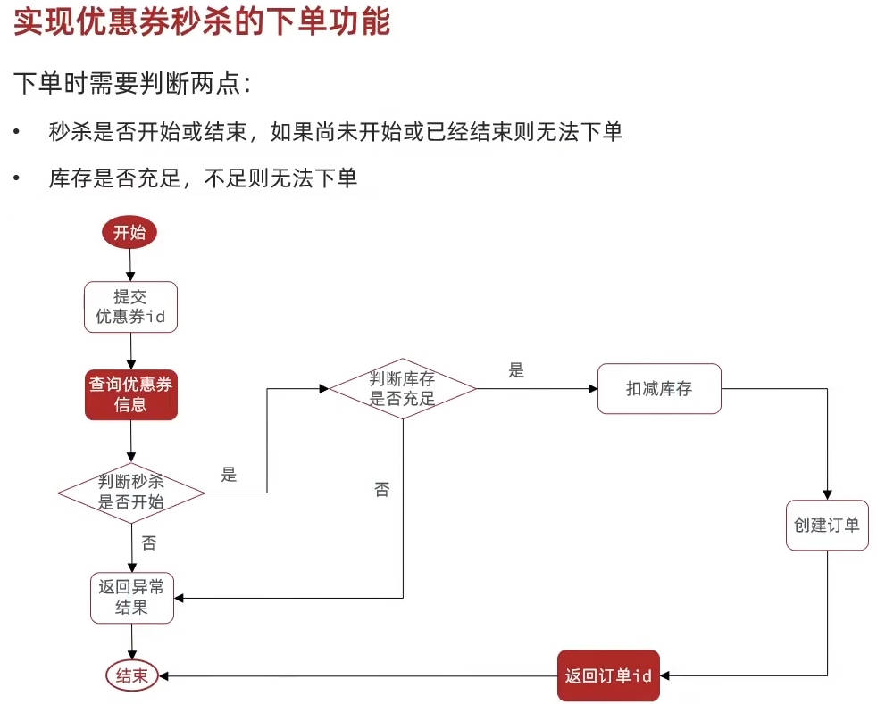
```java
@Override
@Transactional
public Result seckillVoucher(Long voucherId) {
    //1. 查询优惠券
    SeckillVoucher voucher = seckillVoucherService.getById(voucherId);
    //2. 判断秒杀是否开始
    LocalDateTime beginTime = voucher.getBeginTime();
    if (beginTime.isAfter(LocalDateTime.now())) {
        return Result.fail("秒杀尚未开始！");
    }
    //3. 判断秒杀是否结束
    LocalDateTime endTime = voucher.getEndTime();
    if (endTime.isBefore(LocalDateTime.now())) {
        return Result.fail("秒杀已经结束！");
    }
    //4. 判断库存是否充足
    Integer stock = voucher.getStock();
    if (stock <= 0) {
        return Result.fail("库存不足！");
    }
    //5. 扣减库存
    boolean success = seckillVoucherService.update()
            .setSql("stock = stock - 1")
            .eq("voucher_id", voucherId)
            .update();
    if (!success) {
        return Result.fail("库存不足！");
    }
    //6. 创建订单
    VoucherOrder voucherOrder = new VoucherOrder();
    //6.1. 订单id
    long orderId = redisIdWorker.nextId("order");
    voucherOrder.setId(orderId);
    //6.2. 用户id
    Long userId = UserHolder.getUser().getId();//从用户登录拦截器里获取用户id
    voucherOrder.setUserId(userId);
    //6.3. 代金劵id
    voucherOrder.setVoucherId(voucherId);
    //6.4. 保存订单
    save(voucherOrder);
    //7. 返回订单id
    return Result.ok(orderId);
}
```

### 3.3 超卖问题
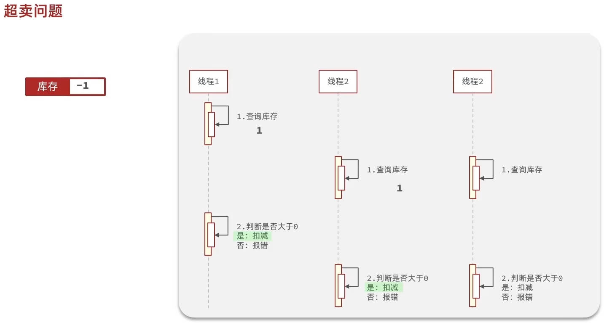
- 超卖问题的原因是在高并发场景下，多个线程同时判断库存充足，然后都去扣减库存，导致库存超卖
- 超卖问题是典型的多线程安全问题，针对这一问题常见的方案就是加锁

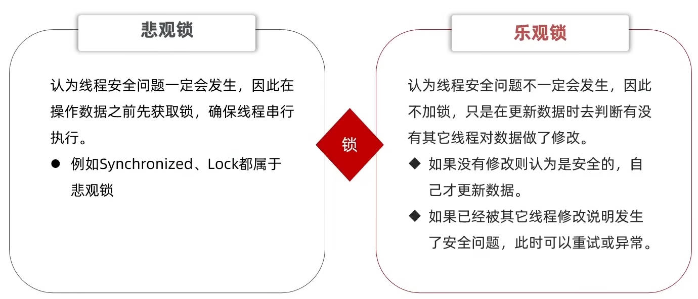

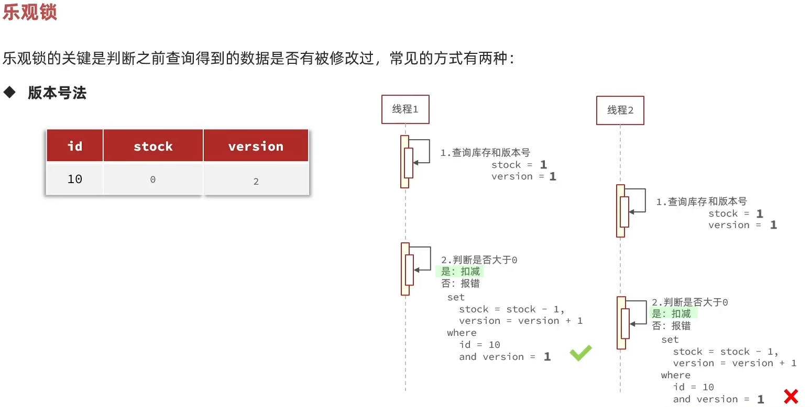
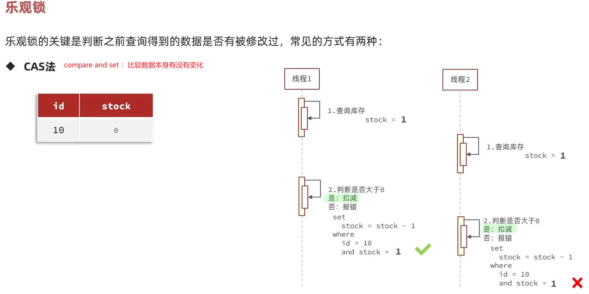
1.悲观锁：添加同步锁，让线程串行执行
- 优点：简单粗暴
- 缺点：性能一般

2.乐观锁：不加锁，在更新时判断是否有其他线程在修改
- 优点：性能好
- 缺点：存在成功率低的问题
- 在高并发场景下，不像库存一样的数据就需要判断数据是否改变来解决超卖问题，但是线程成功率超低，我们也可以采取分批，比如把100个库存分到10张表，分批加锁的方式
下面我们采取乐观锁的方案来解决超卖问题：
只需修改扣减库存的代码，将乐观锁的判断条件加上判断库存是否大于0即可。
```java
//5. 扣减库存
boolean success = seckillVoucherService.update()
        .setSql("stock = stock - 1")
        .eq("voucher_id", voucherId)
        //.eq("stock", voucher.getStock()) //乐观锁，判断库存是否改变(但是有库存时导致某些线程失败率过高)
        .gt("stock", 0) //乐观锁，判断库存是否大于0
        .update();
```

### 3.4 一人一单
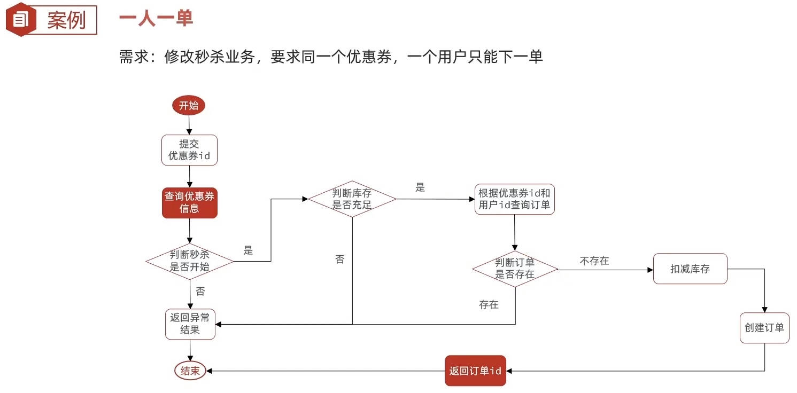
- 由于是插入订单，不是更新订单，我们无法使用乐观锁去判断数据有没有被修改，使用需要用悲观锁。
- 使用用户ID进行加锁，而不是对全部的线程都加锁
- 因为我们是根据用户ID进行加锁的，所以不同用户之间是不会互相干扰的，而对全部的线程都加锁，会导致不同用户之间也会互相干扰，这是我们不希望看到的。
- 代码中涉及到了`事务失效`、`动态代理`、`锁和事务的先后`问题(代码有注解)
- 下面代码中使用`synchronized`锁的方式只适用于`非集群模式`，集群模式下每个JVM都有自己的锁监视器，同一个用户在不同的JVM中是无法互斥的，导致一人多单的产生。
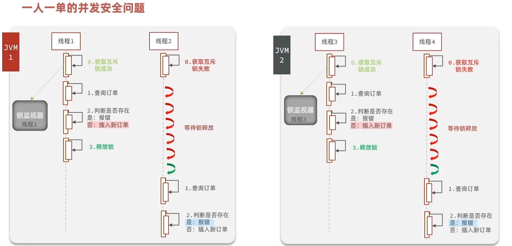
```java
@Service
public class VoucherOrderServiceImpl extends ServiceImpl<VoucherOrderMapper, VoucherOrder> implements IVoucherOrderService {

    @Resource
    private ISeckillVoucherService seckillVoucherService;

    @Resource
    private RedisIdWorker redisIdWorker;
    @Override
    public Result seckillVoucher(Long voucherId) {
        //1. 查询优惠券
        SeckillVoucher voucher = seckillVoucherService.getById(voucherId);
        //2. 判断秒杀是否开始
        LocalDateTime beginTime = voucher.getBeginTime();
        if (beginTime.isAfter(LocalDateTime.now())) {
            return Result.fail("秒杀尚未开始！");
        }
        //3. 判断秒杀是否结束
        LocalDateTime endTime = voucher.getEndTime();
        if (endTime.isBefore(LocalDateTime.now())) {
            return Result.fail("秒杀已经结束！");
        }
        //4. 判断库存是否充足
        Integer stock = voucher.getStock();
        if (stock <= 0) {
            return Result.fail("库存不足！");
        } 

        Long userId = UserHolder.getUser().getId();//从用户登录拦截器中获取用户id
        synchronized(userId.toString().intern()) { //每次传进来的userId都是不同的对象，所以这里使用字符串的值作为锁的对象，toString()也是返回的对象，使用我们需要使用intern()方法.intern()方法可以确保字符串常量池中只有一个相同内容的字符串对象
            //需要等事务提交之后再释放锁，所以不能用在createVoucherOrder事务方法中
            //return createVoucherOrder(voucherId);//这种是当前对象的方法调用，事务不生效
            IVoucherOrderService proxy = (IVoucherOrderService) AopContext.currentProxy();//获取当前对象(接口IVoucherOrderService)的代理对象
            return proxy.createVoucherOrder(voucherId);//这种是代理对象的方法调用，事务生效
        }
    }

    @Transactional //事务生效是因为spring对当前这个类做了动态代理，拿到了它的代理对象做的事务处理，事务在代理对象的方法中生效，而不是在当前对象的方法中生效
    public Result createVoucherOrder(Long voucherId) {
        //5.一人一单
        Long userId = UserHolder.getUser().getId();//从用户登录拦截器中获取用户id
        //5.1. 查询订单
        int count = query().eq("user_id", userId).eq("voucher_id", voucherId).count();
        //5.2. 判断是否存在订单
        if (count > 0) {
            //用户已经购买过一次
            return Result.fail("用户已经购买过一次！");
        }
        //6. 扣减库存
        boolean success = seckillVoucherService.update()
                .setSql("stock = stock - 1")
                .eq("voucher_id", voucherId)
                //.eq("stock", voucher.getStock()) //乐观锁，判断库存是否改变(但是有库存时导致某些线程失败率过高)
                .gt("stock", 0) //乐观锁，判断库存是否大于0
                .update();
        if (!success) {
            return Result.fail("库存不足！");
        }
        //7. 创建订单
        VoucherOrder voucherOrder = new VoucherOrder();
        //7.1. 订单id
        long orderId = redisIdWorker.nextId("order");
        voucherOrder.setId(orderId);
        //7.2. 用户id
        voucherOrder.setUserId(userId);
        //7.3. 代金劵id
        voucherOrder.setVoucherId(voucherId);
        //7.4. 保存订单
        save(voucherOrder);

        //8. 返回订单id
        return Result.ok(orderId);
    }

}
```

由于动态代理的对象是接口，所以我们需要用接口来接收代理对象，才能调用代理对象的方法，所以需要在接口中定义一个方法，用来创建订单。
```java
public interface IVoucherOrderService extends IService<VoucherOrder> {

    Result seckillVoucher(Long voucherId);

    Result createVoucherOrder(Long voucherId);

}
```

在启动类中，我们需要用@EnableAspectJAutoProxy(exposeProxy = true)注解开启aspectj动态代理，暴露代理对象，我们才能获取到当前对象的代理对象。
```java
@EnableAspectJAutoProxy(exposeProxy = true)//开启aspectj动态代理，暴露代理对象
```

我们需要在pom.xml中添加aspectjweaver依赖，我们获取动态代理对象需要用到这个依赖。
```java
<!--动态代理的模式-->
<dependency>
    <groupId>org.aspectj</groupId>
    <artifactId>aspectjweaver</artifactId>
</dependency>
```
## 4. 分布式锁
### 4.1. 分布式锁的基本原理和不同实现方式对比
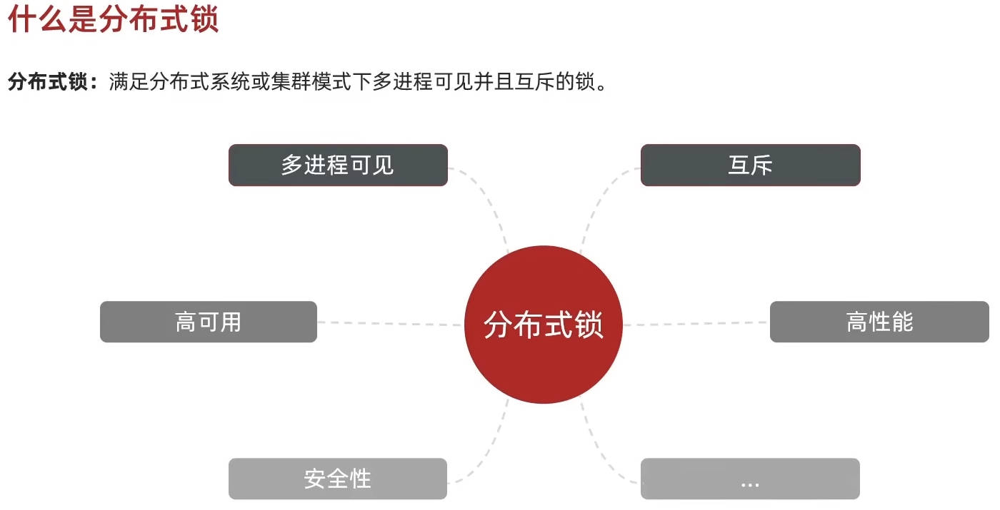
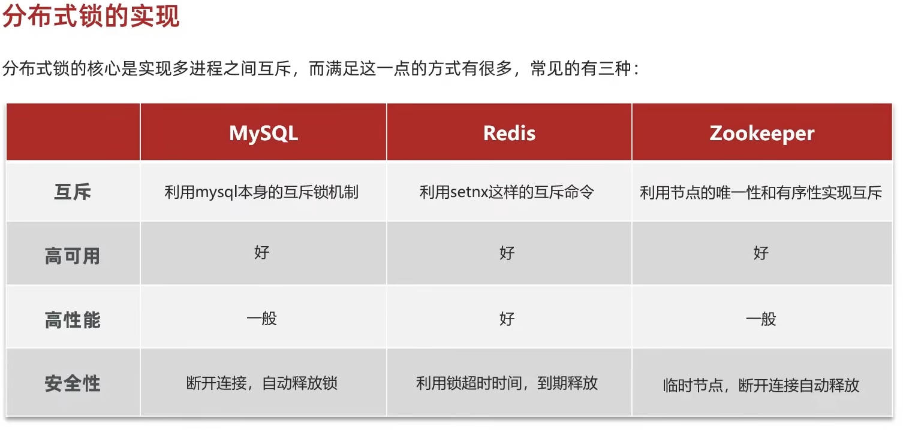
### 4.2. Redis的分布式锁实现思路
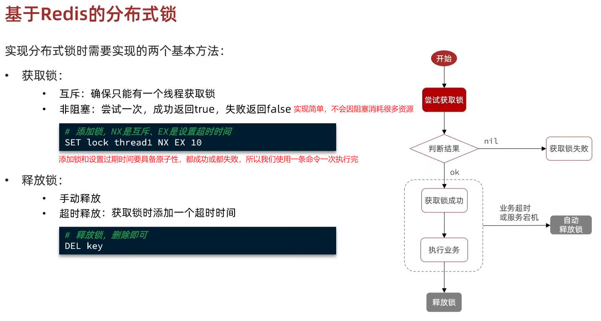
### 4.3. 实现Redis分布式锁初级版本
- 我们先实现一个简单的Redis分布式锁，后续再进行优化。
- 我们先定义一个接口ILock，用来定义分布式锁的基本方法。
```java
package com.hmdp.utils;

public interface ILock {
    /**
     * 尝试获取锁
     * @param timeoutSec 超时时间，单位秒
     * @return true表示获取锁成功，false表示获取锁失败
     */
    boolean tryLock(long timeoutSec);

    /**
     * 释放锁
     */
    void unlock();
}
```
- 我们实现一个简单的Redis分布式锁SimpleRedisLock，用来尝试获取锁和释放锁。
```java
package com.hmdp.utils;

import java.util.concurrent.TimeUnit;

import org.springframework.data.redis.core.StringRedisTemplate;

public class SimpleRedisLock implements ILock {


    private final String name;
    private final StringRedisTemplate stringRedisTemplate;

    public SimpleRedisLock(String name, StringRedisTemplate stringRedisTemplate) {
        this.name = name;
        this.stringRedisTemplate = stringRedisTemplate;
    }

    private static final String KEY_PREFIX = "lock:";

    @Override
    public boolean tryLock(long timeoutSec) {
        // 1. 获取线程标识
        long threadId = Thread.currentThread().getId();
        // 2. 获取锁
        Boolean success = stringRedisTemplate.opsForValue()
                .setIfAbsent(KEY_PREFIX + name, threadId+"", timeoutSec, TimeUnit.SECONDS);
        return Boolean.TRUE.equals(success);//Boolean是包装类，boolean是基本类型，equals方法是比较值是否相等，防止自动拆箱的空指针异常
    }

    @Override
    public void unlock() {
        //释放锁
        stringRedisTemplate.delete(KEY_PREFIX + name);
    }

}
```
- 我们在秒杀下单的方法中，使用SimpleRedisLock来尝试获取锁，判断是否成功。如果成功，就创建订单；如果失败，就返回失败结果。
- 可对比`3.4`中的一人一单，我们在3.4中使用synchronized锁的方式只适用于`非集群模式`，集群模式下每个JVM都有自己的锁监视器，同一个用户在不同的JVM中是无法互斥的，导致一人多单的产生。
```java
//创建锁对象
SimpleRedisLock lock = new SimpleRedisLock("order:" + userId, stringRedisTemplate);
//获取锁，判断是否成功
if (!lock.tryLock(1200)) {
    return Result.fail("不允许重复下单！");
}
try {
    //需要等事务提交之后再释放锁，所以不能用在createVoucherOrder事务方法中
    //return createVoucherOrder(voucherId);//这种是当前对象的方法调用，事务不生效
    IVoucherOrderService proxy = (IVoucherOrderService) AopContext.currentProxy();//获取当前对象(接口IVoucherOrderService)的代理对象
    return proxy.createVoucherOrder(voucherId);//这种是代理对象的方法调用，事务生效
} finally {
    lock.unlock(); //释放锁
}
```

### 4.4. Redis分布式锁误删问题
- 我们在实现Redis分布式锁时，使用了setIfAbsent方法来尝试获取锁，设置了过期时间，但是如果在过期时间内，线程还没有执行完，就会导致锁被误删。
- 线程执行结束时，需要释放锁，此时释放的是其他线程的锁。
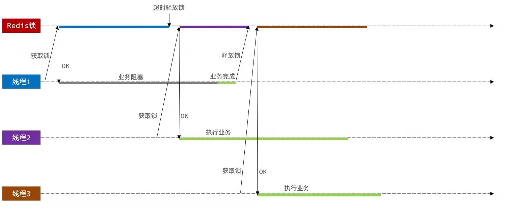
- 为了解决这个问题，我们在释放锁的时候需要拿到锁的value（存进去的是线程的唯一标识），判断是否是当前线程的锁，如果是，才释放锁。
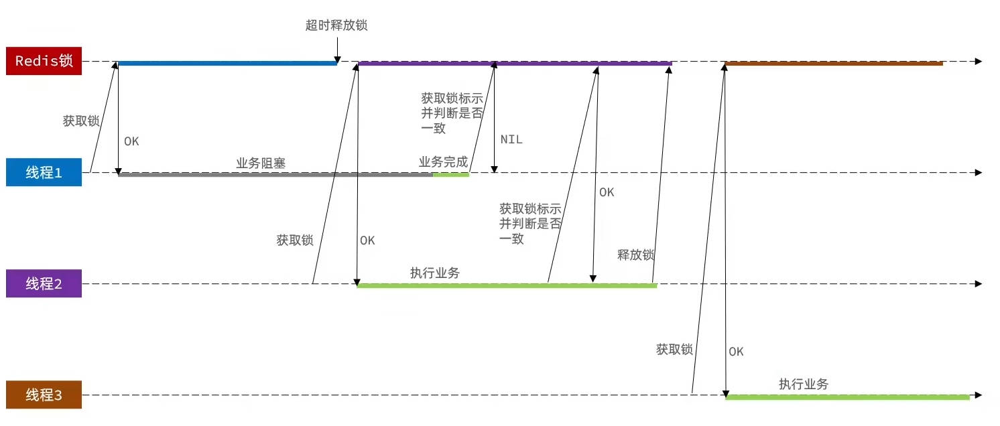
- 我们改变代码流程，获取锁时存入线程标识，释放锁时判断锁是否是当前线程的锁，如果是，才释放锁。
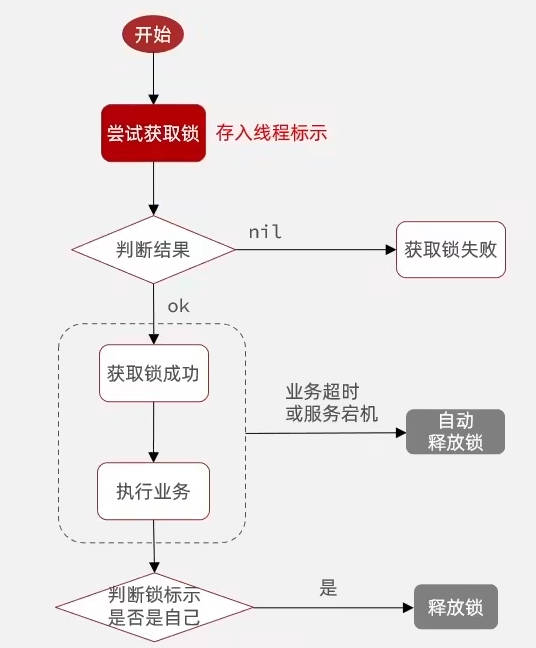
- 需求：修改之前的分布式锁实现，满足：
  - 在获取锁时存入线程标识（UUID+线程id）使用UUID是为了防止不同JVM中线程id重复导致的误删问题
  - 在释放锁时先获取锁中的线程标识，判断是否与当前线程标识一致
    - 如果一致则释放锁
    - 如果不一致则不释放锁 
- 下面是我们针对锁误删对锁的改进，可以对比`4.3`的代码
```java
package com.hmdp.utils;

import java.util.concurrent.TimeUnit;

import org.springframework.data.redis.core.StringRedisTemplate;

import cn.hutool.core.lang.UUID;

public class SimpleRedisLock implements ILock {


    private final String name;
    private final StringRedisTemplate stringRedisTemplate;

    public SimpleRedisLock(String name, StringRedisTemplate stringRedisTemplate) {
        this.name = name;
        this.stringRedisTemplate = stringRedisTemplate;
    }

    private static final String KEY_PREFIX = "lock:";
    private static final String ID_PREFIX = UUID.randomUUID().toString(true) + "-";

    @Override
    public boolean tryLock(long timeoutSec) {
        // 1. 获取线程标识
        String threadId = ID_PREFIX + Thread.currentThread().getId();//我们使用UUID+线程id作为锁的标识，保证每个线程的标识都是唯一的，因为不同的JVM中可能会有相同的线程id
        // 2. 获取锁
        Boolean success = stringRedisTemplate.opsForValue()
                .setIfAbsent(KEY_PREFIX + name, threadId, timeoutSec, TimeUnit.SECONDS);
        return Boolean.TRUE.equals(success);//Boolean是包装类，boolean是基本类型，equals方法是比较值是否相等，防止自动拆箱的空指针异常
    }

    @Override
    public void unlock() {
        // 1. 获取线程标识
        String threadId = ID_PREFIX + Thread.currentThread().getId();
        // 2. 获取锁中的线程标识
        String id = stringRedisTemplate.opsForValue().get(KEY_PREFIX + name);
        // 3. 判断是否为当前线程
        if (threadId.equals(id)) {
            //4. 释放锁
            stringRedisTemplate.delete(KEY_PREFIX + name);
        }
    }

}
```

### 4.5. Lua脚本解决多条命令原子性问题（解决Redis分布式锁误删中原子性问题）
- 在解决完Redis分布式锁误删问题后，我们又发现了新的问题。
- 若在判断锁标识是否一致之后，线程发生了阻塞，在此期间新的线程创建了锁，当阻塞结束，线程继续执行，释放锁时，就会释放新线程创建的锁，这就导致了误删问题。
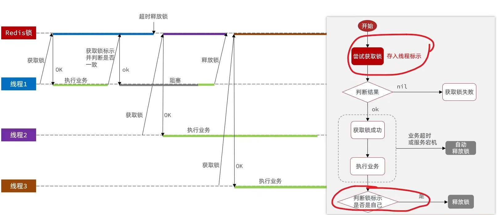
- 所以我们的判断锁标识和释放锁必须要是原子操作，不能分开来做。

- Redis提供了Lua脚本功能，在一个脚本中编写多条Redis命令，确保多条命令执行时的原子性。
- Lua是一种编程语言，它的基本语法可以上菜鸟教程看看，链接：https://www.runoob.com/lua/lua-tutorial.html
- 这里重点介绍Redis提供的调用函数，我们可以使用Lua去操作Redis，而且还能保证它的原子性，这样就可以实现拿锁，判断标识，删锁是一个原子性动作了。
- Redis提供的调用函数语法如下：
```bash
redis.call('命令名称','key','其他参数', ...)
```
- 例如我们要执行set name Kyle，则脚本是这样:
```bash
redis.call('set', 'name', 'Kyle')
```
- 例如我我们要执行set name David，在执行get name，则脚本如下:
```bash
## 先执行set name David
redis.call('set', 'name', 'David')
## 再执行get name
local name = redis.call('get', 'name')
## 返回
return name
```
- 写好脚本以后，需要用Redis命令来调用脚本，调用脚本的常见命令如下:
```bash
## 调用脚本
EVAL script numkeys key [key ...] arg [arg ...]
```
- 例如，我们要调用redis.call('set', 'name', 'Kyle') 0这个脚本，语法如下:
```bash
EVAL "return redis.call('set', 'name', 'Kyle')" 0
```
- 如果脚本中的key和value不想写死，可以作为参数传递，key类型参数会放入KEYS数组，其他参数会放入ARGV数组，在脚本中可以从KEYS和ARGV数组中获取这些参数。
-  `注意：在Lua中，数组下标从1开始`
```bash
EVAL "return redis.call('set', KEYS[1], ARGV[1])" 1 name Lucy
```
- 接下来就使用Lua脚本来代替我们释放锁的逻辑
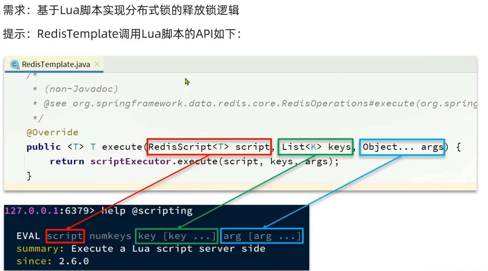
1.在resourse中新增一个静态的Lua脚本unlock.lua，用来释放锁
```lua
-- 比较线程标识与锁中标识是否相等
if(redis.call('get', KEYS[1]) == ARGV[1]) then
    -- 释放锁 del key
    return redis.call('del', KEYS[1])
end
return 0
```
2.静态加载Lua脚本，避免每次调用都加载脚本
```java
private static final DefaultRedisScript<Long> UNLOCK_SCRIPT;//Long是lua脚本的返回值类型
static {//静态代码块，在类加载时执行一次，用于初始化UNLOCK_SCRIPT
    UNLOCK_SCRIPT = new DefaultRedisScript<>();
    UNLOCK_SCRIPT.setLocation(new ClassPathResource("unlock.lua"));//ClassPathResource()会去classpath（就是resources目录）下寻找unlock.lua文件
    UNLOCK_SCRIPT.setResultType(Long.class);//设置返回值类型
}
```
3.在SimpleRedisLock中修改unlock方法，调用lua脚本释放锁
```java
@Override
public void unlock() {
    //调用lua脚本
    stringRedisTemplate.execute(
            //lua脚本
            UNLOCK_SCRIPT,
            //key集合
            Collections.singletonList(KEY_PREFIX + name),
            //arg
            ID_PREFIX + Thread.currentThread().getId()
    );
}
```
- 基于Redis的分布式锁实现思路：
  - 利用set nx ex获取锁，并设置过期时间，保存线程标识
  - 释放锁时先判断线程是否与自己一致，一致则删除锁
  - 使用lua脚本保证释放锁的原子性
- 特性：
  - 利用set nx满足互斥性
  - 利用set ex保证故障时锁依然能释放，避免死锁，提高安全性
  - 利用Redis集群保证高可用和高并发特性

## 5. 分布式锁Redisson
基于SETNX实现的分布式锁存在以下问题:
- `不可重入`。重入问题是比如线程调用a方法，需要用到锁，而a方法中又调用了b方法，b方法也需要用到同一个锁，这就导致了重入问题。
- `不可重试`。获取锁只尝试一次就返回了false，没有重试机制。
- `超时释放`。如果在设置的超时时间内，线程还没有执行完，就会导致锁被误删。存在安全隐患。
- `主从一致性`。在Redis集群模式下，由于主从复制的异步特性，可能会导致锁在主节点上设置成功，但是在从节点上还没有同步，这就导致了主从一致性问题。此时如果主节点宕机，从节点升级为主节点，就会导致锁丢失，这就存在安全隐患。
- 但是上述问题出现的概率很低，在一般场景已经够用了。
- 我们接下来介绍Redisson，它是一个基于Redis的Java驻留内存数据网格（In-Memory Data Grid），它不仅提供了一系列的分布式的Java常用对象，还提供了许多分布式服务，其中就包含各种分布式锁的功能，我们遇到的各种问题都可以用Redisson来解决，不用我们自己手写模块了。
- Redisson提供了分布式锁的多种多样功能
1.可重入锁(Reentrant Lock)
2.公平锁(Fair Lock)
3.联锁(MultiLock)
4.红锁(RedLock)
5.读写锁(ReadWriteLock)
6.信号量(Semaphore)
7.可过期性信号量(PermitExpirableSemaphore)
8.闭锁(CountDownLatch)
9.官网地址：https://redisson.org 和 https://github.com/redisson/redisson
### 5.1 Redisson入门
- 使用Redisson三步
1.引入Redisson依赖
2.配置Redisson客户端
3.使用锁
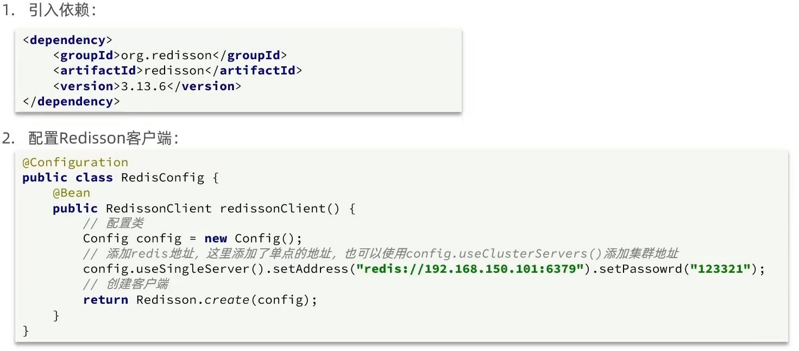
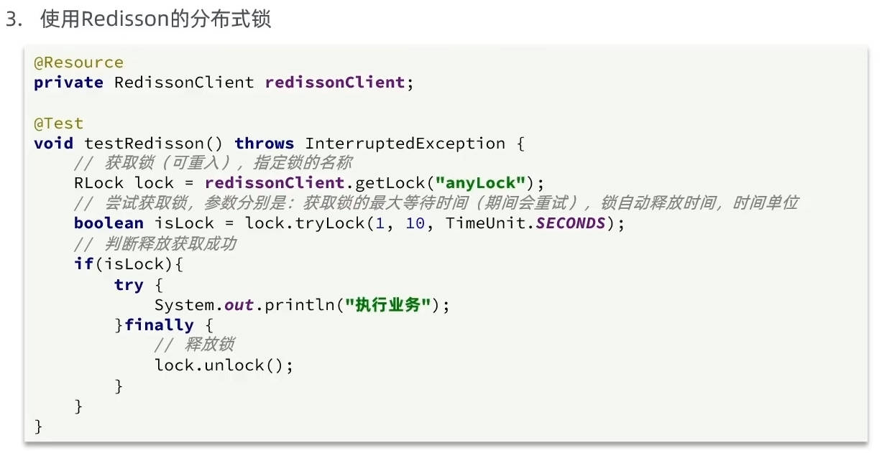
- 引入Redisson依赖
```java
<!--redisson-->
<dependency>
    <groupId>org.redisson</groupId>
    <artifactId>redisson</artifactId>
    <version>3.13.6</version>
</dependency>
```
- 配置Redisson客户端
```java
//新建一个配置类RedissonConfig
package com.hmdp.config;

import org.redisson.Redisson;
import org.redisson.api.RedissonClient;
import org.redisson.config.Config;
import org.springframework.context.annotation.Bean;
import org.springframework.context.annotation.Configuration;

@Configuration
public class RedissonConfig {

    @Bean
    public RedissonClient redissonClient() {
        // 创建Redisson配置对象
        Config config = new Config();
        config.useSingleServer().setAddress("redis://127.0.0.1:6379").setPassword("536536");
        // 创建RedissonClient对象，使用默认配置连接到本地Redis服务器
        return Redisson.create(config);
    }

}
```
- 使用锁（可对比4.3）
```java
//创建锁对象
//SimpleRedisLock lock = new SimpleRedisLock("order:" + userId, stringRedisTemplate);
RLock lock = redissonClient.getLock("lock:order:" + userId);
//获取锁，判断是否成功
if (!lock.tryLock()) {
    return Result.fail("不允许重复下单！");
}
try {
    //需要等事务提交之后再释放锁，所以不能用在createVoucherOrder事务方法中
    //return createVoucherOrder(voucherId);//这种是当前对象的方法调用，事务不生效
    IVoucherOrderService proxy = (IVoucherOrderService) AopContext.currentProxy();//获取当前对象(接口IVoucherOrderService)的代理对象
    return proxy.createVoucherOrder(voucherId);//这种是代理对象的方法调用，事务生效
} finally {
    lock.unlock(); //释放锁
}
```
### 5.2 Redisson的可重入锁原理
- 对于下面的例子需要使用到可重入锁：
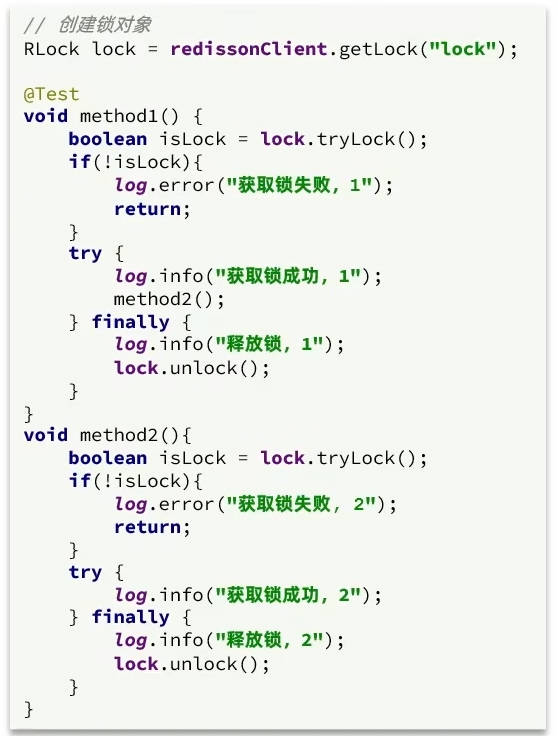

- redisson可重入锁的原理：
  - 获取锁
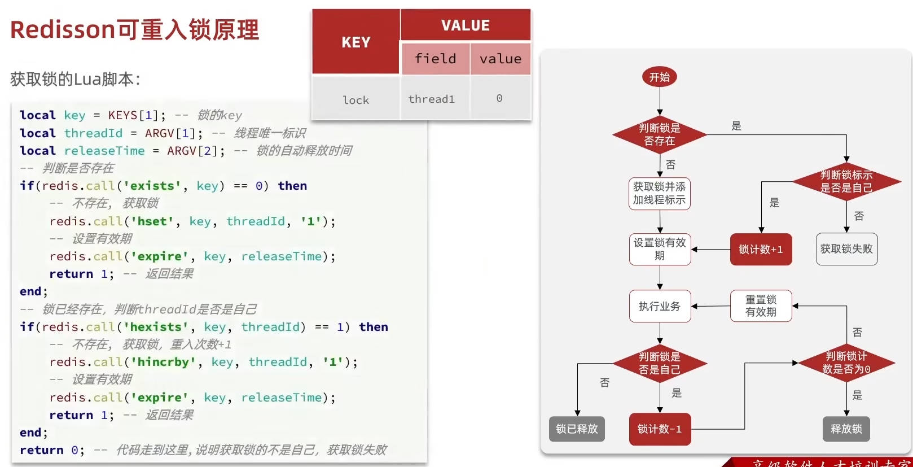
  - 释放锁
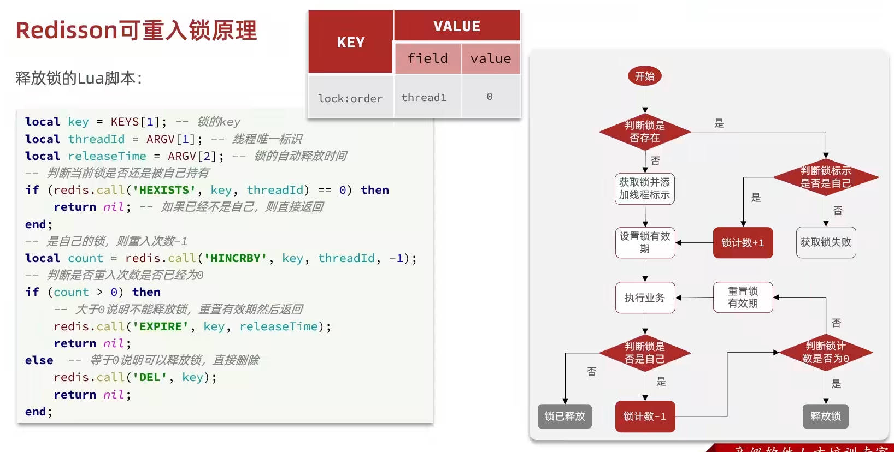

### 5.3 Redisson的重试机制和超时续约
- 重试机制
  - 当线程获取锁失败时，会利用信号量机制等待一个锁释放的信号，然后进行重试获取锁。
  - 一直重试，直到超过等待时间，则结束重试。
  - 通过等待、唤醒这样的机制不会占用过多的cpu，效率还不错。
- 超时续约
  - 当未设置超时时间时，会开启Watchdog机制。
  - 线程获取锁成功后，会开启一个定时任务，每隔一段时间(releaseTime/3)，重置超时时间。
  - 锁初始过期时间：30 秒
  - 续约周期：每 10 秒一次（过期时间的 1/3）
  - 是否自动续约：仅在未指定超时时间时开启
  - Redisson 的 Watchdog 是运行在“加锁的那个 JVM 进程”里的一个定时任务，当进程挂了，Watchdog 也会挂掉不再续约，到期锁会自动释放。
  - 永不过期->进程挂掉就无法释放锁。
  - 过期时间固定->进程时间太久会导致安全隐患。
  - Watchdog续约->很好。＜（＾－＾）＞
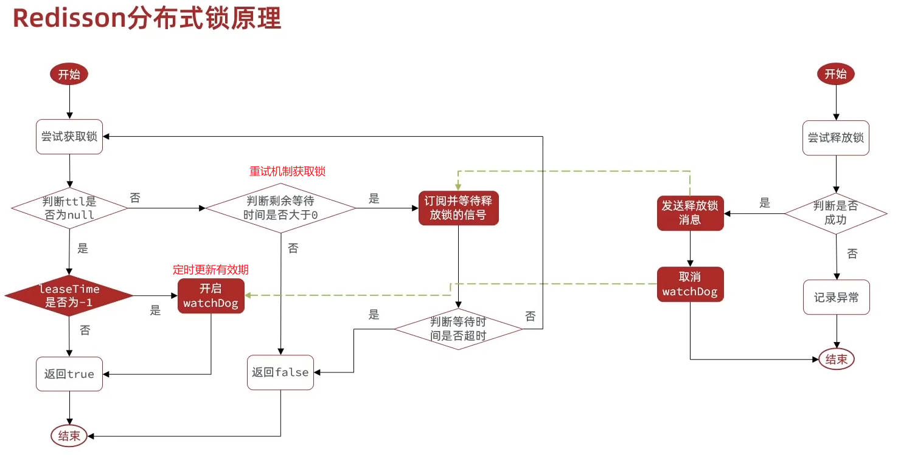

### 5.4 Redisson分布式锁主从一致性问题
- 问题描述：
  - 在Redis集群模式下，由于主从复制的异步特性，可能会导致锁在主节点上设置成功，但是在从节点上还没有同步，这就导致了主从一致性问题。
  - 此时如果主节点宕机，从节点升级为主节点，就会导致锁丢失，这就存在安全隐患。
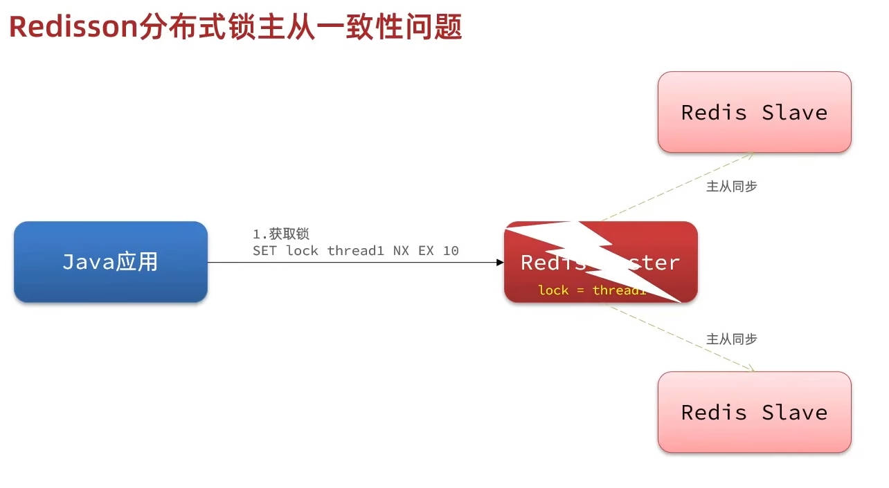
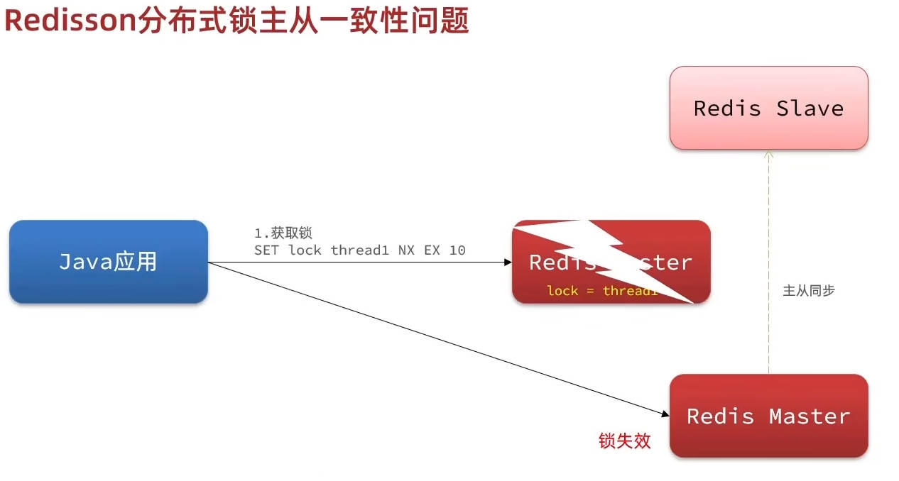

- 解决方法：
  - 我们可以直接使用多个主节点，只有每个主节点同时获取到锁才能认为获取到了锁。
  - 当然我们如果想要更好的效果，也可以进一步的给每个主节点加上从节点，从节点负责同步主节点的数据，当主节点宕机时，从节点可以升级为主节点，继续提供服务。
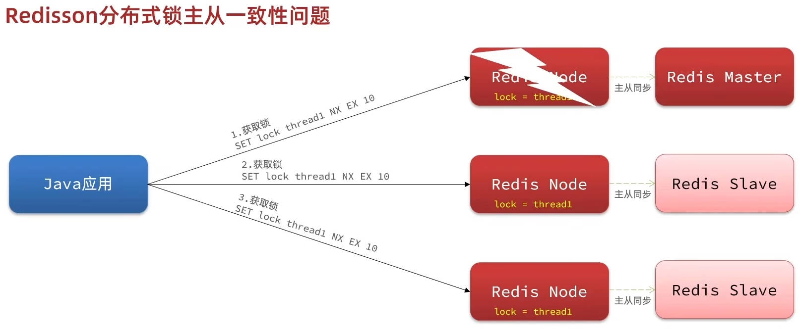
- 先配置多个redis作为主节点
```java
@Configuration
public class RedissonConfig {
    @Bean
    public RedissonClient redissonClient() {
        Config config = new Config();
        config.useSingleServer().setAddress("redis://192.168.137.130:6379")
                .setPassword("root");
        return Redisson.create(config);
    }

    @Bean
    public RedissonClient redissonClient2() {
        Config config = new Config();
        config.useSingleServer().setAddress("redis://92.168.137.131:6379")
                .setPassword("root");
        return Redisson.create(config);
    }

    @Bean
    public RedissonClient redissonClient3() {
        Config config = new Config();
        config.useSingleServer().setAddress("redis://92.168.137.132:6379")
                .setPassword("root");
        return Redisson.create(config);
    }
}
```
- 使用联锁（MultiLock）
- 联锁（MultiLock）是Redisson提供的一种分布式锁实现，它可以将多个锁组合在一起，只有当所有锁都获取到了锁，才认为获取到了锁。
- 创建锁对象需要传入多个锁对象，每个锁对象对应一个Redis节点。
- 使用锁的方式与普通锁相同，只是在创建锁对象时需要传入多个锁对象。
```java
@Resource
private RedissonClient redissonClient;
@Resource
private RedissonClient redissonClient2;
@Resource
private RedissonClient redissonClient3;

private RLock lock;

@BeforeEach
void setUp() {
    RLock lock1 = redissonClient.getLock("lock");
    RLock lock2 = redissonClient2.getLock("lock");
    RLock lock3 = redissonClient3.getLock("lock");
    lock = redissonClient.getMultiLock(lock1, lock2, lock3);
    //这里的getMultiLock()方法使用redissonClient、redissonClient2、redissonClient3调用都可。
}

@Test
void method1() {
    boolean success = lock.tryLock();
    redissonClient.getMultiLock();
    if (!success) {
        log.error("获取锁失败，1");
        return;
    }
    try {
        log.info("获取锁成功");
        method2();
    } finally {
        log.info("释放锁，1");
        lock.unlock();
    }
}

void method2() {
    RLock lock = redissonClient.getLock("lock");
    boolean success = lock.tryLock();
    if (!success) {
        log.error("获取锁失败，2");
        return;
    }
    try {
        log.info("获取锁成功，2");
    } finally {
        log.info("释放锁，2");
        lock.unlock();
    }
}
```
### 5.5 小结
- 不可重入Redis分布式锁
  - 原理：利用SETNX的互斥性；利用EX避免死锁；释放锁时判断线程标识
  - 缺陷：不可重入、无法重试、锁超时失效
- 可重入Redis分布式锁
  - 原理：利用Hash结构，记录线程标识与重入次数；利用WatchDog延续锁时间；利用信号量控制锁重试等待
  - 缺陷：Redis宕机引起锁失效问题
- Redisson的multiLock
  - 原理：多个独立的Redis节点，必须在所有节点都获取重入锁，才算获取锁成功
  - 缺陷：运维成本高、实现复杂

## 6. Redis优化秒杀
- 我们先来看一下秒杀业务的原流程
- 这个流程整个是串联操作，需要多次往数据库读写数据，比较耗时，而优惠卷秒杀业务是一种高并发场景，需要优化。
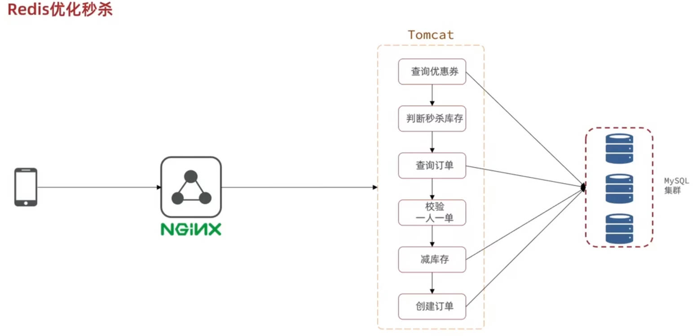
- 优化思路：
- 将用户秒杀的资格认证和订单创建这两个步骤拆分成两个独立的操作。
- 利用Redis的高效、高并发的特性使用lua脚本进行原子操作，对用户进行秒杀资格认证(库存和一人一单)，将(优惠卷id、用户id、订单id)保存到redis，返回订单id，供用户付款。之后可以异步慢慢处理订单创建操作。
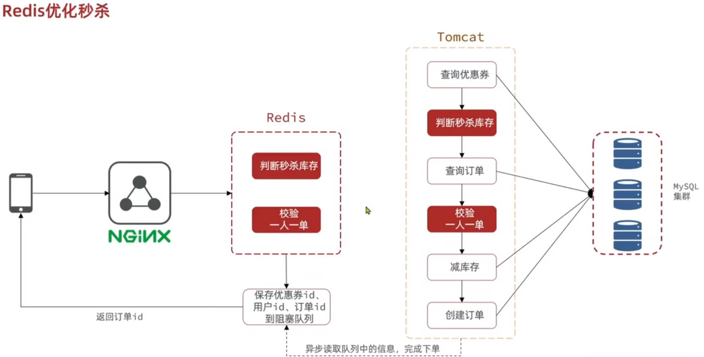
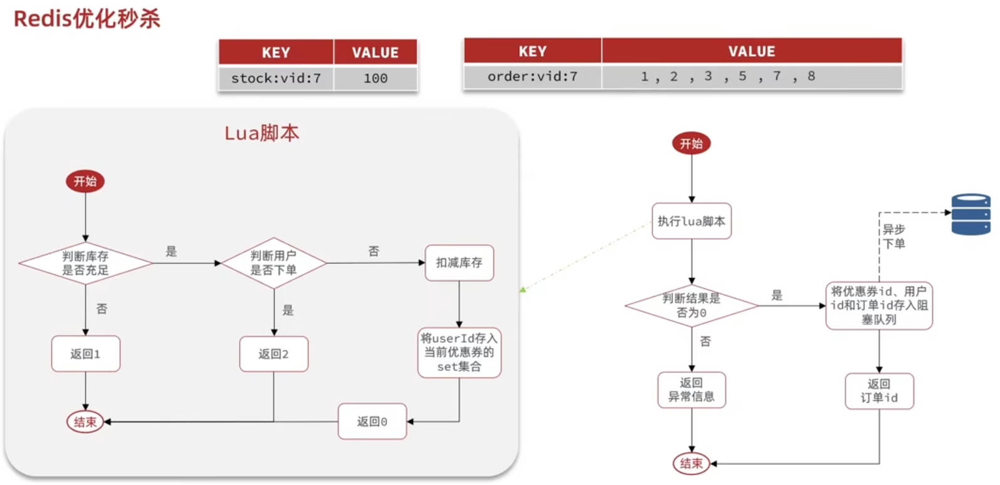


## 7. Redis消息队列实现异步秒杀